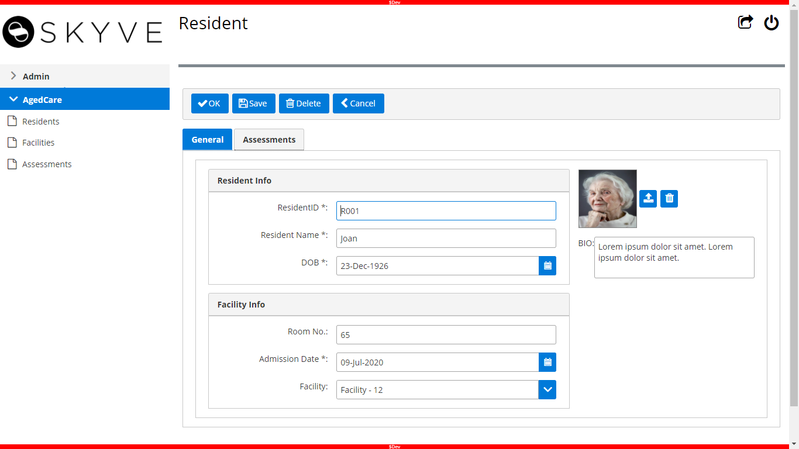
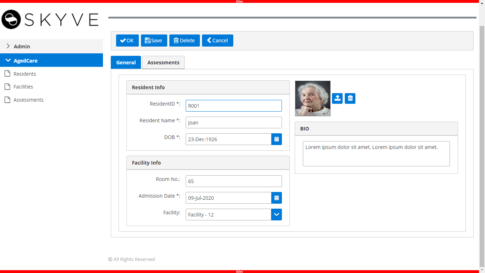
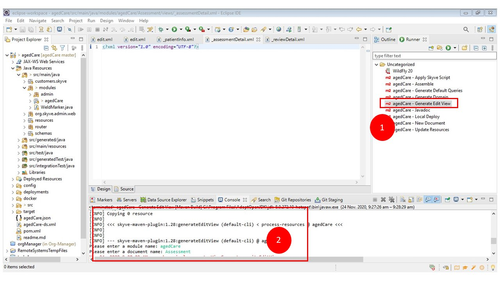

In this section we will override the default detail view which is generated by Skyve.

### Resident Edit view

Skyve provides us with a very useful function to create default `edit view` based on our document attributes and attributes type, the default widget will be applied for each attribute type.

So to create our Resident `edit view`, we will go through the following steps:

### Create edit view

1. Click on `Generate edit view` in the right side of the eclipse window and write the module and document name in the Console window.

   

2. If you go to the agedCare module left side of eclipse and open the resident module. You can see view module and in view module there is a document with `generatedit.xml`. Rename the document, `edit.xml`

   

### Enhance the edit view

In the previous step we generated an edit view by using the Generate Edit View function. Now we will enhance our edit view to make it more visually appealing.

As of now, Resident attributes show one by one, from top to bottom.

We will enhance the view by showing all personal information one the left-hand side of the screen and the photo and BIO on the right-hand side.

To do that, we will need to understand about Skyve View Containers - https://skyvers.github.io/skyve-dev-guide/views/#containers

After reading through the chapter on Skyve Containers, you may have already guessed how to split our view into 2 parts.

The `hbox` container lays out items horizontally.

Open resident `edit.xml` and add the code given below;

```xml
<?xml version="1.0" encoding="UTF-8"?>
<view xmlns="http://www.skyve.org/xml/view"
	xmlns:xsi="http://www.w3.org/2001/XMLSchema-instance" name="edit"
	title="Resident"
	xsi:schemaLocation="http://www.skyve.org/xml/view ../../../../schemas/view.xsd">
	<tabPane>
		<tab title="General">
			<hbox border="true">
				<!-- left side -->
				<vbox responsiveWidth="8" percentageWidth="60">
					<form>
						<column percentageWidth="30" responsiveWidth="4" />
						<column />
						<row>
							<item>
								<default binding="residentID" />
							</item>
						</row>
						<row>
							<item>
								<default binding="residentName" />
							</item>
						</row>
						<row>
							<item>
								<default binding="DOB" />
							</item>
						</row>
						<row>
							<item>
								<default binding="roomNo" />
							</item>
						</row>
						<row>
							<item>
								<default binding="admissionDate" />
							</item>
						</row>
						<row>
							<item>
								<default binding="facility" />
							</item>
						</row>
					</form>
				</vbox>
				<!-- right side -->
				<vbox responsiveWidth="4" percentageWidth="40">
					<form>
						<column percentageWidth="20" responsiveWidth="1" />
						<column />
						<row>
							<item showLabel="false">
								<contentImage binding="photo" />
							</item>
						</row>
						<row>
							<item>
								<default binding="BIO" />
							</item>
						</row>
					</form>
				</vbox>
			</hbox>
		</tab>
		<tab title="Assessments">
			<dataGrid binding="assessments">
				<boundColumn binding="hygieneAssessment" />
				<boundColumn binding="painAssessment" />
				<boundColumn binding="continenceAssessment" />
				<boundColumn binding="sleepAssessment" />
				<boundColumn binding="behaviourAssessment" />
				<boundColumn binding="assessmentCreatedBy" />
				<boundColumn binding="assessmentReviewTime" />
				<onAddedHandlers />
				<onEditedHandlers />
				<onRemovedHandlers />
				<onSelectedHandlers />
			</dataGrid>
		</tab>
	</tabPane>
	<actions>
		<defaults />
	</actions>
	<newParameters />
</view>
```

To see the changes, generate domain and re-deploy the application as you did before (stop the WildFly server, run Generate Domain, then restart WildFly).


Next, we will group related information together to make it easier to manage.
The easiest way is to use the `border` and `borderTitle` attributes of the Form container.

So, in this case, we will have 2 forms, one for Resident information, one for Faciltiy information. Let's add border and borderTitle in the <form> tag.

Let's add `border` and `borderTitle` in the `<form>` tag.

```xml
<?xml version="1.0" encoding="UTF-8"?>
<view xmlns="http://www.skyve.org/xml/view"
	xmlns:xsi="http://www.w3.org/2001/XMLSchema-instance" name="edit"
	title="Resident"
	xsi:schemaLocation="http://www.skyve.org/xml/view ../../../../schemas/view.xsd">
	<tabPane>
		<tab title="General">
			<hbox border="true">
				<!-- left side -->
				<vbox responsiveWidth="8" percentageWidth="60">
					<form border="true" borderTitle="Resident Info">
						<column percentageWidth="30" responsiveWidth="4" />
						<column />
						<row>
							<item>
								<default binding="residentID" />
							</item>
						</row>
						<row>
							<item>
								<default binding="residentName" />
							</item>
						</row>
						<row>
							<item>
								<default binding="DOB" />
							</item>
						</row>
					</form>
					<form border="true" borderTitle="Facility Info">
						<column percentageWidth="30" responsiveWidth="4" />
						<column />
						<row>
							<item>
								<default binding="roomNo" />
							</item>
						</row>
						<row>
							<item>
								<default binding="admissionDate" />
							</item>
						</row>
						<row>
							<item>
								<default binding="facility" />
							</item>
						</row>
					</form>
				</vbox>
				<!-- right side -->
				<vbox responsiveWidth="4" percentageWidth="40">
					<form>
						<column percentageWidth="20" responsiveWidth="1" />
						<column />
						<row>
							<item showLabel="false">
								<contentImage binding="photo" />
							</item>
						</row>
						<row>
							<item>
								<default binding="BIO" />
							</item>
						</row>
					</form>
				</vbox>
			</hbox>
		</tab>
		<tab title="Assessments">
			<dataGrid binding="assessments">
				<boundColumn binding="hygieneAssessment" />
				<boundColumn binding="painAssessment" />
				<boundColumn binding="continenceAssessment" />
				<boundColumn binding="sleepAssessment" />
				<boundColumn binding="behaviourAssessment" />
				<boundColumn binding="assessmentCreatedBy" />
				<boundColumn binding="assessmentReviewTime" />
				<onAddedHandlers />
				<onEditedHandlers />
				<onRemovedHandlers />
				<onSelectedHandlers />
			</dataGrid>
		</tab>
	</tabPane>
	<actions>
		<defaults />
	</actions>
	<newParameters />
</view>
```



Now that we have created a view for Resident records, it's time learn about View Components.

So, what are View Components?

Let's imagine that our view is very complex, lots of sections and these sections can be reused in different views. Skyve allows for reuse of view sections via the component widget.

To demonstrate how to re-use components, we will split our view into three components:

1. Resident Info
2. Facility Info
3. Photo and Bio

The view component must be declared according to the convention, with the file name matching the declared name.

#### Resident Info component

In the Resident > views package, create new `_residentInfo.xml` file with below content:

```xml
<?xml version="1.0" encoding="UTF-8"?>
<view xmlns="http://www.skyve.org/xml/view"
	xmlns:xsi="http://www.w3.org/2001/XMLSchema-instance"
	name="_residentInfo" title="Resident Info"
	xsi:schemaLocation="http://www.skyve.org/xml/view ../../../../schemas/view.xsd">
	<form border="true" borderTitle="Resident Info">
		<column percentageWidth="30" responsiveWidth="4" />
		<column />
		<row>
			<item>
				<default binding="residentID" />
			</item>
		</row>
		<row>
			<item>
				<default binding="residentName" />
			</item>
		</row>
		<row>
			<item>
				<default binding="DOB" />
			</item>
		</row>
	</form>
</view>
```

#### Facility Info component

In the Resident > views package, create new `_facilityInfo.xml` file with below content:

```xml
<?xml version="1.0" encoding="UTF-8"?>
<view xmlns="http://www.skyve.org/xml/view"
	xmlns:xsi="http://www.w3.org/2001/XMLSchema-instance"
	name="_facilityInfo" title="Facility Info"
	xsi:schemaLocation="http://www.skyve.org/xml/view ../../../../schemas/view.xsd">
	<form border="true" borderTitle="Facility Info">
		<column percentageWidth="30" responsiveWidth="4" />
		<column />
		<row>
			<item>
				<default binding="roomNo" />
			</item>
		</row>
		<row>
			<item>
				<default binding="admissionDate" />
			</item>
		</row>
		<row>
			<item>
				<default binding="facility" />
			</item>
		</row>
	</form>
</view>
```

#### Photo and Bio component

In the Resident > views package, create new `_photoBio.xml` file with below content:

```xml
<?xml version="1.0" encoding="UTF-8"?>
<view xmlns="http://www.skyve.org/xml/view"
	xmlns:xsi="http://www.w3.org/2001/XMLSchema-instance" name="_photoBio"
	title="Resident Photo and Bio"
	xsi:schemaLocation="http://www.skyve.org/xml/view ../../../../schemas/view.xsd">
	<form>
		<column percentageWidth="20" responsiveWidth="1" />
		<column />
		<row>
			<item showLabel="false">
				<contentImage binding="photo" />
			</item>
		</row>
	</form>
	<form border="true" borderTitle="BIO">
		<column />
		<row>
			<item showLabel="false">
				<textArea binding="BIO" />
			</item>
		</row>
	</form>
</view>
```

#### Combine together

After done with component creation, we will go to use it on our `edit view`.
Change `edit.xml` view like below:

```xml
<?xml version="1.0" encoding="UTF-8"?>
<view xmlns="http://www.skyve.org/xml/view"
	xmlns:xsi="http://www.w3.org/2001/XMLSchema-instance" name="edit"
	title="Resident"
	xsi:schemaLocation="http://www.skyve.org/xml/view ../../../../schemas/view.xsd">
	<tabPane>
		<tab title="General">
			<hbox border="true">
				<!-- left side -->
				<vbox responsiveWidth="6" percentageWidth="50">
					<component name="_residentInfo" />
					<component name="_facilityInfo" />
				</vbox>
				<!-- right side -->
				<vbox responsiveWidth="6" percentageWidth="50">
					<component name="_photoBio" />
				</vbox>
			</hbox>
		</tab>
		<tab title="Assessments">
			<dataGrid binding="assessments">
				<boundColumn binding="hygieneAssessment" />
				<boundColumn binding="painAssessment" />
				<boundColumn binding="continenceAssessment" />
				<boundColumn binding="sleepAssessment" />
				<boundColumn binding="behaviourAssessment" />
				<boundColumn binding="assessmentCreatedBy" />
				<boundColumn binding="assessmentReviewTime" />
				<onAddedHandlers />
				<onEditedHandlers />
				<onRemovedHandlers />
				<onSelectedHandlers />
			</dataGrid>
		</tab>
	</tabPane>
	<actions>
		<defaults />
	</actions>
	<newParameters />
</view>
```

Now re-deploy the application to check that the view appears as it did before:



### Facility Edit view

In the previous section we explore and practice how to create an edit view and customize it to meet our requirements. It's now easy for us to create an edit view for the Facility document.

The Facility edit view will contain three components:

1. Facility Info
2. Facility address
3. Facility location

Let's start with Facility Info component.

1. Generate the edit view for Facility document

   

2. Add the facility component the same way we have done for the resident component

#### Facility Info component

In the Facility > views package, create new `_facilityInfo.xml`
as below content:

```xml
<?xml version="1.0" encoding="UTF-8"?>
<view xmlns="http://www.skyve.org/xml/view"
	xmlns:xsi="http://www.w3.org/2001/XMLSchema-instance"
	name="_facilityInfo" title="Facility Info"
	xsi:schemaLocation="http://www.skyve.org/xml/view ../../../../schemas/view.xsd">
	<form border="true" borderTitle="Facility Info">
		<column percentageWidth="30" responsiveWidth="4" />
		<column />
		<row>
			<item>
				<default binding="facilityName" />
			</item>
		</row>
		<row>
			<item>
				<default binding="facilityManager" />
			</item>
		</row>
	</form>
</view>
```

#### Facility address component

In the Facility > views package, create new `_facilityAddress.xml` as below content:

```xml

<?xml version="1.0" encoding="UTF-8"?>
<view xmlns="http://www.skyve.org/xml/view"
	xmlns:xsi="http://www.w3.org/2001/XMLSchema-instance"
	name="_facilityAddress" title="Facility Address"
	xsi:schemaLocation="http://www.skyve.org/xml/view ../../../../schemas/view.xsd">
	<form borderTitle="Facility Address" border="true">
		<column percentageWidth="30" responsiveWidth="4" />
		<column />
		<row>
			<item>
				<default binding="buildingNumber" />
			</item>
		</row>
		<row>
			<item>
				<default binding="streetName" />
			</item>
		</row>
		<row>
			<item>
				<default binding="suburb" />
			</item>
		</row>
		<row>
			<item>
				<default binding="state" />
			</item>
		</row>
	</form>
</view>
```

#### Facility location Component

In the Facility > views package, create new `_facilityLocation.xml` as below content:

```xml
<?xml version="1.0" encoding="UTF-8"?>
<view xmlns="http://www.skyve.org/xml/view"
	xmlns:xsi="http://www.w3.org/2001/XMLSchema-instance"
	name="_facilityLocation" title="Facility Location"
	xsi:schemaLocation="http://www.skyve.org/xml/view ../../../../schemas/view.xsd">
	<form border="true" borderTitle="Facility Location">
		<column />
		<row>
			<item showLabel="false">
				<geometryMap binding="location">
					<onChangedHandlers />
				</geometryMap>
			</item>
		</row>
	</form>
</view>
```

#### Combine together

After creating the components, add then to the edit.xml view as shown:

```xml
<?xml version="1.0" encoding="UTF-8"?>
<view xmlns="http://www.skyve.org/xml/view"
	xmlns:xsi="http://www.w3.org/2001/XMLSchema-instance" name="edit"
	title="Facility"
	xsi:schemaLocation="http://www.skyve.org/xml/view ../../../../schemas/view.xsd">
	<hbox border="true">
		<!-- left side -->
		<vbox responsiveWidth="6" percentageWidth="50">
			<component name="_facilityInfo" />
			<component name="_facilityAddress" />
		</vbox>
		<!-- right side -->
		<vbox responsiveWidth="6" percentageWidth="50">
			<component name="_facilityLocation" />
		</vbox>
	</hbox>
	<actions>
		<defaults />
	</actions>
	<newParameters />
</view>
```

Again re-deploy the application to see the changes in your Facility document.


### Assessment Edit view

This completes the edit views for Resident and Facility documents. Next we will create an edit view for our Assessment document. The Assessment document will show the following sections:

1. Resident Info
2. Assessment Detail
3. Review Detail

Let's start with Resident Info

Generate edit view for the assessment document first.



#### Resident info component

In the Assessment > views package, create new `_residentInfo.xml` as below content:

```xml
<?xml version="1.0" encoding="UTF-8"?>
<view xmlns="http://www.skyve.org/xml/view"
	xmlns:xsi="http://www.w3.org/2001/XMLSchema-instance"
	name="_residentInfo" title="Resident Info"
	xsi:schemaLocation="http://www.skyve.org/xml/view ../../../../schemas/view.xsd">
	<form border="true" borderTitle="Resident Info">
		<column percentageWidth="30" responsiveWidth="4" />
		<column />
		<row>
			<item>
				<default binding="parent.residentName" />
			</item>
		</row>
	</form>
	<form border="true" borderTitle="Resident Photo">
		<column percentageWidth="30" responsiveWidth="4" />
		<column />
		<row>
			<item showLabel="false">
				<contentImage binding="parent.photo" />
			</item>
		</row>
	</form>
</view>
```

#### Assessment Detail component

In the Assessment > views package, create new `_assessmentDetail.xml` as below content:

```xml
<?xml version="1.0" encoding="UTF-8"?>
<view xmlns="http://www.skyve.org/xml/view"
	xmlns:xsi="http://www.w3.org/2001/XMLSchema-instance"
	name="_assessmentDetail" title="Assessment Detail"
	xsi:schemaLocation="http://www.skyve.org/xml/view ../../../../schemas/view.xsd">
	<form border="true" borderTitle="Assessment Detail">
		<column percentageWidth="30" responsiveWidth="4" />
		<column />
		<row>
			<item>
				<default binding="hygieneAssessment" />
			</item>
		</row>
		<row>
			<item>
				<default binding="painAssessment" />
			</item>
		</row>
		<row>
			<item>
				<default binding="continenceAssessment" />
			</item>
		</row>
		<row>
			<item>
				<default binding="sleepAssessment" />
			</item>
		</row>
		<row>
			<item>
				<default binding="behaviourAssessment" />
			</item>
		</row>
	</form>
</view>
```

#### Review Detail component

In the Assessment > views package, create new `_reviewDetail.xml` as below content:

```xml
<?xml version="1.0" encoding="UTF-8"?>
<view xmlns="http://www.skyve.org/xml/view"
	xmlns:xsi="http://www.w3.org/2001/XMLSchema-instance"
	name="_reviewDetail" title="Review Detail"
	xsi:schemaLocation="http://www.skyve.org/xml/view ../../../../schemas/view.xsd">
	<form border="true" borderTitle="Review Detail">
		<column percentageWidth="30" responsiveWidth="4" />
		<column />
		<row>
			<item>
				<default binding="assessmentCreatedBy" />
			</item>
		</row>
		<row>
			<item>
				<default binding="assessmentReviewTime" />
			</item>
		</row>
	</form>
</view>
```

#### Combine together:

After creating the components, add then to the edit.xml view as shown:

```xml
<?xml version="1.0" encoding="UTF-8"?>
<view xmlns="http://www.skyve.org/xml/view"
	xmlns:xsi="http://www.w3.org/2001/XMLSchema-instance" name="edit"
	title="Assessment"
	xsi:schemaLocation="http://www.skyve.org/xml/view ../../../../schemas/view.xsd">
	<hbox border="true">
		<!-- left side -->
		<vbox responsiveWidth="5" percentageWidth="40">
			<component name="_residentInfo" />
			<component name="_reviewDetail" />
		</vbox>
		<!-- right side -->
		<vbox responsiveWidth="7" percentageWidth="60">
			<component name="_assessmentDetail" />
		</vbox>
	</hbox>
	<actions>
		<defaults />
	</actions>
	<newParameters />
</view>
```

Let's re-deploy the application to see the changes we made in this step.


Continue to [3.10 Roles]({{ site.url }}{{ site.baseurl }}/ch3-roles/)