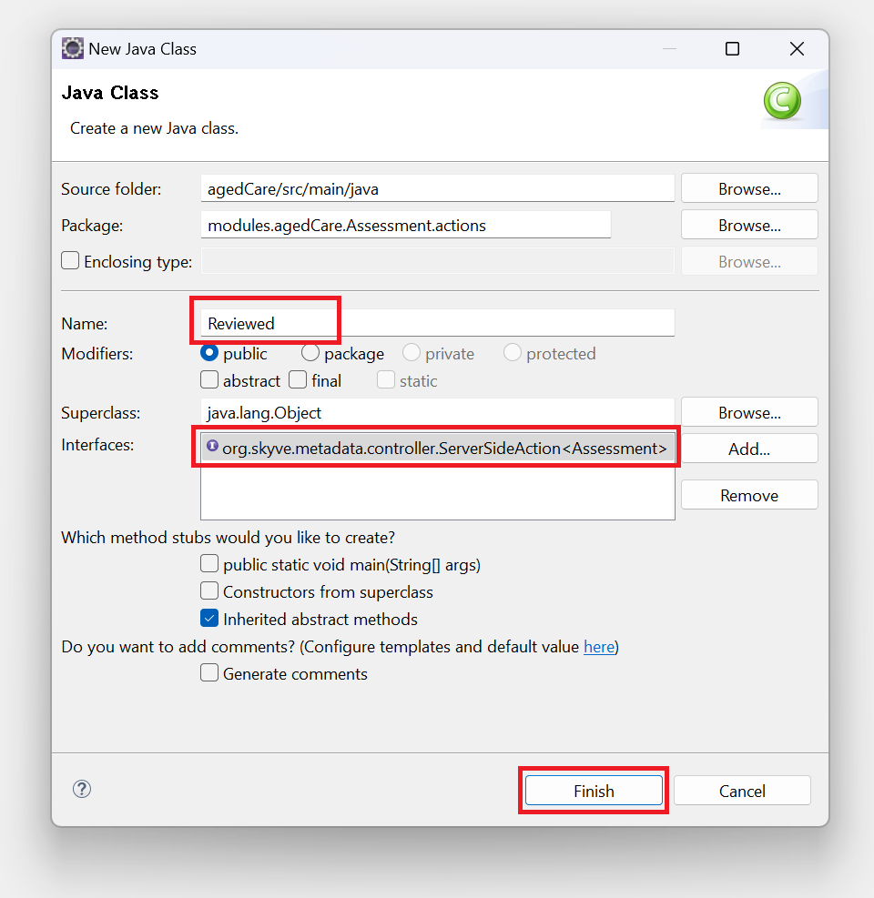
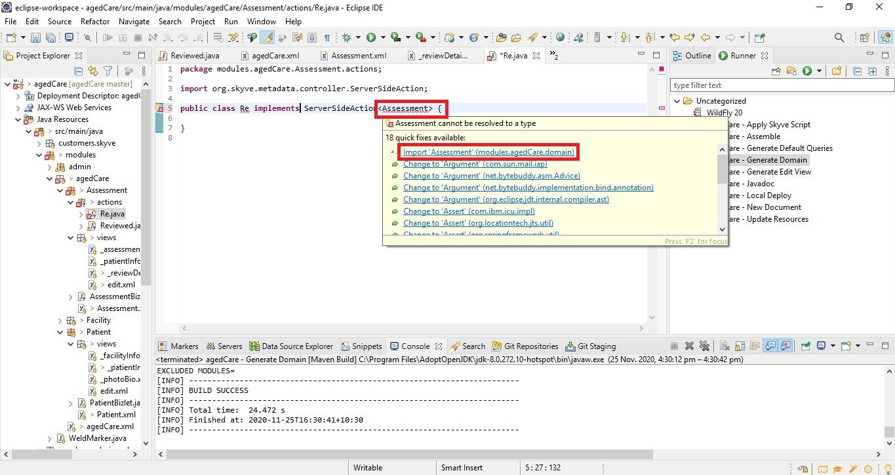
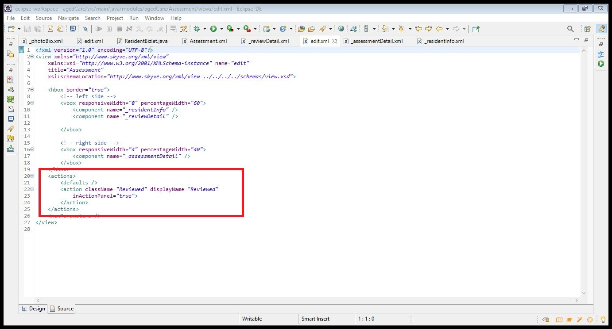
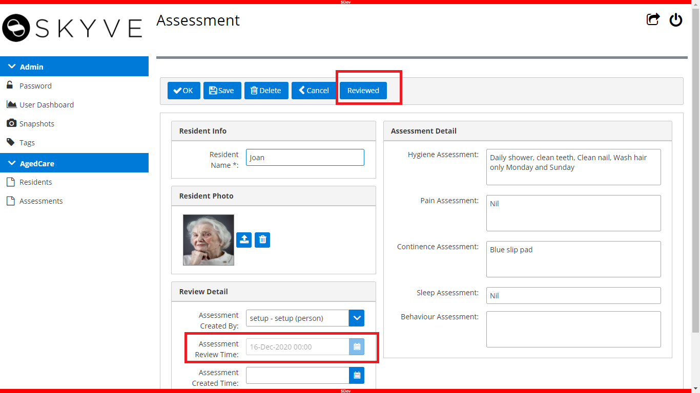

Actions represent behaviours that impact our application data. Actions can be in the form of buttons, hyperlinks or API calls. For more detail, see the developer guide [chapter on actions](https://skyvers.github.io/skyve-dev-guide/actions/).

Next, we will add an action that only a nurse can click, which sets the status of the assessment to `reviewed=true` and sets the `assessmentReviewDate`.

Firstly, we will create an action class in the actions package (within the document package) that implements `org.skyve.metadata.controller.ServerSideAction` - that is, an action that will be run on the Server (rather than in the user's browser).

1. To create an action, go to the Assessment package and create a new package called `actions`.

2. Then, under actions package, create a action class `Reviewed.java`. On the class creation form, use the Add button to choose `org.skyve.metadata.controller.ServerSideAction` as the interface class.

   

3. Adjust the imports at the top of the file for the Assessment document to `import modules.agedCare.domain.Assessment;`

   

4. Click on Add unimplemented methods

   

5. Add the code as shown below

```java
package modules.agedCare.Assessment.actions;

import org.skyve.domain.types.DateTime;
import org.skyve.metadata.controller.ServerSideAction;
import org.skyve.metadata.controller.ServerSideActionResult;
import org.skyve.web.WebContext;

import modules.admin.ModulesUtil;
import modules.agedCare1.domain.Assessment;

public class Reviewed implements ServerSideAction<Assessment> {

	private static final long serialVersionUID = -7544189610898309931L;

	@Override
	public ServerSideActionResult<Assessment> execute(Assessment bean, WebContext webContext) throws Exception {
		bean.setAssessmentReviewTime(new DateTime());
		bean.setAssessmentCreatedBy(ModulesUtil.currentAdminUser());
		return new ServerSideActionResult<>(bean);
	}
}
```


6. For the action to be available in the view, we need to declare the action in the view, as follows:

Open `edit.xml` in the `Assessment` package to add the action as shown below:

```xml
<actions>
	<defaults />
	<action className="Reviewed" displayName="Reviewed" inActionPanel="true"/>
</actions>
```



7. Next, we need to assign privileges so that only Nurses can use the action

To do this, modify the role definitions in the module (the `agedCare.xml` file).

In our document, only Nurses can review the assessments, so we can add the `action` in nurse role under `privileges` as below


To check your changes, generate domain and redeploy your application, and sign in as a Nurse user.


Congratulations, we are almost finished.

The last step is to ensure that the Assessment Reviewed Time can only be changed using the action (which is restricted to Nurse users).

To do this, modify the Resident view in `_reviewDetail.xml`, and change the `Assessment Review Time` attribute to be `enabled="false"`, like this:

```xml
<row>
   <item>
     <textField binding="assessmentReviewTime" enabled="false" />
   </item>
</row>
```

Save the changes to the view, return to your browser and refresh the screen to see the change. The Assessment Reviewed Time can now only be modified by a Nurse using the action.

You can see the Reviewed button on the top.

When you click on the Reviewed button, it sets the Assessment Review field with the current date and time.



Congratulations, you have completed the Aged Care tutorial!

In this tutorial, you learned how to:

- create a Skyve application using Skyve Foundry
- deploy your application
- configure your application for collaboration
- configure your local developer environment, build and deploy
- modify the XML metadata that defines the data, menus and roles within your application
- add custom Java code to control visibility, set values and perform action behaviours within the application.

From here, it is time for you to explore Skyve some more and try your own applications and changes. Remember you can ask questions on the [Skyve slack channel](https://join.slack.com/t/skyveframework/shared_invite/enQtNDMwNTcyNzE0NzI2LTRkMWUxZDBlZmFlMmJkMjQzYWMzYWQxMmQzYWQ1ZTdlODNkNjRlYzVhYjFmMmQ4NTlhYWY4MjNhMGVkZGNlMjY), or purchase direct assistance from Skyve specialist developers through Skyve Foundry. Check the [skyve.org](https://skyve.org/) homepage for self-help training videos and don't forget the [Developer Guide](https://skyvers.github.io/skyve-dev-guide/).

We hope that you have enjoyed this tutorial!