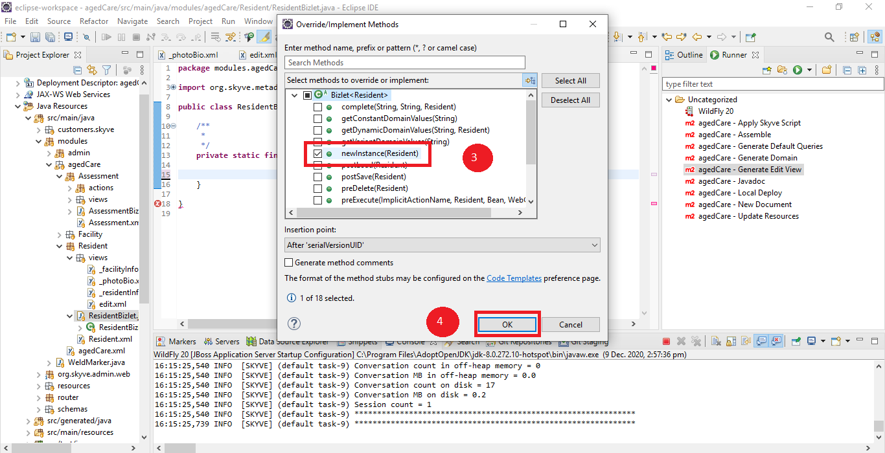
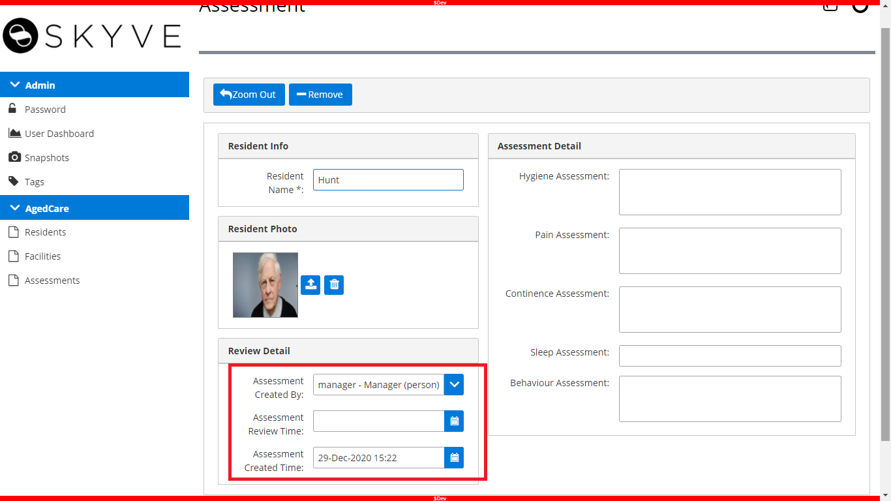
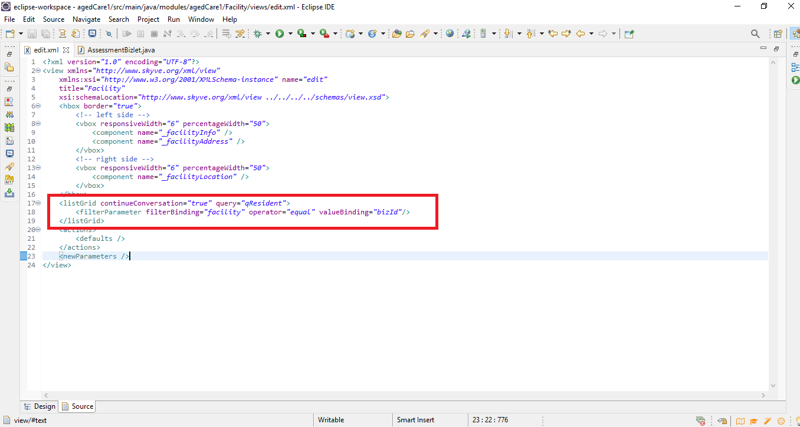

Adding business logic to the record lifecycle using a Bizlet class.

In Skyve you can add business logic using a special class called a Bizlet class. For each document, you can create a Bizlet class to extend lifecycle stages like `newInstance` (when a record is created), `preSave` (just before a record is saved), etc.

Each document package can include declarations of actions, reports, views and the associated Bizlet file. The Bizlet file contains document-specific behaviours including overrides of default action behaviours and document bean lifecycle events.

You can read more about Bizlet and Extension classes in the [bizlet chapter](https://skyvers.github.io/skyve-dev-guide/bizlets/#bizlets) of the developer guide.

### Bizlet ResidentID

First of all, let's show you how to create a Bizlet for the Resident document to customize the document behaviour. Skyve uses a naming convention to locate the Bizlet for a document, where it expects the bizlet to be named `<DocumentName>Bizlet`. So for our Resident document, we will be creating a `ResidentBizlet`.

Right-click the `Resident` package and select `New`, then select `Class` in the sub-menu.

The New Class window will appear as shown below:


To complete the creation of the ResidentBizlet class, use the "Eclipse Quick Fix suggestions" as shown below:


Now, it is time to override the `newInstance` method to set the `Resident ID` number when a new instance of a Resident record is created.

By overriding, we mean that we want our application to do all the usual things Skyve needs to do to create a record as well as some things we want specifically - in this case, assign a new ID number. Because Skyve provides a way to generate unique ID numbers, either numeric only, or alpha-numeric, we can use this to generate numbers like:
R001
R002
...
etc

To override the newInstance method:


Select newInstance from the list.



The override method is generated in the file


Add the below code in the method

```java
{
	String residentId;

	residentId = ModulesUtil.getNextDocumentNumber("R", Resident.MODULE_NAME, Resident.				DOCUMENT_NAME, Resident.residentIDPropertyName, 4);
	bean.setResidentID(residentId);

	return super.newInstance(bean);
}
```

The method `ModulesUtil.getNextDocumentNumber("R", Resident.MODULE_NAME, Resident.DOCUMENT_NAME, Resident.residentIDPropertyName, 4)`; will create a new unique number with a prefix of "R" , for Resident type records, for the Resident ID attribute, with a length of 4 characters.

Because this code is called in the newInstance() method, the ResidentID number will be assigned as soon as a new record is created.

To test, redeploy the application and click on a new record in the Resident document. We will see that the `ResidentID` is already generated.

### preSave() method of the Bizlet

In next few steps, we will see how we can use the `preSave()` Bizlet method.

In the previous step, we created a `newInstance` method. Now, I want you to change the Bizlet and use the preSave() method instead of newInstance() as follows:

- When we save the resident record, check if the residentId is null - if it is null, assign a new DocumentNumber using `modulesUtil.getNextDocumentNumber` (similar to what you did for newInstance)
- Add a condition to the Resident.xml file called `hasID` which checks if `bean.getResidentId()!=null`
- Only show the `residentID` field in the Resident view if the `hasID` condition is true

1. Modify the `ResidentBizlet.java` file and override `preSave()` (edit the ResidentBizlet.java file, go to source > override and implement method and select preSave() from list and click on OK).

   

2. Add following code in the `preSave()` method in `ResidentBizlet.java`

```java
package modules.agedCare.Resident;

import org.skyve.metadata.model.document.Bizlet;

import modules.admin.ModulesUtil;
import modules.agedCare.domain.Resident;

public class ResidentBizlet extends Bizlet<Resident> {

	private static final long serialVersionUID = 1455780144763235289L;

	public Resident newInstance(Resident bean) throws Exception {
		return super.newInstance(bean);
	}
	@Override
	public void preSave(Resident bean) throws Exception {
	    if (bean.getResidentID() == null) {
			String residentId = ModulesUtil.getNextDocumentNumber("P", Resident.MODULE_NAME, Resident.DOCUMENT_NAME, Resident.residentIDPropertyName, 4);

			bean.setResidentID(residentId);
			return;
		}
		return;
	}
}
```


3. Next, add a condition to the `Resident.xml` file called `hasID` which checks if `bean.getResident()!=null`
4. Open `Resident.xml`, and add a condition after `attributes` as shown below:

```xml

<conditions>
	<condition name="hasID">
		<expression><![CDATA[getResidentID()!=null]]></expression>
	</condition>
</conditions>
```

5. To show the `residentID` field in the Resident view if the `hasID` condition is true, open `_residentInfo.xml`

6. Then, change ResidentID field as shown below:

```xml
<row>
	<item>
		<textField disabled="true" visible="hasID" binding="residentID" />
	</item>
</row>

```

To see the changes, generate domain and deploy the application. Sign in as a manager, and add a new resident. The resident id will generate when you save all other details.


After completing the details for the Resident record, press the save button and check that the Resident ID number has been generated.


### Enhancements to the Aged Care application

In this section, we will add more functionality to the Assessment document, to automatically record the date and time that the Assessment record is created.
To do this we will:

- Add a new `dateTime` attribute to the Assessment document called `assesmentCreatedTime`
- Add a `Bizlet` for `Assessment` to set the `assesmentCreatedTime` when a new assessment is created and record the user who created the assessment
- In the `Facility` view, show a `listGrid` of `Residents` at that facility
- Add a `status` enumeration for Resident with appropriate values (current, discharged, deceased), where the default value is current

1. Add a new `dateTime` attribute to the Assessment document called `assesmentCreatedTime` - to do this, in the `Assessment.xml` file, add a new attribute as below:

```xml
<dateTime name="assessmentCreatedTime">
	<displayName>Assessment Created Time</displayName>
</dateTime>
```

Next, modify the `_reviewDetail` view component - open the `_reviewDetail.xml` file to add that attribute in a new row.

```xml
<row>
	<item>
		<default binding="assessmentCreatedTime" />
	</item>
</row>
```

Generate domain, and deploy your app to check that you can see the new field in the Assessment records.


2. Add a Bizlet for the Assessment document to automatically set the `assesmentCreatedTime` when a new assessment is created and to record the user who created the assessment. Firstly, create the `AssessmentBizlet.java` file as we did above:

- Right-click to the `Assessment` package and select New, then select Class in the sub-menu.
- Follow the Quick Fix suggestions to resolve errors in `AssessmentBizlet.java` file and import all the packages.
- Override the `newInstance` method. (Click on source > override and implement method. Choose newInstance from the list and Eclipse will generate the newInstance method and override notation for us.)
  Then, update the method as shown below:

```java
package modules.agedCare.Assessment;

import org.skyve.domain.types.DateTime;
import org.skyve.metadata.model.document.Bizlet;

import modules.admin.ModulesUtil;
import modules.agedCare1.domain.Assessment;

public class AssessmentBizlet extends Bizlet<Assessment> {

	private static final long serialVersionUID = 3621162734311172527L;

	@Override
	public Assessment newInstance(Assessment bean) throws Exception {
		bean.setAssessmentCreatedTime(new DateTime());
		bean.setAssessmentCreatedBy(ModulesUtil.currentAdminUser());
		return super.newInstance(bean);
	}
}
```

Generate domain and deploy the application to see the changes.

So, now we have the `Assessment Created Time` and `Assessment Created By` in the Assessment document as shown:



3. Next we want to change the Facility view to show a list of all the Residents associated with the Facility.

In Skyve, we can use a listGrid as follows: (you can read more about the listGrid widget here - https://skyvers.github.io/skyve-dev-guide/views/#listgrid-example)

Go to the `Facility` package and open the `edit.xml` to add a listGrid as below

```xml
<listGrid continueConversation="true" query="qResident">
	<filterParameter filterBinding="facility" operator="equal"valueBinding="bizId" />
</listGrid>
```



Generate domain to check the result.


4. Next we will modify our application to record a status for each Resident.

To do this, we will add a enumeration called `residentStatus` to the Resident document, with values (current, discharged, deceased), where the default value is current.

Open the `Resident.xml` and add this code in `<attributes>`

```xml
<enum name="residentStatus">
	<displayName>Resident Status</displayName>
	<defaultValue>current</defaultValue>
	<values>
		<value code="Current" />
		<value code="Discharged" />
		<value code="Deceased" />
	</values>
</enum>
```

Next, open `_residentInfo.xml` and add a row:

```xml
<row>
	<item>
		<default binding="residentStatus" />
	</item>
</row>
```

Generate domain, and deploy the app again. You can see the new field in Assessment, `Resident Status`.


Continue to [Actions]({{ site.url }}{{ site.baseurl }}ch4-actions/)