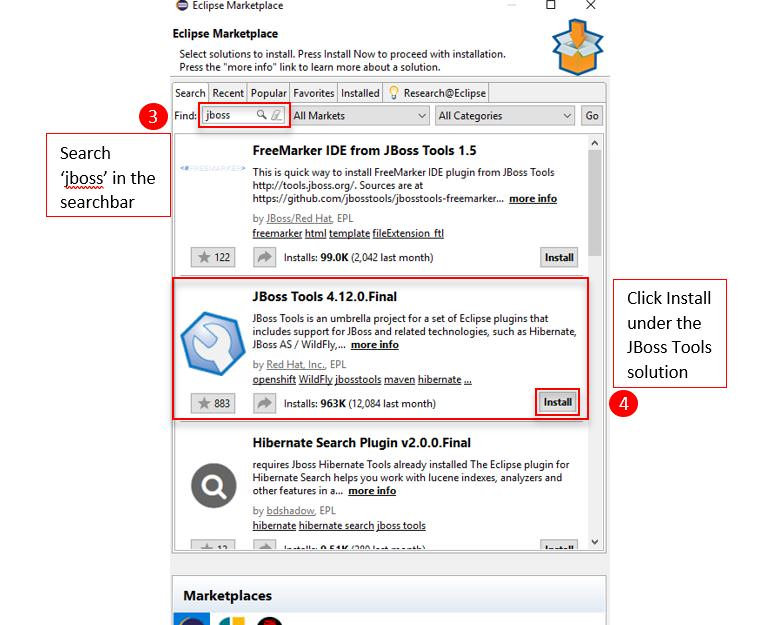
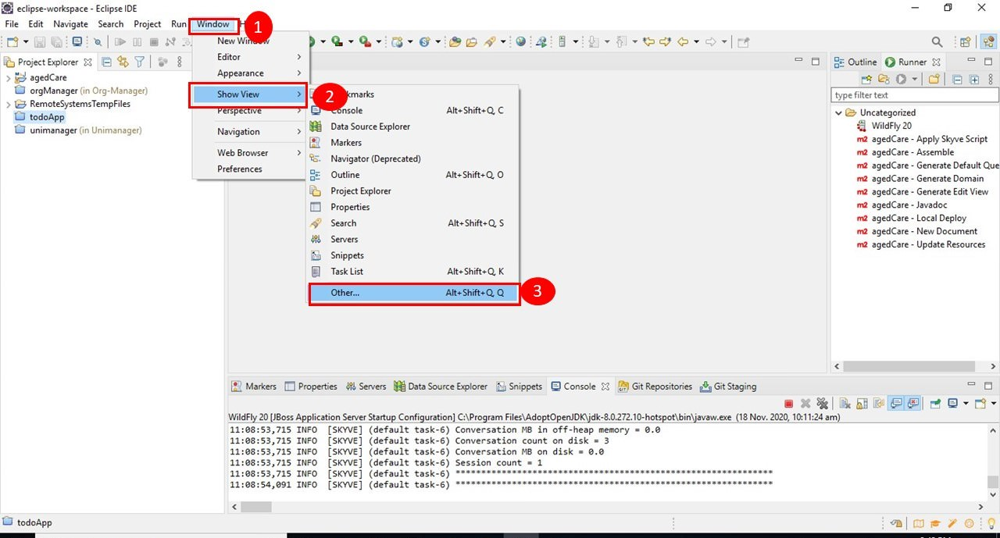
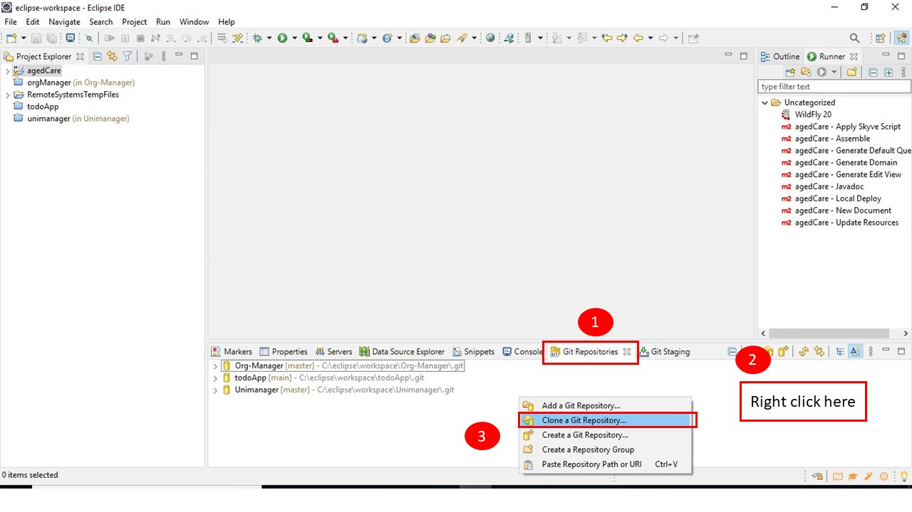
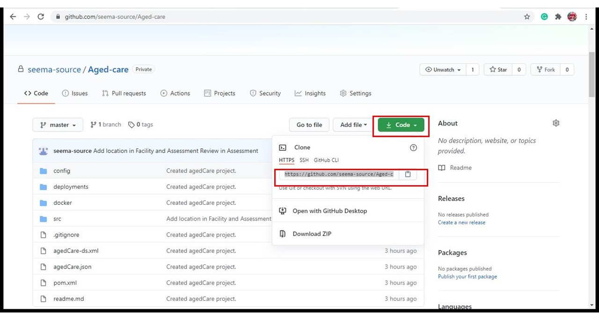
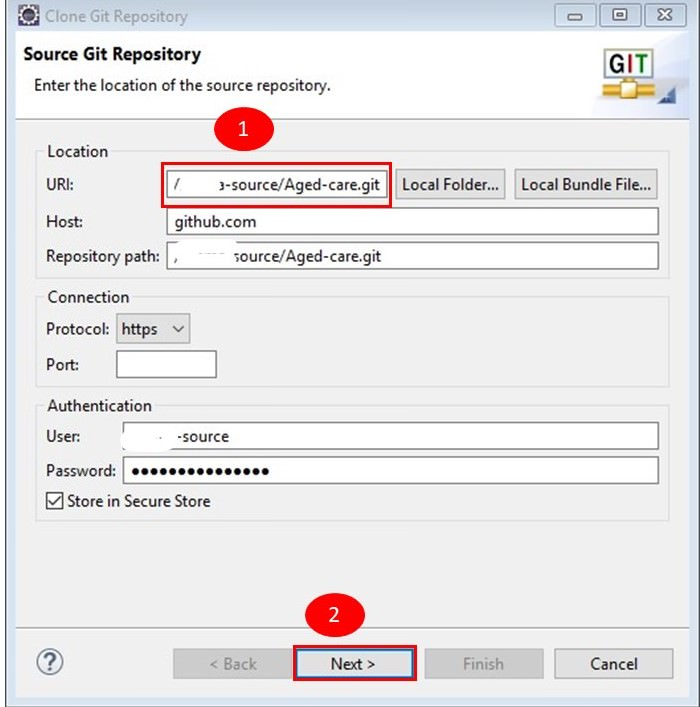
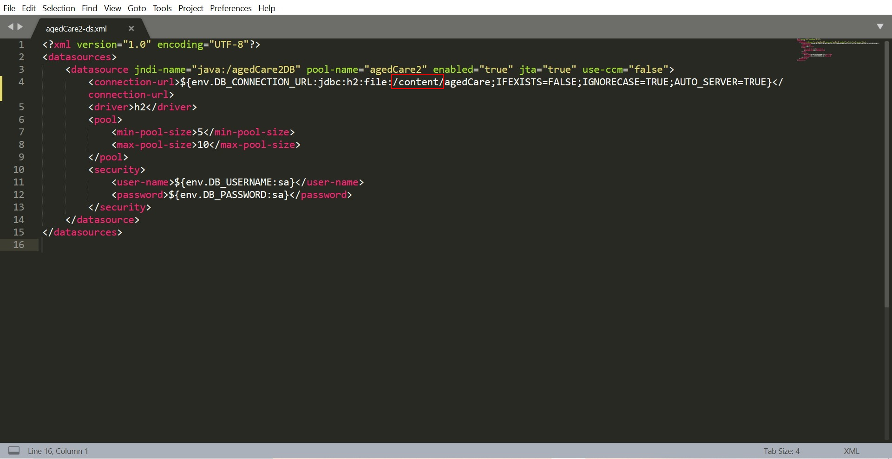
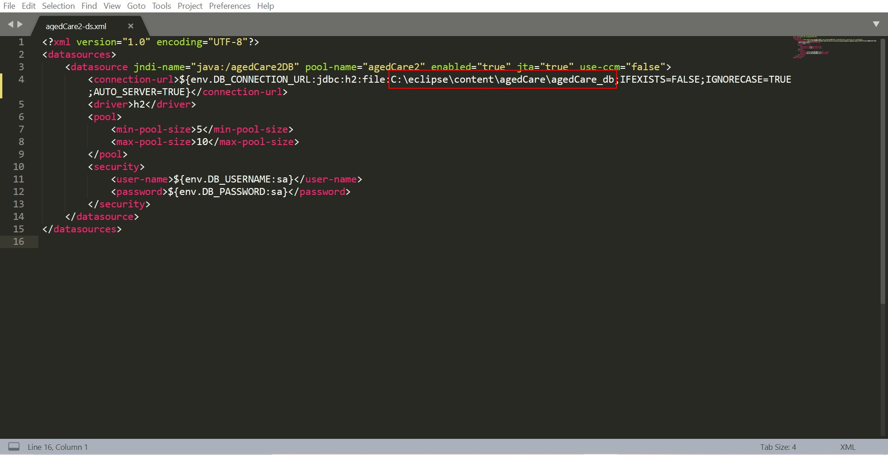
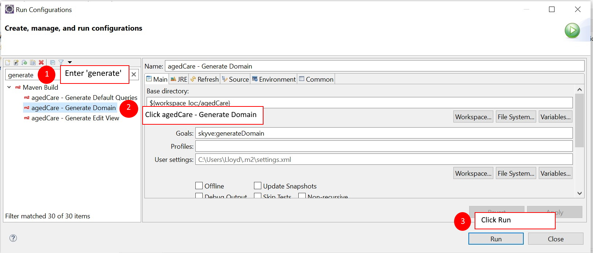
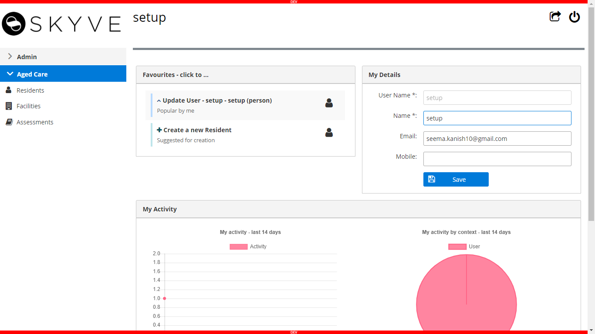

In this section, we will work on setting the project up for collaboration, and configure the local environment. After this, we will edit some XML files, which will change the lists, views, and layout of our application. This step will enable us to test and deploy our application locally on our own (or another) machine.

For more information, visit our [Dev Guide](https://skyvers.github.io/skyve-dev-guide/) - which will help you learn and understand about our development. It also covers most [Skyve Framework](https://skyve.org) elements and concepts. In addition, there are many real examples for you to refer to.

## 3.1. Collaboration

Next, we need to set our application up for collaboration using GitHub.

Why do we need collaboration?

Collaboration will allow another user of your team to edit your application or between [Foundry](https://foundry.skyve.org/foundry/) users and developer. So, to enable collaboration, we need to provide our application with a remote endpoint of a new Git repository.

To find out more details on collaboration, go to the [Help button](https://Foundry.skyve.org/Foundry/loggedIn.jsp?a=e&m=Foundry&d=Help) in the top right of the Foundry page, and follow the steps for collaboration.

### Setup for GitHub

To enable collaboration, firstly sign up or log into a [GitHub](https://github.com/) account.
To create a new repository, follow the steps below:

- Click on the Add button on the top right side to create a new repository

  

- Next, enter the name of the repository, make it private, and click on create

  

- After the repository has been created, you will see the link as shown below. Copy this link.

  

- Next, go to [Foundry](https://foundry.skyve.org/foundry/), open the collaborate tab and paste the link in Remote Endpoint

- Click on Apply
- Click on Save

  

- Then, go to the collaborate tab of your application, describe the changes with a comment, and click on the "commit and push" button

  (Note: "Commit" will put your changes into your local repository and "Push" sends those changes to  the remote location)

  

- Next, check your project in GitHub

- Go to GitHub and open the repository to see all the files

  

You have now successfully created your application and configured it for collaboration!

## 3.2. Configure your Local Environment

For this section, we have chosen to show how to use Eclipse as the development environment, however, if you prefer, you can use other development environment tools such as IntelliJ, NetBeans, Visual Studio Code, etc. However, if you're not completely familiar with these, use Eclipse so that you can follow the steps below.

Before you can import the project into Eclipse, you need to download and install Eclipse in your system.

### Download and Install Eclipse and JDK

#### Download and Install Eclipse

  - Click here to [Download Eclipse](https://www.eclipse.org/downloads/packages/)
  - Next, Click on [Eclipse IDE for Enterprise Java Developers](https://www.eclipse.org/downloads/packages/release/2020-09/r/eclipse-ide-enterprise-java-developers)

  

  - Click on download
  - Then, install Eclipse in your system

#### Download and Install JDK

  - Install an OpenJDK 11 version from [AdoptOpenJDK](https://adoptopenjdk.net/installation.html?variant=openjdk11&jvmVariant=hotspot#x86-32_win-jdk) (or an alternative OpenJDK of your choice)

## 3.3. Install and Configure Wildfly Server

We need an application server to be able to access the application through our browser. For this we will demonstrate using Red Hat's Wildfly application server plugin. Skyve apps can be deployed on recent versions of Wildfly (10-20).

### Install Wildfly Server

You can skip this step if WildFly Server is already installed on your system.

Before installing WildFly Server, make sure JBoss Tools is installed on your system.

To install JBoss Tools, click on Help, then click Eclipse Marketplace.

In the search bar, enter 'jboss', then search.

Select the JBoss Tools version that the search returns, and click Install.

Select the list as shown below

To check if JBoss Tools is installed properly, click on Help, then click Eclipse Marketplace.

Change to the `Installed` tab.

If the JBoss Tools plugin is present, you are ready to continue.

After JBoss Tools is installed properly, follow these steps to install WildFly Server.

1. Once Eclipse is opened, right-click under the Project Explorer tab and highlight New, then from the pop-out, click on Other

   
   
2. Enter text `server` in the `type filter text` field, select `Server` and click the Next button.

   

2. Select the WildFly version you wish to work with and click Next

   

3. Click Next again

   

4. Click on the Download and install runtime link

   

5. Select the latest version of WildFly, then click Next

   

6. Once you have read the terms of the licence agreement, check the box to accept the terms, and click Next

   

7.  Finally, select the path for where you wish your download and install locations to be found, then click Finish to complete the installation

    

    

8.  Wait for Eclipse to complete the download and installation process before moving on to the next step

    

## 3.4. Add Repository in Eclipse

After download and installation of Eclipse and the server, the next step is to add our repository to Eclipse.

1. Open Eclipse in your system
2. Click on the Window tab and click on Show View, then Other

   

3. Select Git Repositories and click on open

   

4. Click on Git Repositories in the bottom area of eclipse, right click and select "Clone a Git Repository"...

   

5. Get URL from GitHub by going to GitHub and click on Code button.

   

6. Copy that link, paste in the Clone window, and click on Next

   

7. Click on Next again

   

8. Choose the directory where you want to put your project and Click on Finish

   

In Git Repositories, we can see our repository is added now!

## 3.5. Import Project

As we have already created a project in Skyve [Foundry](https://foundry.skyve.org/foundry/), now it is time to import that project into Eclipse to complete changes in the Aged Care app. To import the project in Eclipse, follow the steps below:

1. Click on File tab in Eclipse and Select import

   

2. Select Existing Maven Project from list and click on Next

   

3. Set your root directory (the folder where you cloned your Git repository to in the previous section) and click on Finish

   

You can see your project in the Project Explorer area in Eclipse.

## 3.6. Set the server

To run our project on the server, we need to set Server in Eclipse first.

1. Click on Server tab in Eclipse and right click

   

2. Click on Add and Remove and then Finish

   

## 3.7 Configure and Deploy the Skyve Project

### Deploy your Skyve project

Once the Wildfly Server is configured, it's easy to deploy your Skyve project to your WildFly Server.

1. Open the WildFly deployments folder by right-clicking on the server and clicking on Show In, then clicking on File Browser

   

2. Copy the agedCare.json and agedCare-ds.xml and paste in the WildFly deployments folder that you opened in the previous step.

   

Skyve applications can store images and other types of rich content. To do this, Skyve needs to have full access to a folder to store and manage content.
You need to create a dedicated folder for Skyve to do this. The content folder can be located anywhere and named whatever you like, however it is easiest to place it inside your eclipse folder and name it something simple like `content`.

3. Create a folder named `content` inside your eclipse folder

4. Open the File window and browse to the content folder (which is in your root folder) and create new folder named `agedCare`.

   

5. Open the agedCare.json file in your preferred text editor.

Go to the `content` section and modify the `directory` setting to tell Skyve where the content folder is located.
Note that you must not use backslashes even if you are running on Windows - and the folder path must be terminated with a slash
e.g. `directory: "C:/eclipse/content/",`

Go to the bottom of the file to change the identifier.

If you want to change the username and password, you can change in the bootstrap section. However, in this app it is not changed.

Lastly, save and close the file.

5. Open agedCare-ds.xml file in the text editor

   

   Go to connection-url and replace `/content/agedCare` with the content folder address, and save the file.

   

### Run your Aged Care application

Part of Skyve's low-code approach is to generate Java code for you (in the background) so that you don't have to write large amounts of Java code. We call this step `Generate Domain` because Java classes will be created representing the `domain` (the `problem domain` or `area of knowledge`) of your project. The domain classes are Java classes that do the work of managing data access and storage for your application.

Generate domain validates and compiles the metadata (XML files) in your project and checks that the application domain is in a valid state. Errors for the developer to fix are written to your console, and if generation is successful, the domain will be compiled to produce Java domain files and unit tests.

To run the `Generate Domain` command, follow the steps below:
- Click the Run tab, then click Run Configurations.

- Enter the text `generate` in the `type filter` search field, click the option `agedCare - Generate Domain`, then click Run.

- Right click the server and click the Start button to start the server.

When your Console Window shows text similar to that shown below, your agedCare app has been deployed and is running on your localhost server (your local machine).

If not, you may try to debug by yourself to find the source of the problem, or [Join Us On Slack](https://join.slack.com/t/skyveframework/shared_invite/enQtNDMwNTcyNzE0NzI2LWNjMTBlMTMzNTA4YzBlMzFhYzE0ZmRhOWIzMWViODY4ZTE1N2QzYWM1MTdlMTliNDIyYTBkOWZhZDAxOGQyYjQ) and ask any questions there. You will receive support from the [Skyve](https://skyve.org) team or a community team member.

Access the Aged Care app from your Web Browser at http://localhost:8080/agedCare. Sign in using the default username "setup" and password "setup".

Continue to [3.8 List Views]({{ site.url }}{{ site.baseurl }}ch3-list-views/)