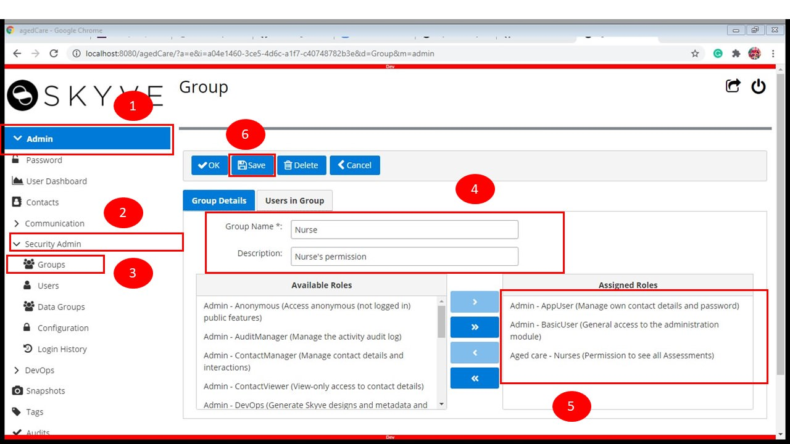
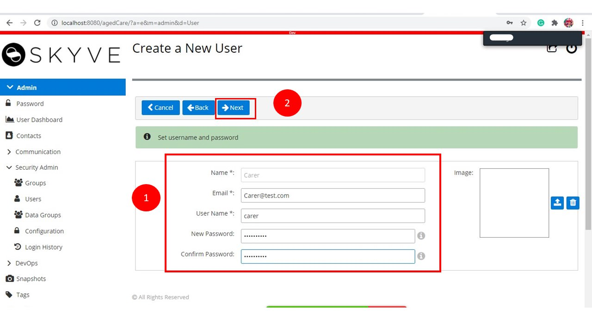
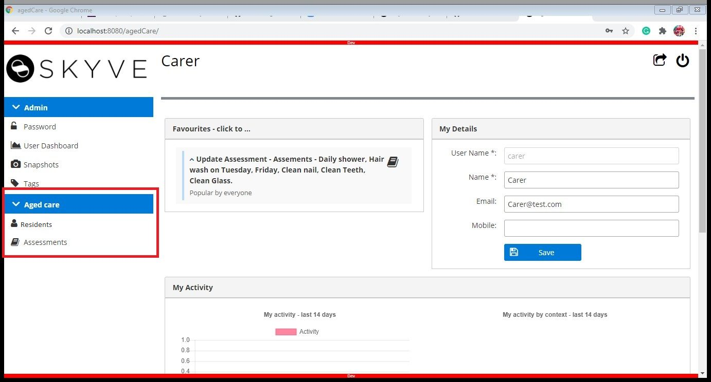

It's now time to create Groups and Users in the application.

In most applications, there are usually groups of users who have similar permissions, e.g. Staff and Client. This approach allows you to assign access based on the kinds of roles users might perform in the application. The `admin` module that Skyve provides includes a security group concept as well as a user administration function. For more details, see the [User Guide](https://skyvers.github.io/skyve-user-guide/users/) section on adding Users and Groups.

For our application, we will create groups for Carer, Nurse and Manager:

* A Carer is someone who can see all Residents' information and do a few assessments for them.
* A Nurse is qualified to distribute and complete an Assessment review.
* A Manager has access to all information and can also manage user access.

Go to the application and create groups for carer, nurse, and manager, following the steps below:

Open `Admin`>`Security Admin`>`Groups`

1. Create a group for the Carer as shown below:

   

2. Create a group for the Manager as shown below:

   

3. Createa  group for the Nurse as shown below:

   

Next, create a User for the Carer, Manager and Nurse groups.

Go to the application, Open `Admin`>`Security Admin`>`Users`

1. Create Users for Carer by entering a Full name and Email

2. Click on New Contact

   

3. Set User Name and password

   

4. Click on Existing group, select carer, and add to Assigned Group

   

5. Click on Save

Next, create a User for each the Manager and Nurse groups in the same way as we created a User for the Carer group in the previous steps.

Once you have created users for each role, it is time to test to make sure that they can do what they need within the application. For each user type, make sure you are signed out of the application, then sign in as that user.

First, let's test the Carer user.

As you can see, a Carer can access Resident and Assessment data in the Aged care module. This is because the menu items for Resident and Assessment were assigned permissions for Carer and Nurse in the agedCare.xml file. However, access to the Facility menu item is only assigned to the Manager role.

The Carer dashboard is shown below:

You should also check that the Nurse and Manager users can access what they need by correctly signing in as those users.

Continue to [Conditions]({{ site.url }}{{ site.baseurl }}ch4-conditions/)