# Aged care Application Tutorial

### Contents

- [1. Tutorial Overview ](https://github.com/seema-source/Aged-care/blob/master/readme.md#1-is-this-tutorial-right-for-me-)
- [2. Aged care App Overview](https://github.com/seema-source/Aged-care#2-aged-care-app-overview)
  - [Functionality overview](https://github.com/seema-source/Aged-care/blob/master/readme.md#functionality-overview)
  - [Low code App using Skyve Foundry](https://github.com/seema-source/Aged-care/blob/master/readme.md#low-code-app-using-skyve-foundry)
  - [Low-code Extensions](https://github.com/seema-source/Aged-care/blob/master/readme.md#low-code-extensions)
- [3. No-code Development](https://github.com/seema-source/Aged-care/blob/master/readme.md#3-no-code-development)
  - [1. Getting Started](https://github.com/seema-source/Aged-care/blob/master/readme.md#1-getting-started)
  - [2. Create](https://github.com/seema-source/Aged-care/blob/master/readme.md#2-create)
  - [3. Collaboration](https://github.com/seema-source/Aged-care/blob/master/readme.md#3-collaboration)
- [4. Low-code Extensions](https://github.com/seema-source/Aged-care#4-low-code-extension)

  - [4.1 Configure local environment](https://github.com/seema-source/Aged-care#41-configure-your-local-environment)

    - [Download and Install Eclipse and JDK](https://github.com/seema-source/Aged-care#download-and-install-eclipse-and-jdk)

      - [Download and Install Eclipse](https://github.com/seema-source/Aged-care#download-and-install-eclipse)

      - [Download and Install JDK](https://github.com/seema-source/Aged-care#download-and-install-jdk)

  - [4.2 Install and Configue Wildfly Server](https://github.com/seema-source/Aged-care#42-install-and-configue-wildfly-server)

    - [Install Wildfly Server](https://github.com/seema-source/Aged-care#install-wildfly-server)

  - [4.3 Add Repository in Eclipse](https://github.com/seema-source/Aged-care#43-add-repository-in-eclipse)
  - [4.4 Import Project](https://github.com/seema-source/Aged-care#44-import-project)

  - [4.5 Set the server](https://github.com/seema-source/Aged-care#45-set-the-server)
  - [4.6 Deploy and Configure Skyve Project](https://github.com/seema-source/Aged-care#46-deploy-and-configure-skyve-project)
  - [4.7 List Views](https://github.com/seema-source/Aged-care#47-list-views)
    - [Resident List](https://github.com/seema-source/Aged-care#resident-list)
    - [Facility List](https://github.com/seema-source/Aged-care#facility-list)
    - [Assessments List](https://github.com/seema-source/Aged-care#assessments-list)
  - [4.8 Edit Views, Layout, and Components](https://github.com/seema-source/Aged-care#48-edit-views-layout-and-components)
    - [Resident Edit view](https://github.com/seema-source/Aged-care#resident-edit-view)
    - [Facility Edit view](https://github.com/seema-source/Aged-care#facility-edit-view)
    - [Assessment Edit view](https://github.com/seema-source/Aged-care#assessment-edit-view)
  - [4.9 Roles](https://github.com/seema-source/Aged-care#49-roles)

- [5. Java Extensions](https://github.com/seema-source/Aged-care#5-java-extension)

  - [Conditions](https://github.com/seema-source/Aged-care#conditions)
  - [Bizlets](https://github.com/seema-source/Aged-care#bizlets)
  - [Actions](https://github.com/seema-source/Aged-care#actions)
    Is This Tutorial Right For Me ?

# 1. Tutorial Overview

### 1.1.

Before we start the tutorial, it is important to know about the answers to a few questions as below:

##### Will I benefit from it ?

If a custom app is what you need, the potential benefits of the Skyve system are significant.
You can develop your own powerful app, quickly and cheaply, with a dramatically reduced learning curve.
This tutorial will help you work out what can be achieved. You’ll also find out whether you’re personally up to the challenge (tip: you probably are).

##### Do I have enough skills ?

This tutorial has been designed to cater to people with a wide variety of skill levels.

We’ve split it into 3 sections:

- The first section is for everyone and requires no coding skills – we lead you through building a sample app using only “point and click” !

- Those with basic coding skills (or who are willing to learn some) can progress to the second section and extend their app

- Those with more advanced Java coding skills can progress from there on to the third section and extend their app even further
  So even if “point and click” is all you can manage and you’re allergic to any sort of ‘coding’, this tutorial is still for you ! It’ll help you get a ‘no-code’ Skyve app with a simple but functional interface, up and running in no time.

In this tutorial, we will show you how easy it is to build a powerful application using the Skyve Enterprise Application platform.

To familiarise you with Skyve application development, we will build a simple application together to manage aged care facilities, their residents, and care assessments.

### 1.2. Aged Care Management

A typical aged care provider might manage multiple facilities, each housing many residents. Residents are regularly assessed to ensure that they are well and safe, and that their care matches their needs.

Care providers must record the personal details of each resident and where they are located. They must also retain records care assessments for each resident both to facilitate regualar activities and to satisfy audit requirements.

Our app will meet these record storage and retrieval needs for an (imaginary!) aged care provider.

### 1.3. No-code Development

In the first main section of our tutorial, we will lead you through the no-code development of our Aged Care app.

No-code application development means developing an app using only a point-and-click interface - in this case Skyve Foundry.

In Foundry, you will use a point-and-click interface to define:

- ‘documents’ representing facilities, residents, and assessments
- data ‘attributes’ that need to be recorded for each different document type
- relationships between different types of documents (e.g. each resident belongs to one facility; each resident has many assessments)

Behind the scenes and hidden from sight, Foundry takes care of all the ‘coding’ for you. It builds the app to your specifications and will even deploy it to a web-server and run it for you, so that you can immediately use it.

At the end of this section of the tutorial, you’ll have a functioning, usable Aged Care app up and running. At that point, you may decide that Foundry provides everything you need to build your app, in which case you could stop here and leave the tutorial.

Or, if you have some basic coding skills or you’re willing to acquire them, we’d encourage you to move on to the ‘Low-code Extensions’ section which will show you how to enhance your app in ways that are beyond the scope of Foundry.

### 1.4. Low-code Extension

In the second main section of the tutorial, we will lead you through the addition of some low-code enhancements to the same Aged Care app that we just developed using Foundry in the previous section.

When you create a no-code app using the Foundry point-and-click interface, Foundry automatically converts your app definition into a suite of Skyve low-code XML (eXtensible Markup Language) files. In Foundry, these are hidden away and no-code users never need to interact with them directly.

In this section of the tutorial, you will export your Aged Care app out of Foundry and access it using an IDE (Integrated Development Environment – a developer’s coding toolkit) located on your own computer. This will allow you to manipulate the Skyve XML code directly, opening up an even broader range of functionality options to you.

Why do we call this ‘low-code’ ?

Web-based applications are typically written in Java or a similarly complex and powerful programming language. Indeed, Skyve itself uses Java - Skyve apps are automatically converted from Skyve XML into Java during the build process so that they can be deployed to a web server and run.

By contrast, the Skyve XML language is a dramatically simpler language – it allows you to select from a wide array of common application functions and configure them quite specifically to your needs. For Skyve users who need or want to go beyond the capabilities of Foundry, Skyve XML typically allows them to avoid the steep learning curve required to learn Java and the long development times required to write native Java apps.

So, using Skyve XML is still coding. But in contrast to coding in Java or a similar web-based language, it’s a great deal simpler, easier, faster and far more succinct. Hence, ‘low-code’. Furthermore, even when you do need to add code to extend a Skyve app, Skyve provides high level APIs to common Java frameworks, meaning that your code will be simpler and more succinct than usual.

In this section of the tutorial,we will focus on building in some user interface enhancements to our Aged Care app that are not possible (yet!) using the Foundry point-and-click interface. We will edit and change the layouts of the Resident, Assessment, and Facility documents.

At the end of this section of the tutorial, you’ll have a significantly enhanced AgedCare app up and running, as well as a very broad palette of rapid application development capabilities at your fingertips with Skyve XML.

### 1.5. Java Extensions

While Skyve XML is already very powerful (and constantly growing) and covers a huge range of common functionality needs, there remain some bespoke requirements that cannot be met through Skyve XML alone. For those situations, Java extensions are the answer.

The Skyve platform provides an extensive system of programming hooks that enable you to develop discrete Java methods and graft them into your Skyve XML app, where they can leverage the full functionality of the Skyve system to provide you with the bespoke functionality you need.

If you don't have Java coding skills yourself, your simplest and cheapest option might be to buy support hours from one of our expert developers - you can do this within your Account in Skyve Foundry.

If you already have some Java skills, however, you can do this yourself ! In the third main section of the tutorial, we will lead you through the development of some Java enhancements to your AgedCare app.

Specifically, we will add some Java-code conditions and actions into our app to restrict, in a very granular and specific way, which users can access particular assessments relating to particular residents.

At the end of this section of the tutorial, you’ll have a further-enhanced AgedCare app up and running. More significantly, though, you’ll be able to combine your powerful new Skyve app development capabilities with your existing Java skills to create no-limits applications far faster than you could ever do with Java alone.

# 2. No-code Development

In this section, we will go through the development of the Aged care application and will cover information about the Skyve platform and Skyve foundry in detail.

This section also covers how to create and add different documents: Resident, Assessments, and Facility in the Aged care application and how to deploy an application in foundry.

### 2.1. Getting Started

Before continuing with our tutorial, there are some pages you may want to visit:

- [What is Skyve?](https://skyve.org/what-is-skyve) - Skyve is a framework used to build attractive, secure, and scalable application with rich features and mobility. For more detail what [Skyve](https://skyve.org) is, and how it will be useful in your Enterprise Application Development visit our [Skyve](https://skyve.org/) page.

- [Getting Started](https://skyve.org/getting-started) - Will help give you some ideas on how to start with our [Skyve](https://skyve.org) Framework.

- [Skyve foundry](https://foundry.skyve.org/)-Will help you to start developing your application and also give [Demo](https://youtu.be/7oynha0tFmw) about how to use skyve foundry.

Now, lets move to the next step how to create application with [Skyve foundry](https://foundry.skyve.org/)

### 2.2. Create your app in Foundry

To create a new [Skyve](https://skyve.org) Project, you can go to the [Skyve foundry](https://foundry.skyve.org/) and [Get started](https://foundry.skyve.org/foundry/register.xhtml) to register your account and if you are already register Sign in with your register email and password.

To create a new skyve project through foundry go to the [How to get started](https://youtu.be/G3OQu5PeUn8) on the top right-hand side of skyve foundry page and watch the video for more information about how to create new application.

Now, I will take you step by step creation of application:

- Click on the Add button

  

- Enter the name of App and email address

  

- Click on save, after that start build Data Design

#### About Data design:

_*Documents:*_ In data design, documents are related to the real business entities (e.g.resident, facility, assessment). For more details about documents click on this link https://skyvers.github.io/skyve-dev-guide/concepts/

_*Attributes:*_ Attributes contain information about each document (e.g. Resident's document attributes : name, id, photo, bio etc.). Attributes can have different data types and different view.

_*Data type:*_ Data type specifies which type of value an attribute name hold.

- Text or String: Used for a combination of any characters that appear on a keyboard, such as letters, numbers and symbols.

- Memo: Memo data type also called "Long Text". It is used to store large amount of text.

- Date: A Date includes the time, the year, the name of the day of the week, and the time zone.

- Image: Image data type is used where we want to upload an image in our document.

- Integer: It is used to store the numeric values.

- Association: This data type is used where there is a relationship between two entity object based on common attributes. An entity object only needs an association to access the data of another entity object.

In this tutorial we have three documents:

#### 1. Define Resident Document and it's attributes:

The resident document will contain the personal information about the residents and the information about the facility they admitted.

Resident document contain attributes below:

| Attribute name | Data Type   | Length |
| -------------- | ----------- | ------ |
| ResidentID     | Text        | 100    |
| Resident Name  | Text        | 500    |
| Photo          | Image       |
| DOB            | Date        |
| Room Number    | Integer     |
| BIO            | Memo        |
| Admission Date | Date        |
| Facility Name  | Association |

Now, we will create a Resident document and add attributes in Resident document in next few steps.

- Click on Data Design to add the Documents

  

- Add all information as shown below and click on Zoom out

  

- You can see your document on screen.

- Next, create documents for Facility and Assessments same as resident and click on arrow to add attributes for each document

  

- Click on Add button to add attributes to resident document

  

- Add all the attributes for Resident document as below

  

#### 2. Define Facility Document and it's attributes:

The Facility document will contain information about the facility(e.g.facility name, facility manager), facility full address and location.

The attributes for Facility document as below:

| Attribute name   | Data Type   | Length |
| ---------------- | ----------- | ------ |
| Facility Name    | Text        | 500    |
| Building Number  | Integer     |
| Street Name      | Text        | 500    |
| Suburb           | Text        | 500    |
| State            | Text        | 100    |
| Facility manager | Association |

This document will follow the same steps we followed for Resident document. It will look like as below:


#### 3. Define Assessments Document and it's attributes:

The Assessment document will contain information about all the care assessments related to each resident.

The attributes for Assessments document as below:

| Attribute name        | Data Type   | Length |
| --------------------- | ----------- | ------ |
| Hygiene Assessment    | Memo        |
| Pain Assessment       | Memo        |
| Continence Assessment | Memo        |
| Sleep Assessment      | Text        | 600    |
| Behaviour Assessment  | Memo        |
| Staff                 | Association |

Follow the same steps like Resident and Assessment documents. Assessment document look like as below.


### 2.3. Deploying your Aged care app

Our Aged care application is almost ready, now the next step is to deploying our application to check how it look like. (Note: If you are using a free trail version, you can only deploy your application for an hours. To use the free version for another hour you need to redeploy it).

There are following steps to deploy Aged care application as we created in foundry:

1. Go to foundry and click on Aged care application

   

2. Click on Deloy tab and then click on Deploy, usually it take 2 minutes to deploy your application

3. Next, click on the deploy link

   

4. Log in with user "setup" and password which you initialised during deployment


### 2.4. Using your Aged care app

Your application is ready to go. See below how it look like...

Click on Aged care


Click on Facility and then add button


Enter the detail of facility in the fields and click on "Ok" or "Save" button.

**Ok button:** This button performs Save and Close action on cliked. This will save the changes and return you in previous page.

**Save button:** This button will save any changes you perform in the current page when you click on it.

So, press Ok or Save as you go.


Next, click on Assessments


Add data in Assessments


#### Desktop Mode

Skyve provides two seprate user interface: Normal mode and power user mode. In normal mode, the interface is responsive and mobile and tablet friendly where as the power user mode is great for desktop browsers.

To switch between interface click on the switch icon on the top-right of the application screen.

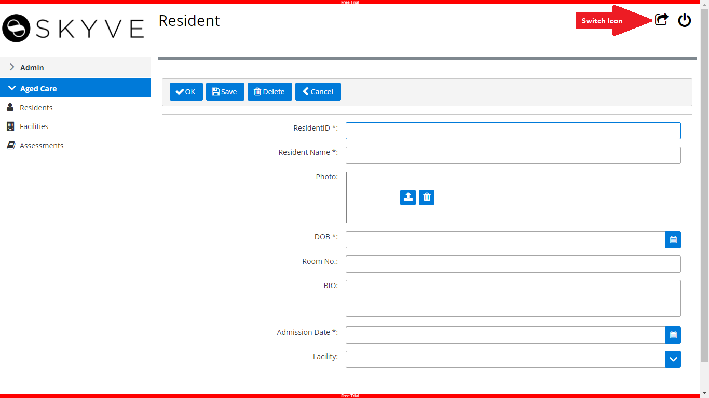

After clicking


#### Making Changes and Re-Deploying

The Skyve free trial server will automatically undeploy your project after one hour - but you can redeploy your application as many times as you need during your testing and your data is saved while the project is offline.

# 3. Low Code Extension

As we already explained about the low code extension at the beginning of the tutorial.

In this section, we will work on collaboration and configuration of the local environment. After that, we will do some editing in the XML files, which will change the lists, views, and layout of our application. So, this step will enable us to test and deploy our application locally on our own (or another machine).

For more detail visit our [Dev Guide](https://skyvers.github.io/skyve-dev-guide/) - which will help you learn and understand about our development. It also covers most [Skyve Framework](https://skyve.org) elements and concepts. There are many real examples for you to refer to also.

### 3.1. Collaboration

Next, we need to Collaborate our application with Github.

Why we need collaboration?

Collaboration will allow another user of your team to do editing in your application or between foundry users and developer. So, to do collaboration we need to provide our application with a remote endpoint of new Git repository.

To find the more detail how to collaborate Go to [Help button](https://foundry.skyve.org/foundry/loggedIn.jsp?a=e&m=foundry&d=Help) top right of the screen Foundry Help, and follow the steps for collaboration.


#### Setup to Github

To enable the collaboration, first of all Sign up or log into [Github](https://github.com/) account.
To create a new repository follow the steps below:

- Click on the Add button on the top right side to create the new repository

  

- Next, enter the name of the repository, make it private, and click on create

  

- After creating repository, you will see the link as shown below, copy the link

  

- Next, go to foundry, open the collaborate tab and paste the link in Remote Endpoint

- Click on apply
- Click on Save

  

- Then, Go to collaborate tab of your application and describe changes with comment, click on commit and push button

  (Note: "Commit will put your changes into your local repo and "Push" sends that changes to remote location)

  

- Next, check your project in Github

- Go to Github, open repository to see all the files

  

This is the End of create and collaboration of the application...!

### 3.2. Configure your local environment

Before import your project in Eclipse, you need to download and install Eclipse in your system.

#### Download and Install Eclipse and JDK

- ##### Download and Install Eclipse

  - Click here to [Download Eclipse](https://www.eclipse.org/downloads/packages/)
  - Next, Click on [Eclipse IDE for Enterprise Java Developers](https://www.eclipse.org/downloads/packages/release/2020-09/r/eclipse-ide-enterprise-java-developers)

  

  - Click on download
  - Then, Install Eclipse in your system

- ##### Download and Install JDK
  - Click here to [download and install JDK 8](https://adoptopenjdk.net/installation.html)
  - Install an OpenJDK 8 version from [AdoptOpenJDK](https://adoptopenjdk.net/installation.html?variant=openjdk8&jvmVariant=hotspot#x86-32_win-jdk) (or an alternative open JDK of your choice)

### 3.3. Install and Configue Wildfly Server

To run our Aged care application, we will need to install and configure for WildFly Server. Skyve apps can be deployed on recent versions of Wildfly (10-20).

- #### Install Wildfly Server
  You can skip this step if WildFly Server is already installed on your system.

Before installing WildFly Server, make sure JBoss Tools is installed on your system.

To install JBoss Tools, click on Help, then click Eclipse Marketplace.


In the searchbar, enter 'jboss' then search.

Select the JBoss Tools version that the search returns, and click Install.


Select list as below


To check if JBoss Tools is installed properly, click on Help, then click Eclipse Marketplace.


Click Installed.

If the JBoss Tools plugin is present, you are ready to continue.


After JBoss Tools was installed properly, follow these steps to install WildFly Server.

1. Once Eclipse is opened, right-click under the Package Explorer tab and highlight New, then from the pop-out, click on Server

   

2. Select the WildFly version you wish to work with and click Next

   

3. Click Next again

   

4. Once more, click the Next button

   

5. Click on the Download and install runtime link

   

Select the latest version of WildFly, then click Next

    

7.  Once you have read the terms of the licence agreement, check the box to accept the terms, and click Next

    

8.  Finally, select the path for where you wish your download and install locations to be found, then click Finish to complete the installation

    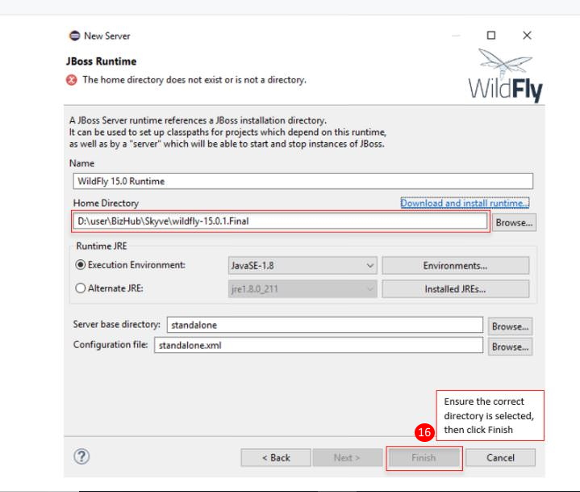

9.  Wait for Eclipse to complete the download and installation process before moving on to the next step

    

### 3.4. Add Repository in Eclipse

After downloading and installation of eclipse and server, the next step is add our repository in the eclipse.

1. Open the Eclipse in your system
2. Click on window tab and click on show View, then other

   

3. Select Git Repositoies and click on open

   

4. Click on Git Repositories in bottom area of eclipse, right click and select clone a Git Repostory...

   

5. Get URL from Github, go to Github and click on Code button.

   

6. Copy that link and paste in Clone window and click on Next

   

7. Click on Next again

   

8. Click on Finish

   

In Git Repositories, we can see our repository is added now!

### 3.5. Import Project

As we already created a project in Skyve foundry, now it is time to import that project in Eclipse to do changes in the Aged care app. To import project in Eclipse follow the steps below:

1. Click on File tab in Eclipse and Select import

   

2. Select Exiting Maven Project form list and click on Next

   

3. Set your root directory (Folder wwhere you cloned your git repository to in the previous section) and click on Finish

   

You can see your project in Project Explorer area in Eclipse.

### 3.6. Set the server

To run our project in server we need to set Server in Eclipse first.

1. Click on Server tab in Eclipse and right click

   

2. Click on Add and Remove and then Finish

   

## 3.7 Deploy and Configure Skyve Project

##### Deploy your Skyve project

Its easy to deploy your Skyve project to your WildFly Server.

1. Open WildFly deployments folder Right-click on the server and click on Show In, then click on File Browser

   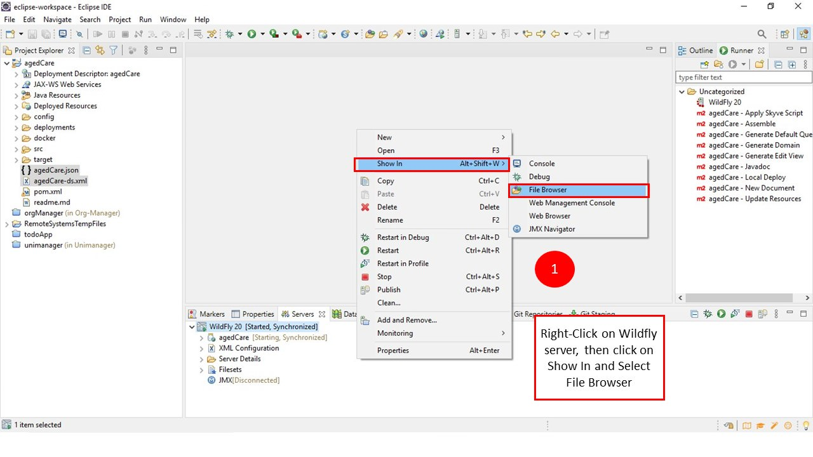

2. Copy the agedCare.json and agedCare-ds.xml and paste in the deployments folder to the WildFly deployments folder that you opened in the previous step.

   

3. Open the File window and content folder which is in your root folder and create new folder with agedCare name

   

4. Open the agedCare.json file in the text editor

   Go to Content section and directory to paste in the Content folder address which we created in previous step in json file.

   

   Go to the bottom of the file to change the identifier.

   

   If you want to change the username and password, you can change in bootstrap in this app it is not changed.

   Lastly, save and close the file.

5. Open agedCare-ds.xml file in the text editor

   

   Go to connection-url and replace ~ sign with content folder address and save the file.

   

##### Run your Aged care application

Before running your project, we will need to generate the domain class first.

Generate domain validates and compiles the metadata (XML files) in your project and checks that the application domain is in a valid state. Errors for the developer to fix are written to your console, and if generate is successful, the domain will be compiled to produce Java domain files and unit tests.


Right click on server and go to start button to start the server.


When you see the below info in your Console Window, agedCare was deployed and is running on your localhost server.


If not, you may try to debug by yourself to find the source of the problem, or [Join Us On Slack](https://join.slack.com/t/skyveframework/shared_invite/enQtNDMwNTcyNzE0NzI2LWNjMTBlMTMzNTA4YzBlMzFhYzE0ZmRhOWIzMWViODY4ZTE1N2QzYWM1MTdlMTliNDIyYTBkOWZhZDAxOGQyYjQ) and ask any questions there. You will get support from the [Skyve](https://skyve.org) team or a community team member.

Access Aged care app from Web Browser at http://localhost:8080/agedCare. Sign in with by default username "setup" and password "setup".


### 3.8. List Views

In most of application data is represented in list and detail views. Skyve also capable to provide each type of view.

Skyve will provide generic/default list and edit views. Skyve supports rapid prototyping of the domain model and gives the developer an ability to begin interacting with the application at an early stage.

List views are basically depend on queries which include only key document attributes for searching and review. Each row of the list corresponds to a document instance however the list may represent data from related documents within the document’s object hierarchy.

- #### Resident List

Lets see our `Resident` list, it shows all the information we define in our document's attributes section.

Hide attributes `admission date` and `resident Id` in the `Resident` documents

Open agedCare.xml

Right after the Menu declaration in agedCare.xml, we will declare Queries like below:

```xml
<queries>
    <query documentName="Resident" name="qResident">
    <description>All Resident</description>
    <columns>
   		<content display="thumbnail" binding="photo" pixelHeight="45" pixelWidth="45" />
    	<column binding="residentID" sortOrder="ascending" hidden="true" />
    	<column binding="residentName" sortOrder="ascending" />
    	<column binding="DOB" sortOrder="ascending" />
    	<column binding="roomNo" sortOrder="ascending" />
    	<column binding="BIO" sortOrder="ascending" />
    	<column binding="admissionDate" sortOrder="ascending" hidden="true" />
    	<column binding="facilityName.facilityName" sortOrder="ascending" />
    </columns>
    </query>
    </queries>

```

Here the `content query column` provides a `content` column type for content items like image and file attachments.

Then you will need to provide `defaultQueryName`- "which is the name of the metadata query to use by default wherever lists of document instances may be required" attribute to your resident document in `agedCare.xml` like below:

```xml
<documents>
        <document ref="Resident" defaultQueryName="qResident"/>
        <document ref="Facility"/>
        <document ref="Assessment"/>
        <document ref="Contact" moduleRef="admin"/>
        <document ref="DataGroup" moduleRef="admin"/>
        <document ref="User" moduleRef="admin"/>
    </documents>


```

To apply the change, stop the `WildFly` server and run the `Generate Domain` command, then start the `WildFly` Server again.

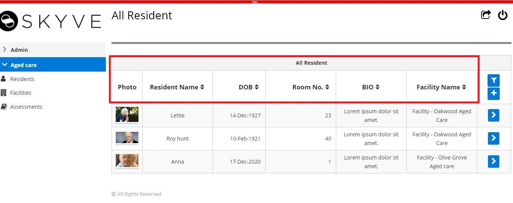

- #### Facility List

Next, Lets see our `Facility` list now, it shows all the information we define in our document's attributes section.

Hide attributes `Location` and `Facility Manager` in the `Facility` documents

Open agedCare.xml

Right after the Menu declaration in agedCare.xml, we will declare Queries like below:

```xml
<query documentName="Facility" name="qFacility">
			<description>All Facilities</description>
			<columns>
				<column binding="facilityName" sortOrder="ascending" />
				<column binding="buildingNumber" sortOrder="ascending" />
				<column binding="streetName" sortOrder="ascending" />
				<column binding="suburb" sortOrder="ascending" />
				<column binding="state" sortOrder="ascending" />
				<column binding="facilityManager" sortOrder="ascending"
					hidden="true" />
				<column binding="location" sortOrder="ascending"
					hidden="true" />
			</columns>
		</query>
```

Then you will need to provide `defaultQueryName` attribute to your facility document in `agedCare.xml` like below:

```xml
<documents>
		<document ref="Resident" defaultQueryName="qResident" />
		<document ref="Facility" defaultQueryName="qFacility" />
		<document ref="Assessment" />
		<document ref="Contact" moduleRef="admin" />
		<document ref="DataGroup" moduleRef="admin" />
		<document ref="User" moduleRef="admin" />
	</documents>
```

To apply the change, stop the `WildFly` server and run the `Generate Domain` command, then start the `WildFly` Server again.


- #### Assessments List

As in `Assessment` document, you can see different assessments related to each resident.
Let's hide `Pain assessement` and `Review date` from the document and add resident name and image.

Let's try it:
Add query in your `agedCare.xml`

```xml
<query documentName="Assessment" name="qAssessment">
    <description>All Assessments</description>
    <columns>
    	<content display="thumbnail" binding="parent.photo" pixelHeight="60" pixelWidth="60" />
    	<column binding="parent.residentName" sortOrder="ascending" />
    	<column binding="hygieneAssessment" sortOrder="ascending" />
    	<column binding="painAssessment" sortOrder="ascending"   hidden="true"/>
    	<column binding="continenceAssessment" sortOrder="ascending" />
    	<column binding="sleepAssessment" sortOrder="ascending" />
    	<column binding="behaviourAssessment" sortOrder="ascending" hidden="true" />
    	<column binding="staff" sortOrder="ascending" />
    	<column binding="assessmentReview" sortOrder="ascending" hidden="true" />
    </columns>
    </query>
```

Then you will need to provide `defaultQueryName` attribute to your Assessment document in `agedCare.xml`, like below:

```xml
<documents>
        <document ref="Resident" defaultQueryName="qResident"/>
        <document ref="Facility"  defaultQueryName="qFacility"/>
        <document ref="Assessment"  defaultQueryName="qAssessment"/>
        <document ref="Contact" moduleRef="admin"/>
        <document ref="DataGroup" moduleRef="admin"/>
        <document ref="User" moduleRef="admin"/>
    </documents>
```

Again, to apply the change, stop the WildFly server and run the Generate Domain command, then start the WildFly Server.


### 3.9. Edit Views, Layout, and Components

In this section we will override the default detail view which is generated by Skyve.

- #### Resident Edit view

Skyve provides us with a very useful function to create default `edit view` based on our document attributes and attributes type, the default widget will be applied for each attribute type.

So to create our Resident `edit view`, we will go through the following steps:

#### Create edit view

1. Click on `Generate edit view` in the right side of the eclipse window and write the module and document name in the Console window.

   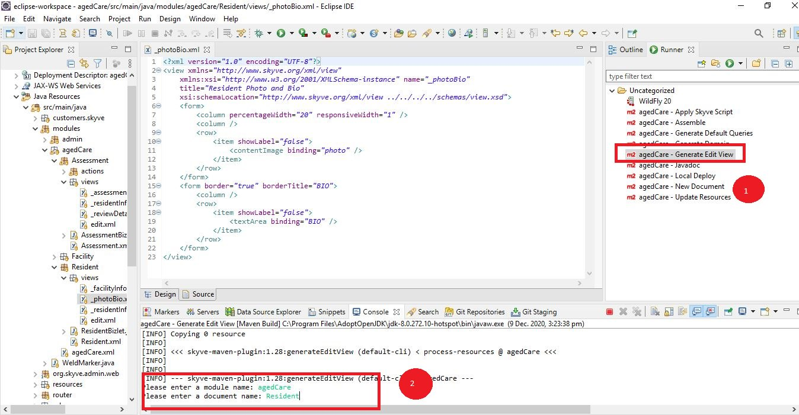

2. If you go to the agedCare module left side of eclipse and open the resident module. You can see view module and in view module there is a document with `generatedit.xml`. Rename the document, `edit.xml`

   

#### Enhance the edit view

In the previous step we generated an edit view by using the Generate Edit View function. Now we will enhance our edit view to make it more visually appealing.

As of now, Resident attributes show one by one, from top to bottom. We will enhance the view by:

Showing all the personal information in the one side and the photo and BIO in other side.

We will plan to split our view into 2 sections: left and right. We will show Resident information on the left side and the Resident Image and BIO will be shown on the right part.

To do that, we will need to understand about Skyve Views Containers - https://skyvers.github.io/skyve-dev-guide/views/#containers

After reading through the Skyve Containers document, you may have already guessed how to split our view into 2 parts.

Yes, hbox container will help us on this.

Open resident `edit.xml` and add the code given below;

```xml
<?xml version="1.0" encoding="UTF-8"?>
<view xmlns="http://www.skyve.org/xml/view" xmlns:xsi="http://www.w3.org/2001/XMLSchema-instance" name="edit" title="Resident" xsi:schemaLocation="http://www.skyve.org/xml/view ../../../../schemas/view.xsd">
    <tabPane>
        <tab title="General">
        <hbox border="true">
		<!-- left side -->
		<vbox responsiveWidth="8" percentageWidth="60">
 			<form>
		        <column percentageWidth="30" responsiveWidth="4"/>
		        <column/>

               <row>
                    <item>
                        <default binding="residentID"/>
                    </item>
                </row>
                <row>
                    <item>
                        <default binding="residentName"/>
                    </item>
                </row>
                 <row>
                    <item>
                        <default binding="DOB"/>
                    </item>
                </row>
                <row>
                    <item>
                        <default binding="roomNo"/>
                    </item>
                </row>
                <row>
                    <item>
                        <default binding="admissionDate"/>
                    </item>
                </row>
                <row>
                    <item>
                        <default binding="facilityName"/>
                    </item>
                </row>

          </form>
		</vbox>
          <!-- right side -->
		<vbox responsiveWidth="4" percentageWidth="40">
			<form>
		        <column percentageWidth="20" responsiveWidth="1" />
				<column />
			<row>
                    <item showLabel="false">
                        <contentImage binding="photo"/>
                    </item>
                </row>

                <row>
                    <item>
                        <default binding="BIO"/>
                    </item>
                </row>

            </form>
            </vbox>
            </hbox>
        </tab>
        <tab title="Assessments">
            <dataGrid binding="assessments">
                <boundColumn binding="hygieneAssessment"/>
                <boundColumn binding="painAssessment"/>
                <boundColumn binding="continenceAssessment"/>
                <boundColumn binding="sleepAssessment"/>
                <boundColumn binding="behaviourAssessment"/>
                <boundColumn binding="staff"/>
                <boundColumn binding="assessmentReview"/>
                <onAddedHandlers/>
                <onEditedHandlers/>
                <onRemovedHandlers/>
                <onSelectedHandlers/>
            </dataGrid>
        </tab>
    </tabPane>
    <actions>
        <defaults/>
    </actions>
    <newParameters/>
</view>
```

To see the changes re-deployed the application.


Next, we will group related information together to make it easier to manage.
The easiest way is to use the `border` and `borderTitle` attributes of the Form container.
So, in this case, I will have 2 forms, one for `Resident Info`, one for `Faciltiy Info`.
Let's add `border` and `borderTitle` in the `<form>` tag.

```xml
<?xml version="1.0" encoding="UTF-8"?>
<view xmlns="http://www.skyve.org/xml/view" xmlns:xsi="http://www.w3.org/2001/XMLSchema-instance" name="edit" title="Resident" xsi:schemaLocation="http://www.skyve.org/xml/view ../../../../schemas/view.xsd">
    <tabPane>
        <tab title="General">
        <hbox border="true">
		<!-- left side -->
		<vbox responsiveWidth="8" percentageWidth="60">
 			<form border="true" borderTitle="Resident Info">
		        <column percentageWidth="30" responsiveWidth="4"/>
		        <column/>

               <row>
                    <item>
                        <default binding="residentID"/>
                    </item>
                </row>
                <row>
                    <item>
                        <default binding="residentName"/>
                    </item>
                </row>
                 <row>
                    <item>
                        <default binding="DOB"/>
                    </item>
                </row>
                </form>
               <form border="true" borderTitle="Facility Info">
                <column percentageWidth="30" responsiveWidth="4"/>
		        <column/>
                <row>
                    <item>
                        <default binding="roomNo"/>
                    </item>
                </row>
                <row>
                    <item>
                        <default binding="admissionDate"/>
                    </item>
                </row>
                <row>
                    <item>
                        <default binding="facilityName"/>
                    </item>
                </row>

          </form>
		</vbox>
          <!-- right side -->
		<vbox responsiveWidth="4" percentageWidth="40">
			<form>
		        <column percentageWidth="20" responsiveWidth="1" />
				<column />
			<row>
                    <item showLabel="false">
                        <contentImage binding="photo"/>
                    </item>
                </row>

                <row>
                    <item>
                        <default binding="BIO"/>
                    </item>
                </row>

            </form>
            </vbox>
            </hbox>
        </tab>
        <tab title="Assessments">
            <dataGrid binding="assessments">
                <boundColumn binding="hygieneAssessment"/>
                <boundColumn binding="painAssessment"/>
                <boundColumn binding="continenceAssessment"/>
                <boundColumn binding="sleepAssessment"/>
                <boundColumn binding="behaviourAssessment"/>
                <boundColumn binding="staff"/>
                <boundColumn binding="assessmentReview"/>
                <onAddedHandlers/>
                <onEditedHandlers/>
                <onRemovedHandlers/>
                <onSelectedHandlers/>
            </dataGrid>
        </tab>
    </tabPane>
    <actions>
        <defaults/>
    </actions>
    <newParameters/>
</view>
```


As, we have already made a nice view for Resident. However, I also want to introduce View Components to you.

So, what is View Components?

Let's imagine that our view is very complex, lots of sections and these sections can be reused in different views. Skyve allows for reuse of view sections via the component widget.

To demonstrate how to re-use components, we will split our view into three components:

1. Resident Info
2. Facility Info
3. Photo and Bio

The view component must be declared according to the convention, with the file name matching the declared name.

##### Resident Info component

In the Resident > views package, create new `_residentInfo.xml` file with below content:

```xml
<?xml version="1.0" encoding="UTF-8"?>
<view xmlns="http://www.skyve.org/xml/view" xmlns:xsi="http://www.w3.org/2001/XMLSchema-instance" name="_residentInfo" title="Resident Info" xsi:schemaLocation="http://www.skyve.org/xml/view ../../../../schemas/view.xsd">

		<form border="true" borderTitle="Resident Info">
		        <column percentageWidth="30" responsiveWidth="4"/>
		        <column/>

               <row>
                    <item>
                        <default binding="residentID"/>
                    </item>
                </row>
                <row>
                    <item>
                        <default binding="residentName"/>
                    </item>
                </row>
                 <row>
                    <item>
                        <default binding="DOB"/>
                    </item>
                </row>
                </form>
                </view>
```

##### Facility Info component

In the Resident > views package, create new `_facilityInfo.xml` file with below content:

```xml
<?xml version="1.0" encoding="UTF-8"?>
<view xmlns="http://www.skyve.org/xml/view" xmlns:xsi="http://www.w3.org/2001/XMLSchema-instance" name="_facilityInfo" title="Facility Info" xsi:schemaLocation="http://www.skyve.org/xml/view ../../../../schemas/view.xsd">

         <form border="true" borderTitle="Facility Info">
                <column percentageWidth="30" responsiveWidth="4"/>
		        <column/>
                <row>
                    <item>
                        <default binding="roomNo"/>
                    </item>
                </row>
                <row>
                    <item>
                        <default binding="admissionDate"/>
                    </item>
                </row>
                <row>
                    <item>
                        <default binding="facilityName"/>
                    </item>
                </row>

          </form>
          </view>
```

##### Photo and Bio component

In the Resident > views package, create new `_photoBio.xml` file with below content:

```xml
<?xml version="1.0" encoding="UTF-8"?>
<view xmlns="http://www.skyve.org/xml/view" xmlns:xsi="http://www.w3.org/2001/XMLSchema-instance" name="_photoBio" title="Resident Photo and Bio" xsi:schemaLocation="http://www.skyve.org/xml/view ../../../../schemas/view.xsd">
<form>
		        <column percentageWidth="20" responsiveWidth="1" />
				<column />
			<row>
                    <item showLabel="false">
                        <contentImage binding="photo"/>
                    </item>
                </row>
 </form>
            <form border="true" borderTitle="BIO">
 		  <column/>
			   <row>
			       <item showLabel="false">
			           <textArea binding="BIO"/>
			      </item>
			   </row>
			</form>
  </view>
```

##### Combine together

After done with component creation, we will go to use it on our `edit view`.
Change `edit.xml` view like below:

```xml
<?xml version="1.0" encoding="UTF-8"?>
<view xmlns="http://www.skyve.org/xml/view" xmlns:xsi="http://www.w3.org/2001/XMLSchema-instance" name="edit" title="Resident" xsi:schemaLocation="http://www.skyve.org/xml/view ../../../../schemas/view.xsd">
    <tabPane>
        <tab title="General">
	<hbox border="true">
		<!-- left side -->
		<vbox responsiveWidth="8" percentageWidth="60">
 			<component name="_residentInfo" />
 			<component name="_facilityInfo" />

		</vbox>

		<!-- right side -->
		<vbox responsiveWidth="4" percentageWidth="40">
			<component name="_photoBio"/>
		</vbox>
	</hbox>

        </tab>
        <tab title="Assessments">
            <dataGrid binding="assessments">
                <boundColumn binding="hygieneAssessment"/>
                <boundColumn binding="painAssessment"/>
                <boundColumn binding="continenceAssessment"/>
                <boundColumn binding="sleepAssessment"/>
                <boundColumn binding="behaviourAssessment"/>
                <boundColumn binding="staff"/>
                <boundColumn binding="assessmentReview"/>
                <onAddedHandlers/>
                <onEditedHandlers/>
                <onRemovedHandlers/>
                <onSelectedHandlers/>
            </dataGrid>
        </tab>
    </tabPane>
    <actions>
        <defaults/>
    </actions>
    <newParameters/>
</view>
```

We will re-deploy our application to see affect. After re-deployment and re-login to the system. We will have the same view as our original before:


- #### Facility Edit view

In the previous section we explore and practice how to create an edit view and customize it to meet our requirements. Now it should be easier for us to create an edit view for your
Facility document right?

Lets demonstrate our Facility edit view below:
It contains three components:

1. Facility Info
2. Facility address
3. Facility location

Let's start with Facility Info component.

1. Generate the edit view for Facility document

   

2. Add facility component same as resident component

##### Facility Info component

In the Facility > views package, create new `_facilityInfo.xml`
as below content:

```xml
<?xml version="1.0" encoding="UTF-8"?>
<view xmlns="http://www.skyve.org/xml/view" xmlns:xsi="http://www.w3.org/2001/XMLSchema-instance" name="_facilityInfo" title="Facility Info" xsi:schemaLocation="http://www.skyve.org/xml/view ../../../../schemas/view.xsd">
    <form border="true" borderTitle="Facility Info">
        <column percentageWidth="30" responsiveWidth="4"/>
        <column/>
        <row>
            <item>
                <default binding="facilityName"/>
            </item>
        </row>
        <row>
            <item>
                <default binding="facilityManager"/>
            </item>
        </row>
        </form>
        </view>

```

##### Facility address component

In the Facility > views package, create new `_facilityAddress.xml` as below content:

```xml

<?xml version="1.0" encoding="UTF-8"?>
<view xmlns="http://www.skyve.org/xml/view" xmlns:xsi="http://www.w3.org/2001/XMLSchema-instance" name="_facilityAddress" title="Facility Address" xsi:schemaLocation="http://www.skyve.org/xml/view ../../../../schemas/view.xsd">
    <form borderTitle="Facility Address" border="true">
        <column percentageWidth="30" responsiveWidth="4"/>
        <column/>

        <row>
            <item>
                <default binding="buildingNumber"/>
            </item>
        </row>
        <row>
            <item>
                <default binding="streetName"/>
            </item>
        </row>
        <row>
            <item>
                <default binding="suburb"/>
            </item>
        </row>
        <row>
            <item>
                <default binding="state"/>
            </item>
        </row>
		</form>
		</view>
```

##### Facility location Component

In the Facility > views package, create new `_facilityLocation.xml` as below content:

```xml
<?xml version="1.0" encoding="UTF-8"?>
<view xmlns="http://www.skyve.org/xml/view" xmlns:xsi="http://www.w3.org/2001/XMLSchema-instance" name="_facilityLocation" title="Facility Location" xsi:schemaLocation="http://www.skyve.org/xml/view ../../../../schemas/view.xsd">
    <form border="true" borderTitle="Facility Location">
        <column />

        <row>
            <item showLabel="false">
                <geometryMap binding="location">
                    <onChangedHandlers/>
                </geometryMap>
            </item>
        </row>
    </form>
    </view>
```

##### Combine together

After done with component creation, we will go to use it on our `edit` view.
Change `edit.xml` view like below:

```xml

<?xml version="1.0" encoding="UTF-8"?>
<view xmlns="http://www.skyve.org/xml/view" xmlns:xsi="http://www.w3.org/2001/XMLSchema-instance" name="edit" title="Facility" xsi:schemaLocation="http://www.skyve.org/xml/view ../../../../schemas/view.xsd">

        <hbox border="true">
		<!-- left side -->
		<vbox responsiveWidth="8" percentageWidth="60">
 			<component name="_facilityInfo" />
 			<component name="_facilityAddress" />

		</vbox>

		<!-- right side -->
		<vbox responsiveWidth="4" percentageWidth="40">
			<component name="_facilityLocation"/>
		</vbox>
	</hbox>

            <actions>
        <defaults/>
    </actions>
    <newParameters/>
</view>

```

Again re-deploy the application to see the changes in your Facility document.


- #### Assessment Edit view

As we finish our edit view for resident and facility document. Now, in this step we will do edit view for our Assessment document.
Assessment document will show sections below:

1. Resident Info
2. Assessment Detail
3. Review Detail

Let's start with Resident Info

Generate edit view for the assessment document first.


##### Resident info component

In the Assessment > views package, create new `_residentInfo.xml` as below content:

```xml
<?xml version="1.0" encoding="UTF-8"?>
<view xmlns="http://www.skyve.org/xml/view" xmlns:xsi="http://www.w3.org/2001/XMLSchema-instance" name="_residentInfo" title="Resident Info" xsi:schemaLocation="http://www.skyve.org/xml/view ../../../../schemas/view.xsd">
    <form border="true" borderTitle="Resident Info">
                <column percentageWidth="30" responsiveWidth="4"/>
		        <column/>
                <row>
                <item>
                        <default binding="parent.residentName"/>
                    </item>
                </row>
                </form>
               <form border="true" borderTitle="Resident Photo">
                <column percentageWidth="30" responsiveWidth="4"/>
		        <column/>
                <row>
                    <item showLabel="false">
                        <contentImage binding="parent.photo"/>
                    </item>
                </row>
      </form>
      </view>
```

##### Assessment Detail component

In the Assessment > views package, create new `_assessmentDetail.xml` as below content:

```xml
<?xml version="1.0" encoding="UTF-8"?>
<view xmlns="http://www.skyve.org/xml/view" xmlns:xsi="http://www.w3.org/2001/XMLSchema-instance" name="_assessmentDetail" title="Assessment Detail" xsi:schemaLocation="http://www.skyve.org/xml/view ../../../../schemas/view.xsd">
    <form border="true" borderTitle="Assessment Detail">
                <column percentageWidth="30" responsiveWidth="4"/>
		        <column/>
		        <row>
            <item>
                <default binding="hygieneAssessment"/>
            </item>
        </row>
        <row>
            <item>
                <default binding="painAssessment"/>
            </item>
        </row>
        <row>
            <item>
                <default binding="continenceAssessment"/>
            </item>
        </row>
        <row>
            <item>
                <default binding="sleepAssessment"/>
            </item>
        </row>
        <row>
            <item>
                <default binding="behaviourAssessment"/>
            </item>
        </row>
        </form>
        </view>
```

##### Review Detail component

In the Assessment > views package, create new `_reviewDetail.xml` as below content:

```xml
<?xml version="1.0" encoding="UTF-8"?>
<view xmlns="http://www.skyve.org/xml/view" xmlns:xsi="http://www.w3.org/2001/XMLSchema-instance" name="_reviewDetail" title="Review Detail" xsi:schemaLocation="http://www.skyve.org/xml/view ../../../../schemas/view.xsd">
    <form border="true" borderTitle="Review Detail">
                <column percentageWidth="30" responsiveWidth="4"/>
		        <column/>
		        <row>
            <item>
                <default binding="staff"/>
            </item>
        </row>
        <row>
            <item>
                <default binding="assessmentReview"/>
            </item>
        </row>
        </form>
        </view>
```

##### Combine together:

After done with component creation, we will go to use it on our edit view.
Change `edit.xml` view like below:

```xml
<?xml version="1.0" encoding="UTF-8"?>
<view xmlns="http://www.skyve.org/xml/view" xmlns:xsi="http://www.w3.org/2001/XMLSchema-instance" name="edit" title="Assessment" xsi:schemaLocation="http://www.skyve.org/xml/view ../../../../schemas/view.xsd">

  <hbox border="true">
		<!-- left side -->
		<vbox responsiveWidth="8" percentageWidth="60">
 			<component name="_residentInfo" />
 			<component name="_reviewDetail" />

		</vbox>

		<!-- right side -->
		<vbox responsiveWidth="4" percentageWidth="40">
			<component name="_assessmentDetail"/>
		</vbox>
	</hbox>
    <actions>
        <defaults/>
    </actions>
    <newParameters/>
</view>
```

Let's re-deploy the application to see the changes we made in this step.


### 3.10. Roles

Each role specifies the privilege levels for documents that the role will access (and associated actions). The role name is the name displayed when assigning roles to user security groups in the admin.

For each document, the privilege level is specified in terms of C (Create) R (Read) U (Update) D (Delete) and the document scope access level, either G (Global), C (Customer), D (Data Group) or U (User). The underscore character (\_) means no permission is granted.

In our Aged care App, we will define below roles:

1. Nurse: Nurse can have all permissions in the resident and assessment documents. But, in the facility document nurses can only have update and scope permission.

2. Carer: Carer can have _RU_C permissions in Resident document, \_R_ \_C permissions in the facility document, and in Assessment carer can CRU_C permissions.

3. Manager: Manager have all the permissions in all three documents.

Note: Before creating a new role just careful about the roles which is already created by the foundry: Viewer and Maintainer. if you want to delete any of this role please, we careful that these roles are not assigned to any user before. Otherwise it will not work. For this tutorial, we are not doing anything with Viewer and Maintainer role.

Open `agedCare.xml` to create new roles and change menu.

```xml
<?xml version="1.0" encoding="UTF-8"?>
<module xmlns="http://www.skyve.org/xml/module" xmlns:xsi="http://www.w3.org/2001/XMLSchema-instance" title="Aged care" prototype="true" name="agedCare" xsi:schemaLocation="http://www.skyve.org/xml/module ../../schemas/module.xsd">
    <homeRef>list</homeRef>
    <homeDocument>Resident</homeDocument>
    <documents>
        <document ref="Resident" defaultQueryName="qResident"/>
        <document ref="Facility"  defaultQueryName="qFacility"/>
        <document ref="Assessment"  defaultQueryName="qAssessment"/>
        <document ref="Contact" moduleRef="admin"/>
        <document ref="DataGroup" moduleRef="admin"/>
        <document ref="User" moduleRef="admin"/>
    </documents>
    <roles>
        <role name="Viewer">
            <description><![CDATA[Enough privileges to view Aged care documents.]]></description>
            <privileges>
                <document name="Resident" permission="_R__C"/>
                <document name="Facility" permission="_R__C"/>
                <document name="Assessment" permission="_R__C"/>
            </privileges>
        </role>
        <role name="Maintainer">
            <description><![CDATA[Enough privileges to create and edit Aged care documents.]]></description>
            <privileges>
                <document name="Resident" permission="CRUDC"/>
                <document name="Facility" permission="CRUDC"/>
                <document name="Assessment" permission="CRUDC"/>
            </privileges>
        </role>

        <role name="Nurses">
	<description>Permission to see all Assessments</description>
	<privileges>
		<document name="Resident" permission="CRUDC" />
		<document name="Facility" permission="_R__C"/>
		<document name="Assessment" permission="CRUDC" />
	</privileges>

</role>
	<role name="Carers">
		<description>Permission to see only Carer Assessments</description>
		<privileges>
			<document name="Resident" permission="_RU_C"></document>
			<document name="Facility" permission="_R__C" />
			<document name="Assessment" permission="CRU_C" />
		</privileges>
	</role>

<role name="Manager">
		<description>Permission to manage Facility, Staff, and Assessments</description>
		<privileges>
			<document name="Resident" permission="CRUDC" />
			<document name="Facility" permission="CRUDC" />
			<document name="Assessment" permission="CRUDC" />
		</privileges>
</role>
    </roles>
    <menu>
        <list document="Resident" name="Residents">
            <role name="Nurses"/>
            <role name="Manager"/>
            <role name="Carers"/>
        </list>
        <list document="Facility" name="Facilities">
            <role name="Manager"/>

        </list>
        <list document="Assessment" name="Assessments">
            <role name="Nurses"/>
            <role name="Carers"/>
            <role name="Manager"/>
        </list>
    </menu>
<module>
```

In the next section, we will use these permissions by applying some conditions in our documents.

End of section 4!!!

# 4. Java Extension

Before start conditions section, let's create Groups and Users in the application.
For more detail click on link for adding users and groups: https://skyvers.github.io/skyve-user-guide/users/

Go to the application and create group for carer, nurse, manager as below:
Open Admin>Security Admin>Groups

1. Create group for the Carer as below:

   

2. Create group for the Manager as below:

   

3. Create group for the Nurse as below:

   

Next, create Users for Carer, Manager, and Nurse.
Go to the application, Open Admin>Security Admin>Users

1. Create Users for Carer by adding Full name and Email

2. Click on New contact

   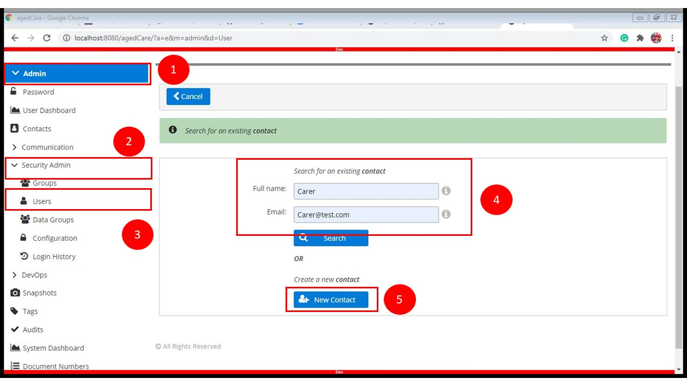

3. Set user name and password

   

4. Click on Existing group, select carer and add in Assigned Group

   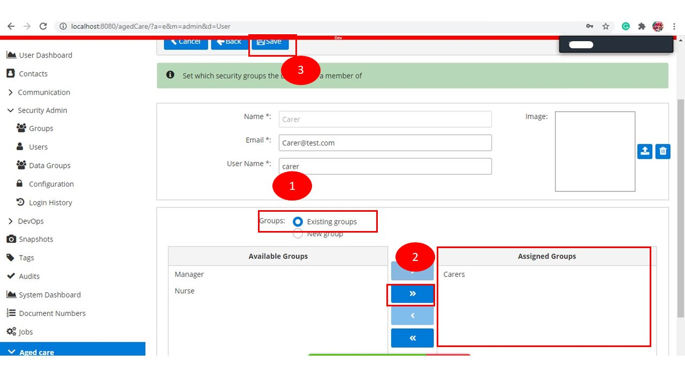

5. Click on save

Now, create Users for Manager and Nurse same as we created for Carer in the previous steps.

After completing creation of Groups and Users. Let's check it is working or not?
Logout your application and login with the user we created in preview steps.

First login with carer.


You can see, the carer can access resident and assessment in Agedcare module. This is because in `agedCare.xml` in menu we gave permission to only Manager to see the facility module.

Carer login page shown below:


If you want to check Nurse and Manager, login as their user name and password.

- #### Conditions

In `Assessment` document, when we login as a carer, we can not see, we can not see few assessments such as `Pain assessment` and `Behaviour assessment`. This can be achieved through further usage of conditions. In particular, we can have a condition to determine the visibility of some specified attributes on the screen. To begin with, we define the condition in the `Assessment.xml`. We will define this condition as follows:

```xml
<conditions>
    <condition name="roleCarer">
    <expression><![CDATA[isUserInRole("agedCare", "Carers")]]></expression>
    </condition>
    </conditions>
```

To see the changes we also need to change the visibility of the assessments as below:

Open the `assessmentDetail.xml` and change the visibility of `Pain assessment` and `Behaviour assessment`


To see the changes, generate domain and re-deployed the server.

Login as a Carer


Open the Assessment module, you can see the pain assessment and the Behavious assessment are not available for the carer any more.


- #### Bizlets

The document package includes declarations of actions, reports, views and the associated Bizlet file. The Bizlet file contains document-specific behaviours including overrides of default action behaviours and document bean lifecycle events (e.g. newInstance, preSave, etc.).

More info on Bizlets can be found at the following Skyve Developer Guide link: https://skyvers.github.io/skyve-dev-guide/bizlets/

##### Bizlet ResidentID

First of all, let's show you how to create `ResidentBizlet` to customize the document as we want.
Right-click to the `Resident` package and select `New`, then select `Class` in the sub-menu.
The new Class window will appear like below:

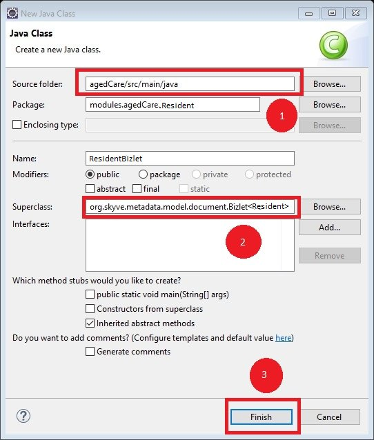

The `ResidentBizlet` class is created, It shows some errors, to remove these errors we will use "Eclipse Quick Fix suggestions" as below:


Alright, after fixing the above two issues, we will override the `newInstance` method to read resident information. Create the `newInstance` as follow:


Select newInstance from the list.


The override method is generated in the file


Add the below code in the method

```java
{
String residentId;

residentId=ModulesUtil.getNextDocumentNumber("P", Resident.MODULE_NAME, Resident.DOCUMENT_NAME, Resident.residentIDPropertyName, 4);
bean.setResidentID(residentId);

return super.newInstance(bean);

}
```

By using this code, we set the residentId for our new document.

#### preSave() method

In next few steps, we will see how we can use the `preSave()` method.
In previous step we created a `newInstance` method. Now,
I want you to change the Bizlet and use the preSave() method instead of newInstance() as follows:

- When we SAVE the resident record, check if the residentId is null - if it is null, assign a new DocumentNumber using `modulesUtil.getNextDocumentNumber` (similar to what you did for new instance)
- Add a condition to the Resident.xml called `hasID` which checks if `bean.getResidentId()!=null`
- Only show the `residentID` field in the Resident view, if the `hasID` condition is true

1. In first step, go to `residentBizlet.java` and add new Bizlet
   go to source > override and implement method and select presave() from list and click on `Ok`

   

2. Add code in the `preSave()` method as below

   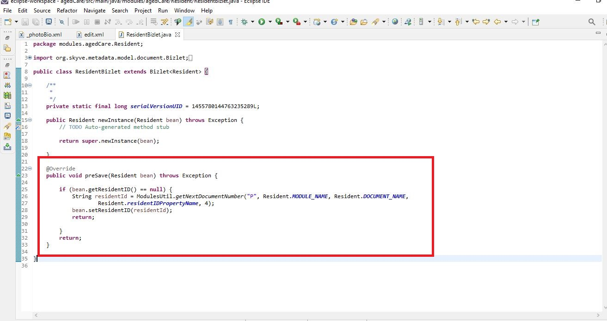

3. Next, add condition to the `Resident.xml` called `hasID` which checks if `bean.getPatiendId()!=null`
4. Opem `Resident.xml`, and add condition after `attributes` as below

```xml
<conditions>
		<condition name="hasID">
			<expression><![CDATA[getResidentID()!=null]]></expression>

		</condition>
	</conditions>
```

5. To show the `residentID` field in the Resident view, if the `hasID` condition is true, open `_residentInfo.xml`

6. Then, change ResidentID field as below:

```xml
<row>
			<item>
				<textField disabled="true" visible="hasID"
					binding="residentID" />
			</item>
		</row>

```

To see the changes, generate domain and deployed application.
Sign in as a manager, and go to add new resident there is no resident id but it will generate when you save all other details.


After filling all the details, press on the save button then you see it generate the ResidentID field to the document.

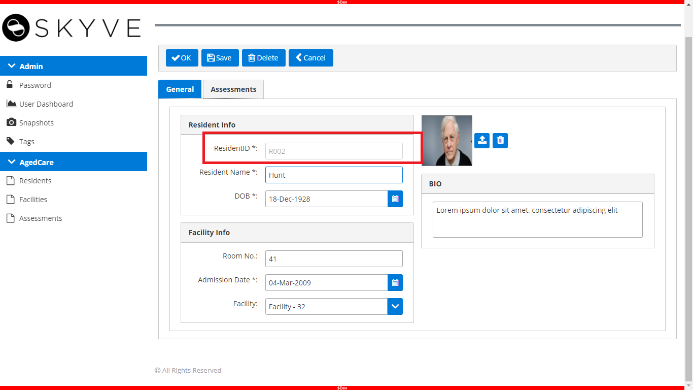

#### Enhancement in Aged care application

In this section, we will add more functionality in our documents as below:

- Add a new `dateTime` to Assessment called `assesmentCreatedTime`
- Add a `Bizlet` for `Assessment` to set the `assesmentCreatedTime` when a new assessment is created and record the user who created the assessment
- In the `Facility` view, show a `listGrid` of `Residents` at that facility
- Add a `status` enumeration for Resident with appropriate values (current, discharged, deceased), where the default value is current

1. Add a new `dateTime` to Assessment called `assesmentCreatedTime`, go to `Assessment.xml` and add new attribute as below

```xml
<dateTime name="assessmentCreatedTime">
			<displayName>Assessment Created Time</displayName>
		</dateTime>
```

Open `_reviewInfo` to add that column, so add new row

```xml
<row>
			<item>
				<default binding="assessmentCreatedTime" />
			</item>
		</row>

```

Generate domain, deploy app and you an see the new field in Assessment.


2. Add a Bizlet for Assessment to set the `assesmentCreatedTime` when a new assessment is created and record the user who created the assessment

As we already know how to create a Bizlet for the document, follow the same steps.

Right-click to the `Assessment` package and select `New`, then select `Class` in the sub-menu.

After following the Quick Fix suggestions to fixed error in AssessmentBizlet.java

Next, we will override the `newInstance` method.

Click on source > override and implement method. Choose `newInstance` form the list.

Eclipse will generate `newInstance` method and override notation for us. We will need to update the method like below:

```java
private static final long serialVersionUID = 2286961040250324230L;

	@Override
	public Assessment newInstance(Assessment bean) throws Exception {
		// TODO Auto-generated method stub
		bean.setAssessmentCreatedTime(new DateTime());
		bean.setStaff(ModulesUtil.currentAdminUser());
		return super.newInstance(bean);
	}

}
```

Change the display name to AssessmentCreatedBy in `Assessment.xml` file. I will be clear to know who created the assessment.


Generate domain and deploy the application to see the changes.

So, now you set the assessment time and AssessmentCreatedBy in your Assessment document as below.


3. In the Facility view, show a listGrid of Residents at that facility

Go to the `Facility` package and open the `edit.xml` to add listGrid as below


Generate domain to check result.


4. Add a `status` enumeration for Resident with appropriate values (current, discharged, deceased), where the default value is current

Open the `Resident.xml` and add this code in `<attributes>`

```xml
<enum name="residentStatus">
			<displayName>Resident Status</displayName>
			<defaultValue>current</defaultValue>
			<values>
				<value code="Current" />
				<value code="Discharged" />
				<value code="Deceased" />
			</values>
		</enum>
```

Next, open `_residentInfo.xml` and add row

```xml
<row>
			<item>
				<default binding="residentStatus" />
			</item>
		</row>
```

Generate domain, deploy app again. You can see the new field in Assessment `Resident Status`.


- #### Actions
  Actions are basically represent the behaviours that impact our application status or data. It can be in the form of button, hyperlinks or API calls.
  For more detail visit the link https://skyvers.github.io/skyve-dev-guide/actions/.

Now, we will add action that only a nurse can click, and it sets a status on the assessment to `reviewed=true` and sets the `assessmentReviewdate`.

1. Create an action class in the `actions` package within the document package that implements `org.skyve.metadata.controller.ServerSideAction` (or one of the other subtypes)

2. To create action, go to `Assessment` package and create a new package `actions` under `Assessment` package

3. Then, under `actions` package create a action class `reviewed.java`

   

4. Click on import Assessment `(modules.agedCare.domain)`

   

5. Click on Add unimplemented methods

   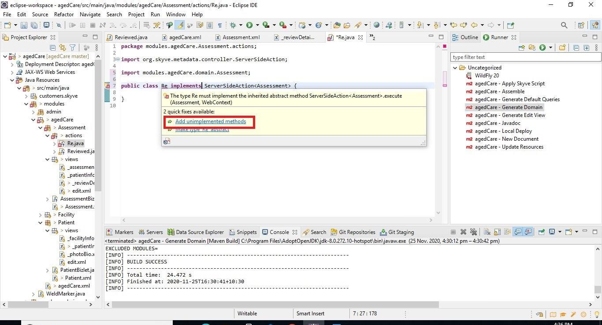

6. Add the code as shown below

   

7. Declare the action in the section of the `view` declaration

open `edit.xml` in the `Assessment` package to add action as below


8. Set privileges to execute the action within the role definitions section of the `agedCare.xml` file

In our document only nurse can review the assessments, So we can add the `action` in nurse role under `privileges` as below


Generate domain and deploy application.

Log in as a nurse user


You can see the Reviewed button on the top.

When you click on the Reviewed button it set the Assessment Review field with current date and time.


The end!!!!
