# Aged care Application Tutorial

### Contents

- [1. Tutorial Overview ](https://github.com/seema-source/Aged-care#1-tutorial-overview)
  - [1.1. Is this Tutorial right for me ?](https://github.com/seema-source/Aged-care#11-is-this-tutorial-right-for-me-)
  - [1.2. Aged Care Management](https://github.com/seema-source/Aged-care#12-aged-care-management)
  - [1.3. No-code Development](https://github.com/seema-source/Aged-care#13-no-code-development)
  - [1.4. Low-code Extension](https://github.com/seema-source/Aged-care#14-low-code-extension)
  - [1.5. Java Extensions](https://github.com/seema-source/Aged-care#15-java-extensions)

* [2. No-code Development](https://github.com/seema-source/Aged-care#2-no-code-development)
  - [2.1. Getting Started](https://github.com/seema-source/Aged-care#21-getting-started)
  - [2.2. Create your app in Foundry](https://github.com/seema-source/Aged-care#22-create-your-app-in-Foundry)
  - [2.3. Deploying your Aged care app](https://github.com/seema-source/Aged-care#23-deploying-your-aged-care-app)
  - [2.4. Using your Aged care app](https://github.com/seema-source/Aged-care#24-using-your-aged-care-app)

- [ 3. Low Code Extension](https://github.com/seema-source/Aged-care#3-low-code-extension)
  - [3.1. Collaboration](https://github.com/seema-source/Aged-care#31-collaboration)
  - [3.2. Configure your local environment](https://github.com/seema-source/Aged-care#32-configure-your-local-environment)
  - [3.3. Install and Configue Wildfly Server](https://github.com/seema-source/Aged-care#33-install-and-configue-wildfly-server)
  - [3.4. Add Repository in Eclipse](https://github.com/seema-source/Aged-care#34-add-repository-in-eclipse)
  - [3.5. Import Project](https://github.com/seema-source/Aged-care#35-import-project)
  - [3.6. Set the server](https://github.com/seema-source/Aged-care#36-set-the-server)
  - [3.7. Deploy and Configure Skyve Project](https://github.com/seema-source/Aged-care#37-deploy-and-configure-skyve-project)
  - [3.8 List Views](https://github.com/seema-source/Aged-care#38-list-views)
  - [3.9. Edit Views, Layout, and Components](https://github.com/seema-source/Aged-care#39-edit-views-layout-and-components)
  - [3.10. Roles](https://github.com/seema-source/Aged-care#310-roles)

* [4. Java Extensions](https://github.com/seema-source/Aged-care#4-java-extension)
  - [Conditions](https://github.com/seema-source/Aged-care#conditions)
  - [Bizlets](https://github.com/seema-source/Aged-care#bizlets)
  - [Actions](https://github.com/seema-source/Aged-care#actions)

# 1. Tutorial Overview

### 1.1. Is this Tutorial right for me ?

Before we start the tutorial, it is important to know about the answers to a few questions as below:

##### Will I benefit from it ?

If a custom app is what you need, the potential benefits of the Skyve system are significant.
You can develop your own powerful app, quickly and cheaply, with a dramatically reduced learning curve.
This tutorial will help you work out what can be achieved. You’ll also find out whether you’re personally up to the challenge (tip: you probably are).

##### Do I have enough skills ?

This tutorial has been designed to cater to people with a wide variety of skill levels.

We’ve split it into 3 sections:

- The first section is for everyone and requires no coding skills – we lead you through building a sample app using only “point and click” !

- Those with basic coding skills (or who are willing to learn some) can progress to the second section and extend their app

- Those with more advanced Java coding skills can progress from there on to the third section and extend their app even further
  So even if “point and click” is all you can manage and you’re allergic to any sort of ‘coding’, this tutorial is still for you ! It’ll help you get a ‘no-code’ Skyve app with a simple but functional interface, up and running in no time.

In this tutorial, we will show you how easy it is to build a powerful application using the Skyve Enterprise Application platform.

To familiarise you with Skyve application development, we will build a simple application together to manage aged care facilities, their residents, and care assessments.

### 1.2. Aged Care Management

A typical aged care provider might manage multiple facilities, each housing many residents. Residents are regularly assessed to ensure that they are well and safe, and that their care matches their needs.

Care providers must record the personal details of each resident and where they are located. They must also retain records care assessments for each resident both to facilitate regualar activities and to satisfy audit requirements.

Our app will meet these record storage and retrieval needs for an (imaginary!) aged care provider.

### 1.3. No-code Development

In the first main section of our tutorial, we will lead you through the no-code development of our Aged Care app.

No-code application development means developing an app using only a point-and-click interface - in this case Skyve [Foundry](https://foundry.skyve.org/foundry/).

In [Foundry](https://foundry.skyve.org/foundry/), you will use a point-and-click interface to define:

- ‘documents’ representing facilities, residents, and assessments
- data ‘attributes’ that need to be recorded for each different document type
- relationships between different types of documents (e.g. each resident belongs to one facility; each resident has many assessments)

Behind the scenes and hidden from sight, [Foundry](https://foundry.skyve.org/foundry/) takes care of all the ‘coding’ for you. It builds the app to your specifications and will even deploy it to a web-server and run it for you, so that you can immediately use it.

At the end of this section of the tutorial, you’ll have a functioning, usable Aged Care app up and running. At that point, you may decide that [Foundry](https://foundry.skyve.org/foundry/) provides everything you need to build your app, in which case you could stop here and leave the tutorial.

Or, if you have some basic coding skills or you’re willing to acquire them, we’d encourage you to move on to the ‘Low-code Extensions’ section which will show you how to enhance your app in ways that are beyond the scope of [Foundry](https://foundry.skyve.org/foundry/).

### 1.4. Low-code Extension

In the second main section of the tutorial, we will lead you through the addition of some low-code enhancements to the same Aged Care app that we just developed using [Foundry](https://foundry.skyve.org/foundry/) in the previous section.

When you create a no-code app using the [Foundry](https://foundry.skyve.org/foundry/) point-and-click interface, [Foundry](https://foundry.skyve.org/foundry/) automatically converts your app definition into a suite of Skyve low-code XML (eXtensible Markup Language) files. In [Foundry](https://foundry.skyve.org/foundry/), these are hidden away and no-code users never need to interact with them directly.

In this section of the tutorial, you will export your Aged Care app out of [Foundry](https://foundry.skyve.org/foundry/) and access it using an IDE (Integrated Development Environment – a developer’s coding toolkit) located on your own computer. This will allow you to manipulate the Skyve XML code directly, opening up an even broader range of functionality options to you.

Why do we call this ‘low-code’ ?

Web-based applications are typically written in Java or a similarly complex and powerful programming language. Indeed, Skyve itself uses Java - Skyve apps are automatically converted from Skyve XML into Java during the build process so that they can be deployed to a web server and run.

By contrast, the Skyve XML language is a dramatically simpler language – it allows you to select from a wide array of common application functions and configure them quite specifically to your needs. For Skyve users who need or want to go beyond the capabilities of [Foundry](https://foundry.skyve.org/foundry/), Skyve XML typically allows them to avoid the steep learning curve required to learn Java and the long development times required to write native Java apps.

So, using Skyve XML is still coding. But in contrast to coding in Java or a similar web-based language, it’s a great deal simpler, easier, faster and far more succinct. Hence, ‘low-code’. Furthermore, even when you do need to add code to extend a Skyve app, Skyve provides high level APIs to common Java frameworks, meaning that your code will be simpler and more succinct than usual.

In this section of the tutorial,we will focus on building in some user interface enhancements to our Aged Care app that are not possible (yet!) using the [Foundry](https://foundry.skyve.org/foundry/) point-and-click interface. We will edit and change the layouts of the Resident, Assessment, and Facility documents.

At the end of this section of the tutorial, you’ll have a significantly enhanced AgedCare app up and running, as well as a very broad palette of rapid application development capabilities at your fingertips with Skyve XML.

### 1.5. Java Extensions

While Skyve XML is already very powerful (and constantly growing) and covers a huge range of common functionality needs, there remain some bespoke requirements that cannot be met through Skyve XML alone. For those situations, Java extensions are the answer.

The Skyve platform provides an extensive system of programming hooks that enable you to develop discrete Java methods and graft them into your Skyve XML app, where they can leverage the full functionality of the Skyve system to provide you with the bespoke functionality you need.

If you don't have Java coding skills yourself, your simplest and cheapest option might be to buy support hours from one of our expert developers - you can do this within your Account in Skyve [Foundry](https://foundry.skyve.org/foundry/).

If you already have some Java skills, however, you can do this yourself ! In the third main section of the tutorial, we will lead you through the development of some Java enhancements to your AgedCare app.

Specifically, we will add some Java-code conditions and actions into our app to restrict, in a very granular and specific way, which users can access particular assessments relating to particular residents.

At the end of this section of the tutorial, you’ll have a further-enhanced AgedCare app up and running. More significantly, though, you’ll be able to combine your powerful new Skyve app development capabilities with your existing Java skills to create no-limits applications far faster than you could ever do with Java alone.

### 1.6. Primer: Skyve & Foundry

In the next section, we’ll start using the Skyve Foundry.
If you’ve already explored the Skyve website, you’ve probably already gained some insight into Skyve in general, including the Foundry.

If not, we invite you to orient yourself now by briefly exploring these webpages before you proceed with the rest of the tutorial:

- [What is Skyve?](https://skyve.org/what-is-skyve) - Skyve is a framework used to build attractive, secure, and scalable application with rich features and mobility. For more detail what [Skyve](https://skyve.org) is, and how it will be useful in your Enterprise Application Development visit our [Skyve](https://skyve.org/) page.

- [Getting Started](https://skyve.org/getting-started) - Will help give you some ideas on how to start with our [Skyve](https://skyve.org) Framework.

- [Skyve Foundry](https://Foundry.skyve.org/)-Will help you to start developing your application and also give [Demo](https://youtu.be/7oynha0tFmw) about how to use skyve [Foundry](https://foundry.skyve.org/foundry/).

Now, lets move to the next step how to create application with [Skyve Foundry](https://Foundry.skyve.org/)

# 2. No-code Development

In this section, we will go through the development of the Aged care application and will cover information about the Skyve platform and Skyve [Foundry](https://foundry.skyve.org/foundry/) in detail.

This section also covers how to create and add different documents: Resident, Assessments, and Facility in the Aged care application and how to deploy an application in [Foundry](https://foundry.skyve.org/foundry/).

### 2.1. Introduction to Foundry

Succinct statement of the purpose, key functions and general nature of Foundry, including (but not necessarily limited to):

- One-stop point-and-click tool for building apps
- Define all the data to be managed by your app, how it’s organised and how it’s related
- Deploy apps to a webserver so anyone can use them on the web

To create a new [Skyve](https://skyve.org) Project, we need to register our account first with following steps:

- Go to the [Skyve Foundry](https://Foundry.skyve.org/)
- Click on [Register](https://Foundry.skyve.org/Foundry/register.xhtml) and Enter your account details

  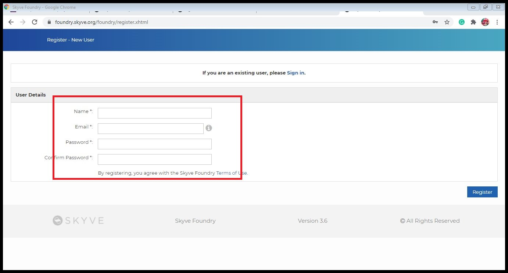

- Active your Email address and if you are already register [Sign in](https://foundry.skyve.org/foundry Signin) with your register email and password.

To create a new skyve project through [Foundry](https://foundry.skyve.org/foundry/) go to the [How to get started](https://youtu.be/G3OQu5PeUn8) on the top right-hand side of skyve [Foundry](https://foundry.skyve.org/foundry/) page and watch the video for more information about how to create new application.

### 2.2. Establish your AgedCare app in Foundry

In the Skyve [Foundry](https://foundry.skyve.org/foundry/), we can create and manage the browser-based applications. Skyve [Foundry](https://foundry.skyve.org/foundry/) allows us to create numbers of application, and that each one will have a single record showing here on welcome screen.


Now, I will take you step by step creation of application:

- Click on the Add button

  

- Enter the name of App and email address

  

- Click on save, after that start build Data Design

### 2.3. Data-driven Design in Foundry

Data driven design refers to how organisations use data to make their content more appealing to users by analysing their behaviour. In Skyve Foundry, we used different data designs such as modules, documents, and attributes to design an application.

_*Modules:*_ In Skyve, modules define self-contained areas of functionality and have their own menu group. By default, Foundry apps start with a single module i.e Admin module. In the Design tab of your application, you can add or remove a module using the Add button.

_*Documents:*_ In data design, documents are related to the real business entities (e.g.resident, facility, assessment). For more details about documents click on this link https://skyvers.github.io/skyve-dev-guide/concepts/

_*Attributes:*_ Attributes contain information about each document (e.g. Resident's document attributes : name, id, photo, bio etc.). Attributes can have different data types and different view.

_*Data type:*_ Data type specifies which type of value an attribute name hold.

- Text or String: Used for a combination of any characters that appear on a keyboard, such as letters, numbers and symbols.

- Memo: Memo data type also called "Long Text". It is used to store large amount of text.

- Date: A Date includes the time, the year, the name of the day of the week, and the time zone.

- Image: Image data type is used where we want to upload an image in our document.

- Integer: It is used to store the numeric values.

- Association: This data type is used where there is a relationship between two entity object based on common attributes. An entity object only needs an association to access the data of another entity object.

### 2.4. Create your Resident document

The resident document will contain the personal information about the residents and the information about the facility they admitted.

Resident document contain attributes below:

| Attribute name | Data Type   | Length |
| -------------- | ----------- | ------ |
| ResidentID     | Text        | 100    |
| Resident Name  | Text        | 500    |
| Photo          | Image       |
| DOB            | Date        |
| Room Number    | Integer     |
| BIO            | Memo        |
| Admission Date | Date        |
| Facility name  | Association |

The `Facility name` attribute will be an association to a Facility (held in the Facility data table). The association represents a link to the entire Facility record (including name, address etc). In a database this would be called a foreign key. In Skyve it is called an association, and in the Aged Care application we are building - we will expect to see a drop-down list for this attribute so that the user can select the associated Facility record."

Now, we will create a Resident document and add attributes in Resident document in next few steps.

- Click on Data Design to add the Documents

  

- Add all information as shown below and click on Zoom out

  

- You can see your document on screen.

- Next, create documents for Facility and Assessments same as resident and click on arrow to add attributes for each document

  

- Click on Add button to add attributes to resident document

  

- Add all the attributes for Resident document as below

  

### 2.5. Create your Facility document

The Facility document will contain information about the facility(e.g.facility name, Facility manager), facility full address and location.

The attributes for Facility document as below:

| Attribute name   | Data Type   | Length |
| ---------------- | ----------- | ------ |
| Facility Name    | Text        | 500    |
| Building Number  | Integer     |
| Street Name      | Text        | 500    |
| Suburb           | Text        | 500    |
| State            | Text        | 100    |
| Facility manager | Association |

The `Facility manager` attribute will be an association to a system user (held in the User data table). The association represents a link to the entire User record (including name, access levels, contact details etc). In a database this would be called a foreign key. In Skyve it is called an association, and in the Aged Care application we are building - we will expect to see a drop-down list for this attribute so that the user can select the associated record for the system user who is the Facility manager."

This document will follow the same steps we followed for Resident document. It will look like as below:

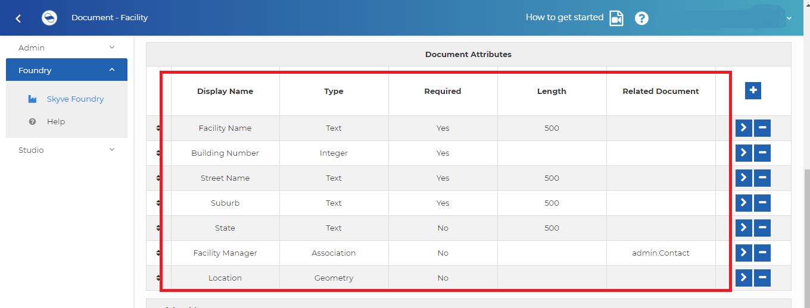

### 2.6. Create your Assessment document

The Assessment document will contain information about all the care assessments related to each resident.

The attributes for Assessments document as below:

| Attribute name        | Data Type   | Length |
| --------------------- | ----------- | ------ |
| Hygiene Assessment    | Memo        |
| Pain Assessment       | Memo        |
| Continence Assessment | Memo        |
| Sleep Assessment      | Text        | 600    |
| Behaviour Assessment  | Memo        |
| Staff                 | Association |

The `Staff` attribute will be an association to a system user (held in the User data table). The association represents a link to the entire User record (including name, access levels, contact details etc). In a database this would be called a foreign key. In Skyve it is called an association, and in the Aged Care application we are building - we will expect to see a drop-down list for this attribute so that the user can select the associated record for the system user who is the Staff person.

Follow the same steps like Resident and Assessment documents. Assessment document look like as below.


### 2.7. Deploy your AgedCare app

Our Aged care application is almost ready, now the next step is to deploying our application to check how it look like. (Note: If you are using a free trail version, you can only deploy your application for an hours. To use the free version for another hour you need to redeploy it).

There are following steps to deploy Aged care application as we created in [Foundry](https://foundry.skyve.org/foundry/):

1. Go to [Foundry](https://foundry.skyve.org/foundry/) and click on Aged care application

   

2. Click on Deloy tab and then click on Deploy, usually it take 2 minutes to deploy your application

3. Next, click on the deploy link

   

4. Sign in with user "setup" and password which you initialised during deployment


### 2.8. Using your AgedCare app

Your application is ready to go. It contains two modules:Admin and Aged care. These two modules show as two menus in the application as shown below.
The Admin module is the provided as part of the Skyve platform for all applications. It provides a range of powerful administration features, including:

- user and access management
- scheduled backups and restoring from backups
- ability to import and export data
- scheduled jobs and tasks
- comprehensive system user activity audit tracking, keeping records of every user interaction in the system.

In the Aged care module, you we see the a menu item for each of the three documents we created in the foundry. Let's see how it look like...

Click to expand the Aged menu.

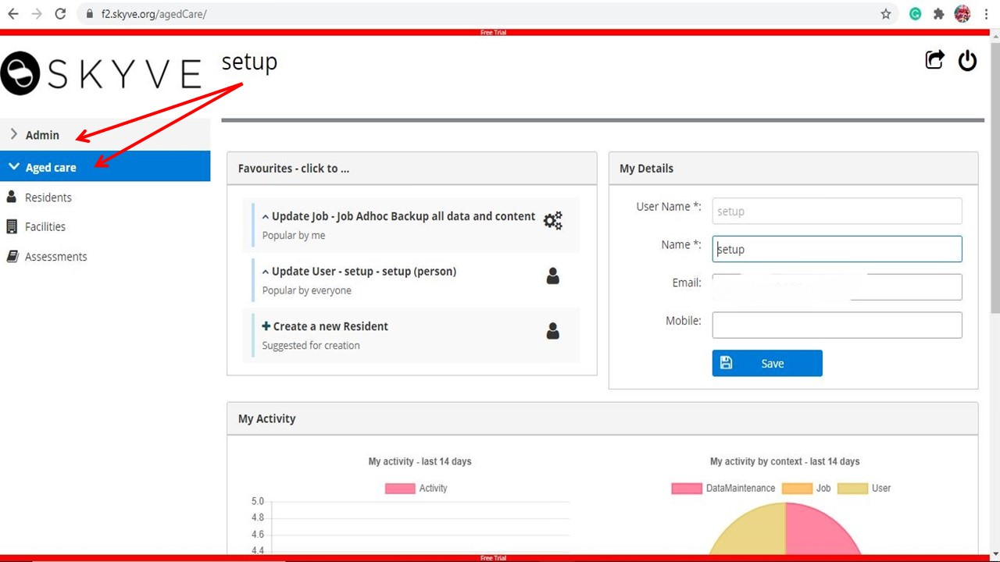

You will notice two red lines- one at the top of the screen and one at the bottom of the screen.
Generally organisations will run several instances of their application, for example, Production, Quality Assurance, Test/UAT and Development etc. For non-production instances, Skyve adds these labels so that the person using the system clearly understands whether they are working on a Production instance or not.

In this case, we are using the Foundry `Free Trial` instance, so the two red indicators show. When you move to a production instance (either hosted on Foundry, or on your own infrastructure) these instance identifiers will not show.


Click on Facility and then add button


Enter the detail of facility in the fields and click on "Ok" or "Save" button.

**Ok button:** This button performs Save and Close action on clicked. This will save the changes and return you in previous page.

**Save button:** This button will save any changes you perform in the current page when you click on it.

So, press Ok or Save as you go.


Next, click on Assessments


Add data in Assessments


#### Desktop Mode

Skyve provides two separate user interface: Normal mode and power user mode. In normal mode, the interface is responsive and mobile and tablet friendly where as the power user mode is great for desktop browsers.

To switch between interface click on the switch icon on the top-right of the application screen.


After switching


#### Making Changes and Re-Deploying

The [Foundry](https://foundry.skyve.org/foundry) free trial server will automatically undeploy your project after one hour - but you can redeploy your application as many times as you need during your testing and your data is saved while the project is offline.

### 2.9. Foundry & App FAQs

- Can I make changes to my app after I’ve deployed it?
- I deployed my app – why did it stop working ?
- How do I re-deploy my app ?
- I’ve got what I came for. Can I build my own app now ?

# 3. Low Code Extension

In this section, we will work on collaboration and configuration of the local environment. After that, we will do some editing in the XML files, which will change the lists, views, and layout of our application. So, this step will enable us to test and deploy our application locally on our own (or another machine).

For more detail visit our [Dev Guide](https://skyvers.github.io/skyve-dev-guide/) - which will help you learn and understand about our development. It also covers most [Skyve Framework](https://skyve.org) elements and concepts. There are many real examples for you to refer to also.

### 3.1. Collaboration

Next, we need to Collaborate our application with Github.

Why we need collaboration?

Collaboration will allow another user of your team to do editing in your application or between [Foundry](https://foundry.skyve.org/foundry/) users and developer. So, to do collaboration we need to provide our application with a remote endpoint of new Git repository.

To find the more detail how to collaborate Go to [Help button](https://Foundry.skyve.org/Foundry/loggedIn.jsp?a=e&m=Foundry&d=Help) top right of the screen [Foundry](https://foundry.skyve.org/foundry/) Help, and follow the steps for collaboration.


#### Setup to Github

To enable the collaboration, first of all Sign up or log into [Github](https://github.com/) account.
To create a new repository follow the steps below:

- Click on the Add button on the top right side to create the new repository

  

- Next, enter the name of the repository, make it private, and click on create

  

- After creating repository, you will see the link as shown below, copy the link

  

- Next, go to [Foundry](https://foundry.skyve.org/foundry/), open the collaborate tab and paste the link in Remote Endpoint

- Click on apply
- Click on Save

  

- Then, Go to collaborate tab of your application and describe changes with comment, click on commit and push button

  (Note: "Commit will put your changes into your local repo and "Push" sends that changes to remote location)

  

- Next, check your project in Github

- Go to Github, open repository to see all the files

  

You have now successfully created your application and configured it for collaboration!

### 3.2. Configure your local environment

For this section, we have chosen to show how to use Eclipse as the development environment, however if you prefer you can use other development environment tools such as IntelliJ, NetBeans, Visual Studio Code etc. However, if you're not completely familiar with these, use Eclipse so that you can follow the steps below.

Before you can import the project into Eclipse, you need to download and install Eclipse in your system.

#### Download and Install Eclipse and JDK

- ##### Download and Install Eclipse

  - Click here to [Download Eclipse](https://www.eclipse.org/downloads/packages/)
  - Next, Click on [Eclipse IDE for Enterprise Java Developers](https://www.eclipse.org/downloads/packages/release/2020-09/r/eclipse-ide-enterprise-java-developers)

  

  - Click on download
  - Then, Install Eclipse in your system

- ##### Download and Install JDK
  - Click here to [download and install JDK 8](https://adoptopenjdk.net/installation.html)
  - Install an OpenJDK 8 version from [AdoptOpenJDK](https://adoptopenjdk.net/installation.html?variant=openjdk8&jvmVariant=hotspot#x86-32_win-jdk) (or an alternative open JDK of your choice)

### 3.3. Install and Configure Wildfly Server

We need an application server to be able to access the application through our browser, for this we will demonstrate using Red Hat's Wildfly application server plugin. Skyve apps can be deployed on recent versions of Wildfly (10-20).

- #### Install Wildfly Server
  You can skip this step if WildFly Server is already installed on your system.

Before installing WildFly Server, make sure JBoss Tools is installed on your system.

To install JBoss Tools, click on Help, then click Eclipse Marketplace.


In the searchbar, enter 'jboss' then search.

Select the JBoss Tools version that the search returns, and click Install.


Select list as below


To check if JBoss Tools is installed properly, click on Help, then click Eclipse Marketplace.


Change to the `Installed` tab.

If the JBoss Tools plugin is present, you are ready to continue.


After JBoss Tools was installed properly, follow these steps to install WildFly Server.

1. Once Eclipse is opened, right-click under the Package Explorer tab and highlight New, then from the pop-out, click on Server

   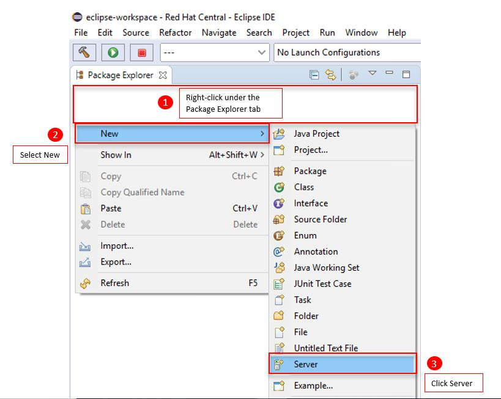

2. Select the WildFly version you wish to work with and click Next

   

3. Click Next again

   

4. Once more, click the Next button

   

5. Click on the Download and install runtime link

   

Select the latest version of WildFly, then click Next


7.  Once you have read the terms of the licence agreement, check the box to accept the terms, and click Next

    

8.  Finally, select the path for where you wish your download and install locations to be found, then click Finish to complete the installation

    

9.  Wait for Eclipse to complete the download and installation process before moving on to the next step

    

### 3.4. Add Repository in Eclipse

After downloading and installation of eclipse and server, the next step is add our repository in the eclipse.

1. Open the Eclipse in your system
2. Click on window tab and click on show View, then other

   

3. Select Git Repositoies and click on open

   

4. Click on Git Repositories in bottom area of eclipse, right click and select clone a Git Repostory...

   

5. Get URL from Github, go to Github and click on Code button.

   

6. Copy that link and paste in Clone window and click on Next

   

7. Click on Next again

   

8. Click on Finish

   

In Git Repositories, we can see our repository is added now!

### 3.5. Import Project

As we already created a project in Skyve [Foundry](https://foundry.skyve.org/foundry/), now it is time to import that project in Eclipse to do changes in the Aged care app. To import project in Eclipse follow the steps below:

1. Click on File tab in Eclipse and Select import

   

2. Select Exiting Maven Project form list and click on Next

   

3. Set your root directory (Folder wwhere you cloned your git repository to in the previous section) and click on Finish

   

You can see your project in Project Explorer area in Eclipse.

### 3.6. Set the server

To run our project in server we need to set Server in Eclipse first.

1. Click on Server tab in Eclipse and right click

   

2. Click on Add and Remove and then Finish

   

## 3.7 Configure and Deploy the Skyve Project

##### Deploy your Skyve project

Once the Wildfly Server is configured, it's easy to deploy your Skyve project to your WildFly Server.

1. Open WildFly deployments folder Right-click on the server and click on Show In, then click on File Browser

   

2. Copy the agedCare.json and agedCare-ds.xml and paste in the deployments folder to the WildFly deployments folder that you opened in the previous step.

   

Skyve applications can store images and other types of rich content. To be able to do this, Skyve needs to have full access to a folder to store and manage content.
You need to create a dedicated folder for Skyve to do this. The content folder can be located anywhere and named whatever you like, however it is easiest to place it inside your eclipse folder and name it something simple like `content`.

3. Open the File window and browse to the content folder (which is in your root folder) and create new folder named `agedCare`.

   

4. Open the agedCare.json file in your preferred text editor.

Go to the `content` section and modify the `directory` setting to tell Skyve where the content folder is located.
Note that you must not use backslashes even if you are running on Windows - and the folder path must be terminated with a slash
e.g. `directory: "C:/eclipse/content/",`

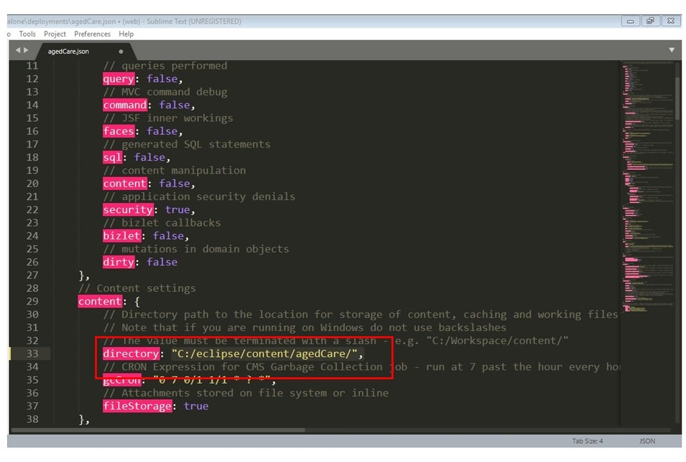

Go to the bottom of the file to change the identifier.


If you want to change the username and password, you can change in bootstrap in this app it is not changed.

Lastly, save and close the file.

5. Open agedCare-ds.xml file in the text editor

   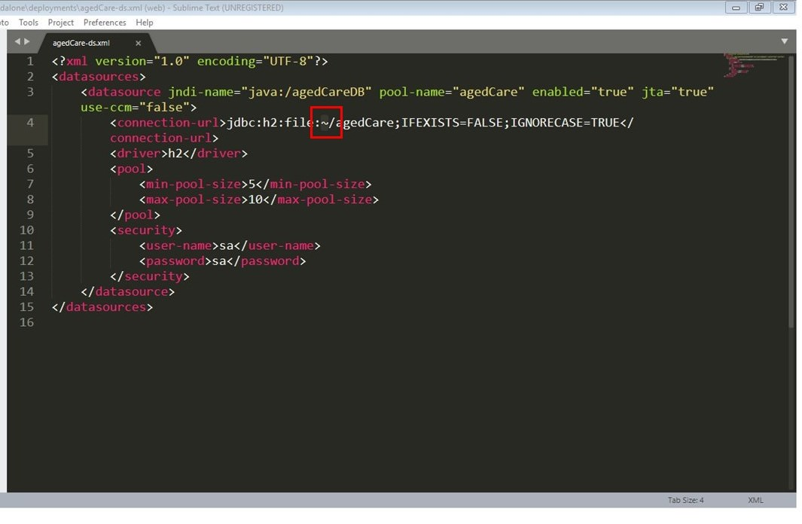

   Go to connection-url and replace ~ sign with content folder address and save the file.

   

##### Run your Aged care application

Part of Skyve's low-code approach is to generate Java code for you (in the background) so that you don't have to write large amounts of Java code. We call this step `Generate Domain` because Java classes will be created representing the `domain` (the `problem domain` or `area of knowledge`) of your project. The domain classes are Java classes that do the work of managing data access and storage for your application.

Generate domain validates and compiles the metadata (XML files) in your project and checks that the application domain is in a valid state. Errors for the developer to fix are written to your console, and if generate is successful, the domain will be compiled to produce Java domain files and unit tests.

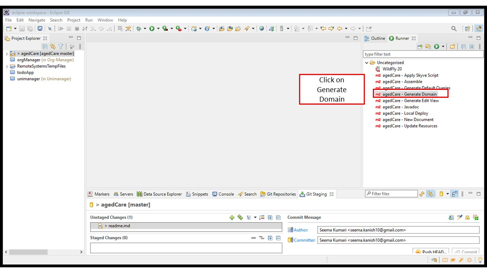

Right click the server and use the start button to start the server.

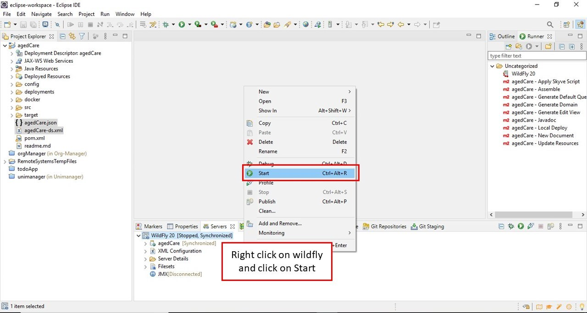

When your Console Window shows text similar to that shown below, your agedCare has been deployed and is running on your localhost server (your local machine).


If not, you may try to debug by yourself to find the source of the problem, or [Join Us On Slack](https://join.slack.com/t/skyveframework/shared_invite/enQtNDMwNTcyNzE0NzI2LWNjMTBlMTMzNTA4YzBlMzFhYzE0ZmRhOWIzMWViODY4ZTE1N2QzYWM1MTdlMTliNDIyYTBkOWZhZDAxOGQyYjQ) and ask any questions there. You will get support from the [Skyve](https://skyve.org) team or a community team member.

Access the Aged care app from your Web Browser at http://localhost:8080/agedCare. Sign in with by default username "setup" and password "setup"..


### 3.8. List Views

Skyve provides two main ways of accessing data - either via list or detail views. The `list` view allows you to search and find the data you wish to change and is normally what you see when you choose a menu item. Once you select a record you will see the `detail` view - which allows you to enter, change or delete data.

Skyve will provide generic/default list and edit views. Skyve supports rapid prototyping of the domain model and gives the developer an ability to begin interacting with the application at an early stage.

List views provide for searching and review of data - they show data in the context of other data in the system. Lists are usually based on queries that you can define, however, for simple applications Skyve will automatically list all records for each type of `document`.

Each row of the list corresponds to an instance of the document (a record) but may include columns from associated documents within the document's object hierarchy.
For example, the list of Residents may include columns for the Facility and Staff - because these documents are associated to the Resident records.

- #### Resident List

The Resident list shows the details of each resident, according to the attributes we defined when creating the Aged care application.

So that we can control exactly what is shown in the list, we will define a query and specify what columns are shown and in which order. To do this we add a query definition to the agedCare module (as shown below).

To make the application easier to use, it can be useful to hide some columns in the list. In this case we will hide the attributes `admissionDate` and `residentId` for the Resident records, and display the Resident photo as a thumbnail image.

A thumbnail is a scaled down version of the image. If you store high quality images of each resident (e.g 5MB each), when you include these images in the list, the user would have to receive a lot of data to view the list. For example, for 50 rows (for example) of Resident data, this would mean the user would have to receive 50x5MB of data, and this would make the `list` view appear very slow to use. Instead, Skyve automatically generates scaled down versions of images (thumbnails) and these can be included in the `list` so that application performance is not compromised.

This means we can include a thumbnail column in our query to show the images of each Resident without significantly impacting on the performance of our application.

Open agedCare.xml

Right after the Menu declaration in agedCare.xml, we will declare Queries like below:

```xml
<queries>
    <query documentName="Resident" name="qResident">
    <description>All Resident</description>
    <columns>
   	<content display="thumbnail" binding="photo" pixelHeight="45" pixelWidth="45" />
    	<column binding="residentID" sortOrder="ascending" hidden="true" />
    	<column binding="residentName" sortOrder="ascending" />
    	<column binding="DOB" sortOrder="ascending" />
    	<column binding="roomNo" sortOrder="ascending" />
    	<column binding="BIO" sortOrder="ascending" />
    	<column binding="admissionDate" sortOrder="ascending" hidden="true" />
    	<column binding="facilityName.facilityName" sortOrder="ascending" />
    </columns>
    </query>
</queries>

```

Here the `content query column` provides a `content` column type for content items like image and file attachments.

You can specify a default query for each document in the module (in the agedCare.xml file ) and this will ensure that wherever a list is shown for this document in your application, you will always get the same query.

To do this, set defaultQueryName for the Resident document to be the name of our query as shown below:

```xml
<documents>
        <document ref="Resident" defaultQueryName="qResident"/>
        <document ref="Facility"/>
        <document ref="Assessment"/>
        <document ref="Contact" moduleRef="admin"/>
        <document ref="DataGroup" moduleRef="admin"/>
        <document ref="User" moduleRef="admin"/>
</documents>


```

To apply the change, stop the `WildFly` server and run the `Generate Domain` command, then start the `WildFly` Server again.


- #### Facility List

Next, let's see our Facility list: it now shows a column for each of the attributes we defined in the document.

Instead, we will create another module query, so that we can define precisely which columns are show.

In the module (the agedCare.xml file), define a Facility query as shown below, hiding the attributes `Location` and `Facility manager`.

Open agedCare.xml

Right after the Menu declaration in agedCare.xml, we will declare Queries like below:

```xml
<query documentName="Facility" name="qFacility">
			<description>All Facilities</description>
			<columns>
				<column binding="facilityName" sortOrder="ascending" />
				<column binding="buildingNumber" sortOrder="ascending" />
				<column binding="streetName" sortOrder="ascending" />
				<column binding="suburb" sortOrder="ascending" />
				<column binding="state" sortOrder="ascending" />
				<column binding="facilityManager" sortOrder="ascending"
					hidden="true" />
				<column binding="location" sortOrder="ascending"
					hidden="true" />
			</columns>
</query>
```

Then you will need to provide `defaultQueryName` attribute to your facility document in `agedCare.xml` like below:

```xml
<documents>
		<document ref="Resident" defaultQueryName="qResident" />
		<document ref="Facility" defaultQueryName="qFacility" />
		<document ref="Assessment" />
		<document ref="Contact" moduleRef="admin" />
		<document ref="DataGroup" moduleRef="admin" />
		<document ref="User" moduleRef="admin" />
</documents>
```

To apply the change, stop the `WildFly` server and run the `Generate Domain` command, then start the `WildFly` Server again.


- #### Assessments List

As in the `Assessment` document, you can see different assessments related to each resident.

Let's hide `Pain assessement` and `Review date` from the document and add resident name and image.

Let's try it: Add a query to your module (the agedCare.xml file)

```xml
<query documentName="Assessment" name="qAssessment">
    <description>All Assessments</description>
    <columns>
    	<content display="thumbnail" binding="parent.photo" pixelHeight="60" pixelWidth="60" />
    	<column binding="parent.residentName" sortOrder="ascending" />
    	<column binding="hygieneAssessment" sortOrder="ascending" />
    	<column binding="painAssessment" sortOrder="ascending"   hidden="true"/>
    	<column binding="continenceAssessment" sortOrder="ascending" />
    	<column binding="sleepAssessment" sortOrder="ascending" />
    	<column binding="behaviourAssessment" sortOrder="ascending" hidden="true" />
    	<column binding="staff" sortOrder="ascending" />
    	<column binding="assessmentReview" sortOrder="ascending" hidden="true" />
    </columns>
</query>
```

Then, set the `defaultQueryName` attribute to your Assessment document, as shown:

```xml
<documents>
        <document ref="Resident" defaultQueryName="qResident"/>
        <document ref="Facility"  defaultQueryName="qFacility"/>
        <document ref="Assessment"  defaultQueryName="qAssessment"/>
        <document ref="Contact" moduleRef="admin"/>
        <document ref="DataGroup" moduleRef="admin"/>
        <document ref="User" moduleRef="admin"/>
</documents>
```

Again, to apply the change, stop the WildFly server and run the Generate Domain command, then start the WildFly Server.


### 3.9. Edit Views, Layout, and Components

In this section we will override the default detail view which is generated by Skyve.

- #### Resident Edit view

Skyve provides us with a very useful function to create default `edit view` based on our document attributes and attributes type, the default widget will be applied for each attribute type.

So to create our Resident `edit view`, we will go through the following steps:

#### Create edit view

1. Click on `Generate edit view` in the right side of the eclipse window and write the module and document name in the Console window.

   

2. If you go to the agedCare module left side of eclipse and open the resident module. You can see view module and in view module there is a document with `generatedit.xml`. Rename the document, `edit.xml`

   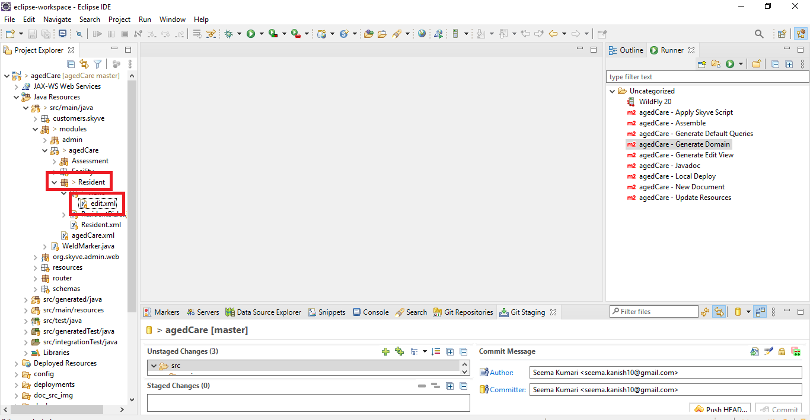

#### Enhance the edit view

In the previous step we generated an edit view by using the Generate Edit View function. Now we will enhance our edit view to make it more visually appealing.

As of now, Resident attributes show one by one, from top to bottom.

We will enhance the view by showing all personal information one the left-hand side of the screen and the photo and BIO on the right-hand side.

To do that, we will need to understand about Skyve View Containers - https://skyvers.github.io/skyve-dev-guide/views/#containers

After reading through the chapter on Skyve Containers, you may have already guessed how to split our view into 2 parts.

The `hbox` container lays out items horizontally.

Open resident `edit.xml` and add the code given below;

```xml
<?xml version="1.0" encoding="UTF-8"?>
<view xmlns="http://www.skyve.org/xml/view"
	xmlns:xsi="http://www.w3.org/2001/XMLSchema-instance" name="edit"
	title="Resident"
	xsi:schemaLocation="http://www.skyve.org/xml/view ../../../../schemas/view.xsd">
	<tabPane>
		<tab title="General">
			<hbox border="true">
				<!-- left side -->
				<vbox responsiveWidth="8" percentageWidth="60">
					<form>
						<column percentageWidth="30" responsiveWidth="4" />
						<column />
						<row>
							<item>
								<default binding="residentID" />
							</item>
						</row>
						<row>
							<item>
								<default binding="residentName" />
							</item>
						</row>
						<row>
							<item>
								<default binding="DOB" />
							</item>
						</row>
						<row>
							<item>
								<default binding="roomNo" />
							</item>
						</row>
						<row>
							<item>
								<default binding="admissionDate" />
							</item>
						</row>
						<row>
							<item>
								<default binding="facilityName" />
							</item>
						</row>
					</form>
				</vbox>
				<!-- right side -->
				<vbox responsiveWidth="4" percentageWidth="40">
					<form>
						<column percentageWidth="20" responsiveWidth="1" />
						<column />
						<row>
							<item showLabel="false">
								<contentImage binding="photo" />
							</item>
						</row>
						<row>
							<item>
								<default binding="BIO" />
							</item>
						</row>
					</form>
				</vbox>
			</hbox>
		</tab>
		<tab title="Assessments">
			<dataGrid binding="assessments">
				<boundColumn binding="hygieneAssessment" />
				<boundColumn binding="painAssessment" />
				<boundColumn binding="continenceAssessment" />
				<boundColumn binding="sleepAssessment" />
				<boundColumn binding="behaviourAssessment" />
				<boundColumn binding="staff" />
				<boundColumn binding="assessmentReview" />
				<onAddedHandlers />
				<onEditedHandlers />
				<onRemovedHandlers />
				<onSelectedHandlers />
			</dataGrid>
		</tab>
	</tabPane>
	<actions>
		<defaults />
	</actions>
	<newParameters />
</view>
```

To see the changes, generate domain and re-deploy the application as you did before (stop the WildFly server, run Generate Domain, then restart WildFly).


Next, we will group related information together to make it easier to manage.
The easiest way is to use the `border` and `borderTitle` attributes of the Form container.

So, in this case, we will have 2 forms, one for Resident information, one for Faciltiy information. Let's add border and borderTitle in the <form> tag.

Let's add `border` and `borderTitle` in the `<form>` tag.

```xml
<?xml version="1.0" encoding="UTF-8"?>
<view xmlns="http://www.skyve.org/xml/view"
	xmlns:xsi="http://www.w3.org/2001/XMLSchema-instance" name="edit"
	title="Resident"
	xsi:schemaLocation="http://www.skyve.org/xml/view ../../../../schemas/view.xsd">
	<tabPane>
		<tab title="General">
			<hbox border="true">
				<!-- left side -->
				<vbox responsiveWidth="8" percentageWidth="60">
					<form border="true" borderTitle="Resident Info">
						<column percentageWidth="30" responsiveWidth="4" />
						<column />
						<row>
							<item>
								<default binding="residentID" />
							</item>
						</row>
						<row>
							<item>
								<default binding="residentName" />
							</item>
						</row>
						<row>
							<item>
								<default binding="DOB" />
							</item>
						</row>
					</form>
					<form border="true" borderTitle="Facility Info">
						<column percentageWidth="30" responsiveWidth="4" />
						<column />
						<row>
							<item>
								<default binding="roomNo" />
							</item>
						</row>
						<row>
							<item>
								<default binding="admissionDate" />
							</item>
						</row>
						<row>
							<item>
								<default binding="facilityName" />
							</item>
						</row>
					</form>
				</vbox>
				<!-- right side -->
				<vbox responsiveWidth="4" percentageWidth="40">
					<form>
						<column percentageWidth="20" responsiveWidth="1" />
						<column />
						<row>
							<item showLabel="false">
								<contentImage binding="photo" />
							</item>
						</row>
						<row>
							<item>
								<default binding="BIO" />
							</item>
						</row>
					</form>
				</vbox>
			</hbox>
		</tab>
		<tab title="Assessments">
			<dataGrid binding="assessments">
				<boundColumn binding="hygieneAssessment" />
				<boundColumn binding="painAssessment" />
				<boundColumn binding="continenceAssessment" />
				<boundColumn binding="sleepAssessment" />
				<boundColumn binding="behaviourAssessment" />
				<boundColumn binding="staff" />
				<boundColumn binding="assessmentReview" />
				<onAddedHandlers />
				<onEditedHandlers />
				<onRemovedHandlers />
				<onSelectedHandlers />
			</dataGrid>
		</tab>
	</tabPane>
	<actions>
		<defaults />
	</actions>
	<newParameters />
</view>
```


Now that we have created a view for Resident records, it's time learn about View Components.

So, what are View Components?

Let's imagine that our view is very complex, lots of sections and these sections can be reused in different views. Skyve allows for reuse of view sections via the component widget.

To demonstrate how to re-use components, we will split our view into three components:

1. Resident Info
2. Facility Info
3. Photo and Bio

The view component must be declared according to the convention, with the file name matching the declared name.

##### Resident Info component

In the Resident > views package, create new `_residentInfo.xml` file with below content:

```xml
<?xml version="1.0" encoding="UTF-8"?>
<view xmlns="http://www.skyve.org/xml/view"
	xmlns:xsi="http://www.w3.org/2001/XMLSchema-instance"
	name="_residentInfo" title="Resident Info"
	xsi:schemaLocation="http://www.skyve.org/xml/view ../../../../schemas/view.xsd">
	<form border="true" borderTitle="Resident Info">
		<column percentageWidth="30" responsiveWidth="4" />
		<column />
		<row>
			<item>
				<default binding="residentID" />
			</item>
		</row>
		<row>
			<item>
				<default binding="residentName" />
			</item>
		</row>
		<row>
			<item>
				<default binding="DOB" />
			</item>
		</row>
	</form>
</view>
```

##### Facility Info component

In the Resident > views package, create new `_facilityInfo.xml` file with below content:

```xml
<?xml version="1.0" encoding="UTF-8"?>
<view xmlns="http://www.skyve.org/xml/view"
	xmlns:xsi="http://www.w3.org/2001/XMLSchema-instance"
	name="_facilityInfo" title="Facility Info"
	xsi:schemaLocation="http://www.skyve.org/xml/view ../../../../schemas/view.xsd">
	<form border="true" borderTitle="Facility Info">
		<column percentageWidth="30" responsiveWidth="4" />
		<column />
		<row>
			<item>
				<default binding="roomNo" />
			</item>
		</row>
		<row>
			<item>
				<default binding="admissionDate" />
			</item>
		</row>
		<row>
			<item>
				<default binding="facilityName" />
			</item>
		</row>
	</form>
</view>
```

##### Photo and Bio component

In the Resident > views package, create new `_photoBio.xml` file with below content:

```xml
<?xml version="1.0" encoding="UTF-8"?>
<view xmlns="http://www.skyve.org/xml/view"
	xmlns:xsi="http://www.w3.org/2001/XMLSchema-instance" name="_photoBio"
	title="Resident Photo and Bio"
	xsi:schemaLocation="http://www.skyve.org/xml/view ../../../../schemas/view.xsd">
	<form>
		<column percentageWidth="20" responsiveWidth="1" />
		<column />
		<row>
			<item showLabel="false">
				<contentImage binding="photo" />
			</item>
		</row>
	</form>
	<form border="true" borderTitle="BIO">
		<column />
		<row>
			<item showLabel="false">
				<textArea binding="BIO" />
			</item>
		</row>
	</form>
</view>
```

##### Combine together

After done with component creation, we will go to use it on our `edit view`.
Change `edit.xml` view like below:

```xml
<?xml version="1.0" encoding="UTF-8"?>
<view xmlns="http://www.skyve.org/xml/view"
	xmlns:xsi="http://www.w3.org/2001/XMLSchema-instance" name="edit"
	title="Resident"
	xsi:schemaLocation="http://www.skyve.org/xml/view ../../../../schemas/view.xsd">
	<tabPane>
		<tab title="General">
			<hbox border="true">
				<!-- left side -->
				<vbox responsiveWidth="8" percentageWidth="60">
					<component name="_residentInfo" />
					<component name="_facilityInfo" />
				</vbox>
				<!-- right side -->
				<vbox responsiveWidth="4" percentageWidth="40">
					<component name="_photoBio" />
				</vbox>
			</hbox>
		</tab>
		<tab title="Assessments">
			<dataGrid binding="assessments">
				<boundColumn binding="hygieneAssessment" />
				<boundColumn binding="painAssessment" />
				<boundColumn binding="continenceAssessment" />
				<boundColumn binding="sleepAssessment" />
				<boundColumn binding="behaviourAssessment" />
				<boundColumn binding="staff" />
				<boundColumn binding="assessmentReview" />
				<onAddedHandlers />
				<onEditedHandlers />
				<onRemovedHandlers />
				<onSelectedHandlers />
			</dataGrid>
		</tab>
	</tabPane>
	<actions>
		<defaults />
	</actions>
	<newParameters />
</view>
```

Now re-deploy the application to check that the view appears as it did before:


- #### Facility Edit view

In the previous section we explore and practice how to create an edit view and customize it to meet our requirements. It's now easy for us to create an edit view for the Facility document.

The Facility edit view will contain three components:

1. Facility Info
2. Facility address
3. Facility location

Let's start with Facility Info component.

1. Generate the edit view for Facility document

   

2. Add the facility component the same way we have done for the resident component

##### Facility Info component

In the Facility > views package, create new `_facilityInfo.xml`
as below content:

```xml
<?xml version="1.0" encoding="UTF-8"?>
<view xmlns="http://www.skyve.org/xml/view"
	xmlns:xsi="http://www.w3.org/2001/XMLSchema-instance"
	name="_facilityInfo" title="Facility Info"
	xsi:schemaLocation="http://www.skyve.org/xml/view ../../../../schemas/view.xsd">
	<form border="true" borderTitle="Facility Info">
		<column percentageWidth="30" responsiveWidth="4" />
		<column />
		<row>
			<item>
				<default binding="facilityName" />
			</item>
		</row>
		<row>
			<item>
				<default binding="facilityManager" />
			</item>
		</row>
	</form>
</view>

```

##### Facility address component

In the Facility > views package, create new `_facilityAddress.xml` as below content:

```xml

<?xml version="1.0" encoding="UTF-8"?>
<view xmlns="http://www.skyve.org/xml/view"
	xmlns:xsi="http://www.w3.org/2001/XMLSchema-instance"
	name="_facilityAddress" title="Facility Address"
	xsi:schemaLocation="http://www.skyve.org/xml/view ../../../../schemas/view.xsd">
	<form borderTitle="Facility Address" border="true">
		<column percentageWidth="30" responsiveWidth="4" />
		<column />
		<row>
			<item>
				<default binding="buildingNumber" />
			</item>
		</row>
		<row>
			<item>
				<default binding="streetName" />
			</item>
		</row>
		<row>
			<item>
				<default binding="suburb" />
			</item>
		</row>
		<row>
			<item>
				<default binding="state" />
			</item>
		</row>
	</form>
</view>
```

##### Facility location Component

In the Facility > views package, create new `_facilityLocation.xml` as below content:

```xml
<?xml version="1.0" encoding="UTF-8"?>
<view xmlns="http://www.skyve.org/xml/view"
	xmlns:xsi="http://www.w3.org/2001/XMLSchema-instance"
	name="_facilityLocation" title="Facility Location"
	xsi:schemaLocation="http://www.skyve.org/xml/view ../../../../schemas/view.xsd">
	<form border="true" borderTitle="Facility Location">
		<column />
		<row>
			<item showLabel="false">
				<geometryMap binding="location">
					<onChangedHandlers />
				</geometryMap>
			</item>
		</row>
	</form>
</view>
```

##### Combine together

After creating the components, add then to the edit.xml view as shown:

```xml

<?xml version="1.0" encoding="UTF-8"?>
<view xmlns="http://www.skyve.org/xml/view"
	xmlns:xsi="http://www.w3.org/2001/XMLSchema-instance" name="edit"
	title="Facility"
	xsi:schemaLocation="http://www.skyve.org/xml/view ../../../../schemas/view.xsd">
	<hbox border="true">
		<!-- left side -->
		<vbox responsiveWidth="8" percentageWidth="60">
			<component name="_facilityInfo" />
			<component name="_facilityAddress" />
		</vbox>
		<!-- right side -->
		<vbox responsiveWidth="4" percentageWidth="40">
			<component name="_facilityLocation" />
		</vbox>
	</hbox>
	<actions>
		<defaults />
	</actions>
	<newParameters />
</view>

```

Again re-deploy the application to see the changes in your Facility document.


- #### Assessment Edit view

This completes the edit views for Resident and Facility documents. Next we will create an edit view for our Assessment document. The Assessment document will show the following sections:

1. Resident Info
2. Assessment Detail
3. Review Detail

Let's start with Resident Info

Generate edit view for the assessment document first.


##### Resident info component

In the Assessment > views package, create new `_residentInfo.xml` as below content:

```xml
<?xml version="1.0" encoding="UTF-8"?>
<view xmlns="http://www.skyve.org/xml/view"
	xmlns:xsi="http://www.w3.org/2001/XMLSchema-instance"
	name="_residentInfo" title="Resident Info"
	xsi:schemaLocation="http://www.skyve.org/xml/view ../../../../schemas/view.xsd">
	<form border="true" borderTitle="Resident Info">
		<column percentageWidth="30" responsiveWidth="4" />
		<column />
		<row>
			<item>
				<default binding="parent.residentName" />
			</item>
		</row>
	</form>
	<form border="true" borderTitle="Resident Photo">
		<column percentageWidth="30" responsiveWidth="4" />
		<column />
		<row>
			<item showLabel="false">
				<contentImage binding="parent.photo" />
			</item>
		</row>
	</form>
</view>
```

##### Assessment Detail component

In the Assessment > views package, create new `_assessmentDetail.xml` as below content:

```xml
<?xml version="1.0" encoding="UTF-8"?>
<view xmlns="http://www.skyve.org/xml/view"
	xmlns:xsi="http://www.w3.org/2001/XMLSchema-instance"
	name="_assessmentDetail" title="Assessment Detail"
	xsi:schemaLocation="http://www.skyve.org/xml/view ../../../../schemas/view.xsd">
	<form border="true" borderTitle="Assessment Detail">
		<column percentageWidth="30" responsiveWidth="4" />
		<column />
		<row>
			<item>
				<default binding="hygieneAssessment" />
			</item>
		</row>
		<row>
			<item>
				<default binding="painAssessment" />
			</item>
		</row>
		<row>
			<item>
				<default binding="continenceAssessment" />
			</item>
		</row>
		<row>
			<item>
				<default binding="sleepAssessment" />
			</item>
		</row>
		<row>
			<item>
				<default binding="behaviourAssessment" />
			</item>
		</row>
	</form>
</view>
```

##### Review Detail component

In the Assessment > views package, create new `_reviewDetail.xml` as below content:

```xml
<?xml version="1.0" encoding="UTF-8"?>
<view xmlns="http://www.skyve.org/xml/view"
	xmlns:xsi="http://www.w3.org/2001/XMLSchema-instance"
	name="_reviewDetail" title="Review Detail"
	xsi:schemaLocation="http://www.skyve.org/xml/view ../../../../schemas/view.xsd">
	<form border="true" borderTitle="Review Detail">
		<column percentageWidth="30" responsiveWidth="4" />
		<column />
		<row>
			<item>
				<default binding="staff" />
			</item>
		</row>
		<row>
			<item>
				<default binding="assessmentReview" />
			</item>
		</row>
	</form>
</view>
```

##### Combine together:

After creating the components, add then to the edit.xml view as shown:

```xml
<?xml version="1.0" encoding="UTF-8"?>
<view xmlns="http://www.skyve.org/xml/view"
	xmlns:xsi="http://www.w3.org/2001/XMLSchema-instance" name="edit"
	title="Assessment"
	xsi:schemaLocation="http://www.skyve.org/xml/view ../../../../schemas/view.xsd">
	<hbox border="true">
		<!-- left side -->
		<vbox responsiveWidth="8" percentageWidth="60">
			<component name="_residentInfo" />
			<component name="_reviewDetail" />
		</vbox>
		<!-- right side -->
		<vbox responsiveWidth="4" percentageWidth="40">
			<component name="_assessmentDetail" />
		</vbox>
	</hbox>
	<actions>
		<defaults />
	</actions>
	<newParameters />
</view>
```

Let's re-deploy the application to see the changes we made in this step.

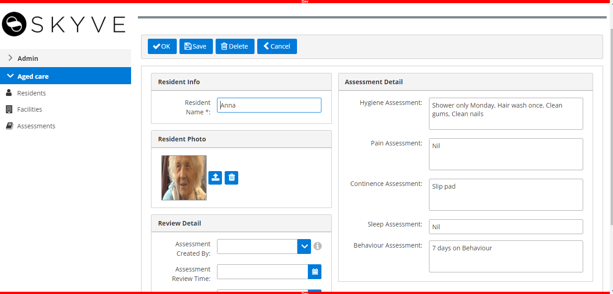

### 3.10. Roles

Each role specifies the privilege levels for documents that the role will access (and associated actions). The role name is the name displayed when assigning roles to user security groups in the admin.

For each document, the privilege level is specified in terms of C (Create) R (Read) U (Update) D (Delete). The underscore character (_) means no permission is granted.
For example, if a role has `CRU_` privileges, this means a user with this role could Create, Read and Update documents but not Delete them.

Skyve also introduces a new concept called Scope. The document scope access level can either be G (Global), C (Customer), D (Data Group) or U (User).

For example, if a role has `CRUDU` privilege, this would mean that a user with this role could Create, Read, Update and Delete documents, but only within the User scope - this means they can only change their own documents - documents they have created - and not documents created by any other user.
If the role specified the privilege `CRUDC` this would mean that a user with this role could Create, Read, Update and Delete documents, for all records within the Customer scope. If you were to offer the Aged care application as Software as a Service, to many different customers, users with this role could only change data for their own Customer tenancy.

For more information about Document Scope, read https://skyvers.github.io/skyve-dev-guide/concepts/#document-scoping

In our Aged care App, we will define below roles:

1. Nurse: Nurse can have all permissions in the resident and assessment documents. But, in the facility document nurses can only have update and scope permission.

2. Carer: Carer can have _RU_C permissions in Resident document, \_R_ \_C permissions in the facility document, and in Assessment carer can CRU_C permissions.

3. Manager: Manager have all the permissions in all three documents.

Note: Before creating a new role just careful about the roles which is already created by the [Foundry](https://foundry.skyve.org/foundry/): Viewer and Maintainer. if you want to delete any of this role please, we careful that these roles are not assigned to any user before. Otherwise it will not work. For this tutorial, we are not doing anything with Viewer and Maintainer role.

Open `agedCare.xml` to create new roles and change menu.

```xml
<?xml version="1.0" encoding="UTF-8"?>
<module xmlns="http://www.skyve.org/xml/module"
	xmlns:xsi="http://www.w3.org/2001/XMLSchema-instance" title="Aged care"
	prototype="true" name="agedCare"
	xsi:schemaLocation="http://www.skyve.org/xml/module ../../schemas/module.xsd">
	<homeRef>list</homeRef>
	<homeDocument>Resident</homeDocument>
	<documents>
		<document ref="Resident" defaultQueryName="qResident" />
		<document ref="Facility" defaultQueryName="qFacility" />
		<document ref="Assessment" defaultQueryName="qAssessment" />
		<document ref="Contact" moduleRef="admin" />
		<document ref="DataGroup" moduleRef="admin" />
		<document ref="User" moduleRef="admin" />
	</documents>
	<roles>
		<role name="Viewer">
			<description><![CDATA[Enough privileges to view Aged care documents.]]></description>
			<privileges>
				<document name="Resident" permission="_R__C" />
				<document name="Facility" permission="_R__C" />
				<document name="Assessment" permission="_R__C" />
			</privileges>
		</role>
		<role name="Maintainer">
			<description><![CDATA[Enough privileges to create and edit Aged care documents.]]></description>
			<privileges>
				<document name="Resident" permission="CRUDC" />
				<document name="Facility" permission="CRUDC" />
				<document name="Assessment" permission="CRUDC" />
			</privileges>
		</role>
		<role name="Nurses">
			<description>Permission to see all Assessments</description>
			<privileges>
				<document name="Resident" permission="CRUDC" />
				<document name="Facility" permission="_R__C" />
				<document name="Assessment" permission="CRUDC" />
			</privileges>
		</role>
		<role name="Carers">
			<description>Permission to see only Carer Assessments</description>
			<privileges>
				<document name="Resident" permission="_RU_C"></document>
				<document name="Facility" permission="_R__C" />
				<document name="Assessment" permission="CRU_C" />
			</privileges>
		</role>
		<role name="Manager">
			<description>Permission to manage Facility, Staff, and Assessments</description>
			<privileges>
				<document name="Resident" permission="CRUDC" />
				<document name="Facility" permission="CRUDC" />
				<document name="Assessment" permission="CRUDC" />
			</privileges>
		</role>
	</roles>
	<menu>
		<list document="Resident" name="Residents">
			<role name="Nurses" />
			<role name="Manager" />
			<role name="Carers" />
		</list>
		<list document="Facility" name="Facilities">
			<role name="Manager" />
		</list>
		<list document="Assessment" name="Assessments">
			<role name="Nurses" />
			<role name="Carers" />
			<role name="Manager" />
		</list>
	</menu>
<module>
```

In the next section, we will use these permissions by applying some conditions in our documents.

# 4. Java Extension

It's now time to create Groups and Users in the application.

In most applications, there are usually groups of users who have similar permissions, e.g. Staff, or Client and this approach allows you to assign access on the basis of the kinds of roles users might perform in the application. The `admin` module that Skyve provides includes a security group concept as well as a user administration function. For more detail click on link for adding Users and Groups: https://skyvers.github.io/skyve-user-guide/users/

For our application, we will create groups for Carer, Nurse and Manager.

A Carer is someone who can see all the Residents information and do few assessments for them.

A Nurse is qualified to distribute and do an Assessment review.

A Manager has access to all information and can also manage user access.

Go to the application and create group for carer, nurse, manager as below:

Open Admin>Security Admin>Groups

1. Create group for the Carer as below:

   

2. Create group for the Manager as below:

   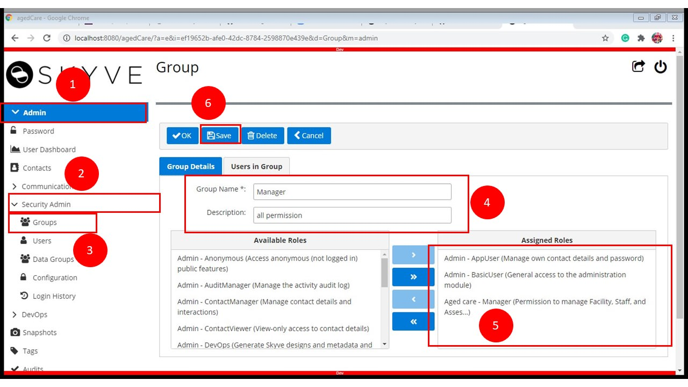

3. Create group for the Nurse as below:

   

Next, create Users for Carer, Manager, and Nurse.
Go to the application, Open Admin>Security Admin>Users

1. Create Users for Carer by adding Full name and Email

2. Click on New contact

   

3. Set user name and password

   

4. Click on Existing group, select carer and add in Assigned Group

   

5. Click on save

Next create Users for Manager and Nurse same in the same way as we created for Carers in the previous steps.

Once you have created users for each role, it is time to test that they can do what they need within the application. For each user type, make sure you are signed out of the application, then sign in as that user.

First, let's test Carer.


You can see, the Carer can access resident and assessment data in the Aged care module. This is because in the agedCare.xml file, the menu items for Resident and Assessment were assigned permissions for Carer and Nurse (however access to the Facility menu item is only assigned to the Manager role).

The Carer sign in page is shown below:


You should also check Nurse and Manager can access what they need correctly by signing in as those users.

- #### Conditions

In the Assessment document, Carers should not have access to see Pain or Behaviour assessments and so these should not be available to users in the Carer security group.

This can be achieved in Skyve by declaring a condition. In particular, we can have a condition to determine the visibility of some specified attributes on the screen. To begin with, we define the condition in the `Assessment.xml`. We will define this condition as follows::

```xml
<conditions>
	<condition name="roleCarer">
		<expression><![CDATA[isUserInRole("agedCare", "Carers")]]></expression>
	</condition>
</conditions>
```

Once the condition is defined, we can control the visibility of the assessments in the view as below:

Open the `assessmentDetail.xml` and change the visibility of `Pain assessment` and `Behaviour assessment`

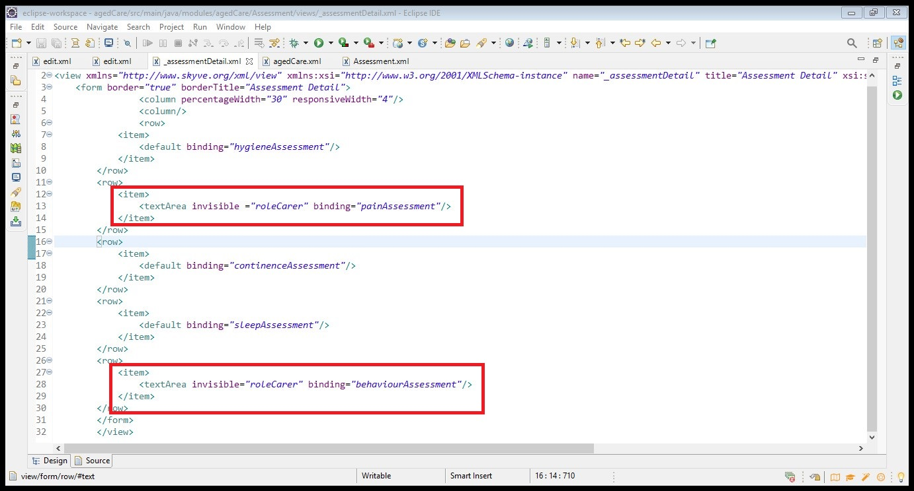

To test the changes, generate domain and re-deploy the server.

Login as a Carer


Open an Assessment, and check that Pain and Behaviour assessments are not available when signed in as a Carer.


- #### Bizlets

Adding business logic to the record lifecycle using a Bizlet class.

In Skyve you can add business logic using a special class called a Bizlet class. For each document you can create a Bizlet class to extend lifecycle stages like `newInstance` (when a record is created) `preSave` (just before a record is saved) etc.

Each document package can include declarations of for actions, reports, views and the associated Bizlet file. The Bizlet file contains document-specific behaviours including overrides of default action behaviours and document bean lifecycle events.

You can read more about Bizlet and Extension classes here - https://skyvers.github.io/skyve-dev-guide/bizlets/#bizlets

##### Bizlet ResidentID

First of all, let's show you how to create `ResidentBizlet` to customize the document as we want.

Right-click to the `Resident` package and select `New`, then select `Class` in the sub-menu.

The new Class window will appear as shown below:


To complete the creation of the ResidentBizlet class, use "Eclipse Quick Fix suggestions" as shown below:


Now it is time to override the `newInstance` method to set the `Resident ID` number when a new instance of a Resident record is created.

By overriding, we mean that we want our application to do all the usual things Skyve needs to do to create a record as well as some things we want specifically - in this case assign a new ID number. Skyve provides a way to generate unique ID numbers, either numeric only, or alpha-numeric - so we can use this to generate numbers like:
R001
R002
...
etc

To override the newInstance method:

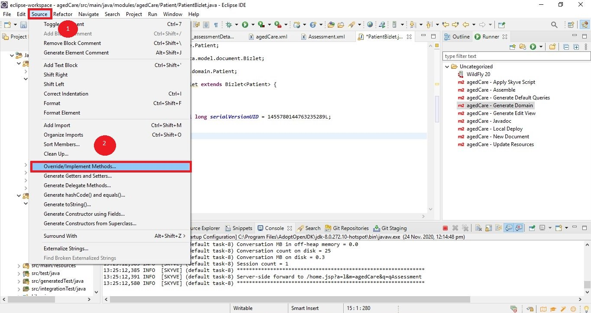

Select newInstance from the list.


The override method is generated in the file


Add the below code in the method

```java

{
String residentId;

residentId=ModulesUtil.getNextDocumentNumber("R", Resident.MODULE_NAME, Resident.DOCUMENT_NAME,
Resident.residentIDPropertyName, 4);
bean.setResidentID(residentId);

return super.newInstance(bean);

}
```

The method `ModulesUtil.getNextDocumentNumber("R", Resident.MODULE_NAME, Resident.DOCUMENT_NAME, Resident.residentIDPropertyName, 4)`; will create a new unique number with a prefix of "R" , for Resident type records, for the Resident ID attribute, with a length of 4 characters.

Because this code is called in the newInstance() method, the ResidentID number will be assigned as soon as a new record is created.

#### preSave() method of the Bizlet

In next few steps, we will see how we can use the `preSave()` Bizlet method.

In previous step we created a `newInstance` method. Now,
I want you to change the Bizlet and use the preSave() method instead of newInstance() as follows:

- When we SAVE the resident record, check if the residentId is null - if it is null, assign a new DocumentNumber using `modulesUtil.getNextDocumentNumber` (similar to what you did for new instance)
- Add a condition to the Resident.xml called `hasID` which checks if `bean.getResidentId()!=null`
- Only show the `residentID` field in the Resident view, if the `hasID` condition is true

1. Modify the `ResidentBizlet.java` file and override the `preSave()` (edit the ResidentBizlet.java file, go to source > override and implement method and select preSave() from list and click on Ok).

   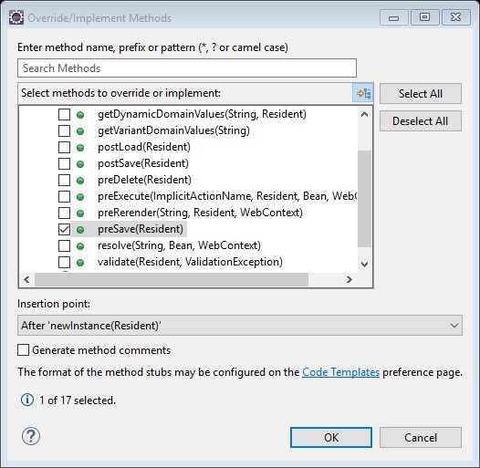

2. Add code in the `preSave()` method the following code

```java
package modules.agedCare.Resident;

import org.skyve.metadata.model.document.Bizlet;

import modules.admin.ModulesUtil;
import modules.agedCare.domain.Resident;

public class ResidentBizlet extends Bizlet<Resident> {

	/**
	 *
	 */
	private static final long serialVersionUID = 1455780144763235289L;

	public Resident newInstance(Resident bean) throws Exception {
		// TODO Auto-generated method stub

		return super.newInstance(bean);

	}

	@Override
	public void preSave(Resident bean) throws Exception {

		if (bean.getResidentID() == null) {
			String residentId = ModulesUtil.getNextDocumentNumber("P", Resident.MODULE_NAME, Resident.DOCUMENT_NAME,
					Resident.residentIDPropertyName, 4);
			bean.setResidentID(residentId);
			return;

		}
		return;
	}

}
```


3. Next, add a condition to the `Resident.xml` called `hasID` which checks if bean.getResident()!=null
4. Opem `Resident.xml`, and add condition after `attributes` as below

```xml

<conditions>
	<condition name="hasID">
		<expression><![CDATA[getResidentID()!=null]]></expression>
	</condition>
</conditions>
```

5. To show the `residentID` field in the Resident view, if the `hasID` condition is true, open `_residentInfo.xml`

6. Then, change ResidentID field as below:

```xml
<row>
	<item>
		<textField disabled="true" visible="hasID" binding="residentID" />
	</item>
</row>

```

To see the changes, generate domain and deploy the application. Sign in as a manager, and add a new resident. The resident id will generate when you save all other details.


After completing the details for the Resident record, press the save button and check that the Resident ID number is generated.


#### Enhancement in Aged care application

In this section, we will add more functionality to the Assessment document, to automatically record the date and time that the Assessment record is created.
To do this we will:

- Add a new `dateTime` attribute to the Assessment doucument called `assesmentCreatedTime`
- Add a `Bizlet` for `Assessment` to set the `assesmentCreatedTime` when a new assessment is created and record the user who created the assessment
- In the `Facility` view, show a `listGrid` of `Residents` at that facility
- Add a `status` enumeration for Resident with appropriate values (current, discharged, deceased), where the default value is current

1. Add a new `dateTime` attribute to the Assessment document called `assesmentCreatedTime` - to do this, in the Assessment.xml file and add a new attribute as below:

```xml
<dateTime name="assessmentCreatedTime">
	<displayName>Assessment Created Time</displayName>
</dateTime>
```

Next, modify the `_reviewInfo` view component - modify the \_reviewInfo.xml file to add that attribute in new row.

```xml
<row>
	<item>
		<default binding="assessmentCreatedTime" />
	</item>
</row>

```

Generate domain, and deploy your app to check that you can see the new field in the Assessment records.

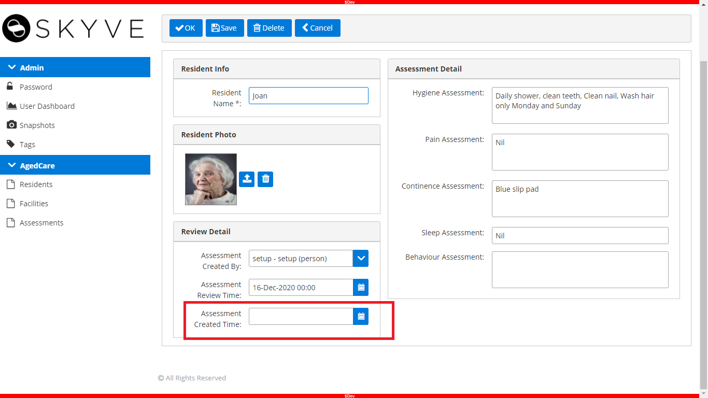

2. Add a Bizlet for the Assessment document to automatically set the `assesmentCreatedTime` when a new assessment is created - and to record the user who created the assessment. First create the `AssessmentBizlet.java` file as we did above:

- Right-click to the `Assessment` package and select New, then select Class in the sub-menu.
- Follow the Quick Fix suggestions to resolve errors in `AssessmentBizlet.java` file.
- Override the `newInstance` method. (Click on source > override and implement method. Choose newInstance form the list - Eclipse will generate newInstance method and override notation for us.)
  Then update the method as shown below:

```java
private static final long serialVersionUID = 2286961040250324230L;
@Override
public Assessment newInstance(Assessment bean) throws Exception
{
    bean.setAssessmentCreatedTime(new DateTime());
    bean.setStaff(ModulesUtil.currentAdminUser());
    return super.newInstance(bean);
}

```

Next, add an attribute to record who the assessment was created by. This attribute will be an association to the Staff member user who creates the record.
The attribute will be defined as:

```xml
<association type="aggregation" name="createdBy">
   <displayName>Assessment Created By</displayName>
   <documentName>User</documentName>
</association>
```

Change the display name to `Assessment Created By` in Assessment.xml file.

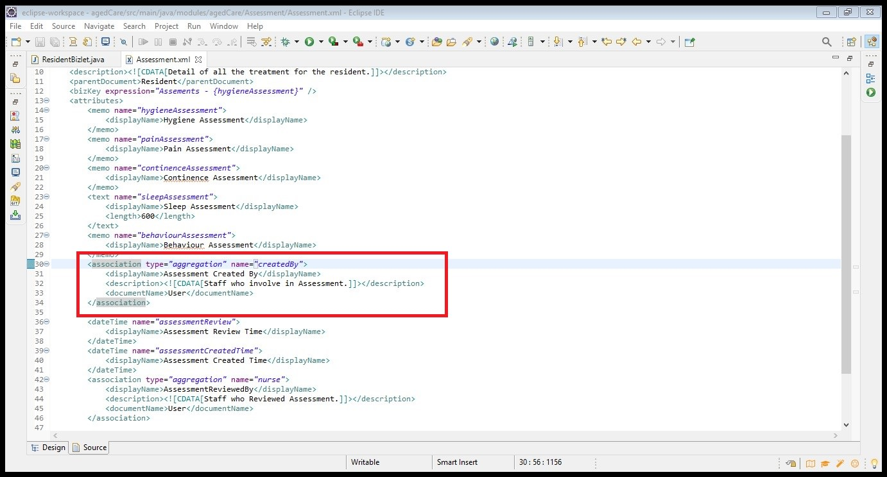

Generate domain and deploy the application to see the changes.

So, now we have the `Assessment Created Time` and `Assessment Created By` in the Assessment document as shown:


3. Next we want to change the Facility view to show a list of all the Residents associated with the Facility.

In Skyve, we can use a listGrid as follows: (you can read more about the listGrid widget here - https://skyvers.github.io/skyve-dev-guide/views/#listgrid-example)

Go to the `Facility` package and open the `edit.xml` to add listGrid as below

```xml
<listGrid continueConversation="true" query="qResident">
		<filterParameter filterBinding="facilityName" operator="equal"valueBinding="bizId" />
</listGrid>
```


Generate domain to check result.

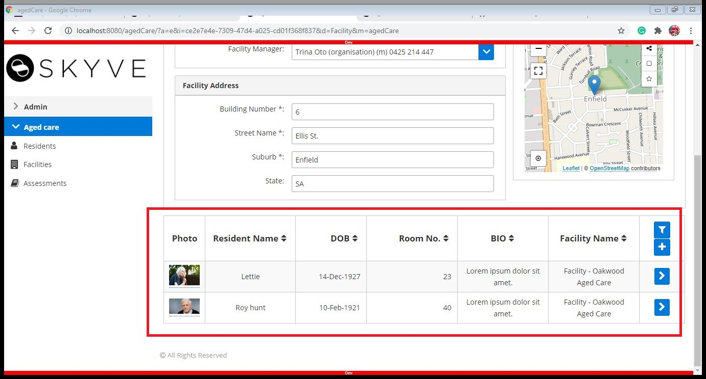

4. Next we will modify our application to record a status for each Resident.

To do this, we will add a enumeration called `residentStatus` to the Resident document, with values (current, discharged, deceased), where the default value is current.

Open the `Resident.xml` and add this code in `<attributes>`

```xml
<enum name="residentStatus">
	<displayName>Resident Status</displayName>
	<defaultValue>current</defaultValue>
	<values>
		<value code="Current" />
		<value code="Discharged" />
		<value code="Deceased" />
	</values>
</enum>
```

Next, open `_residentInfo.xml` and add row

```xml
<row>
	<item>
		<default binding="residentStatus" />
	</item>
</row>
```

Generate domain, deploy app again. You can see the new field in Assessment `Resident Status`.


- #### Actions
  Actions represent behaviours that impact our application data. Actions can be in the form of button, hyperlinks or API calls. For more detail visit the link https://skyvers.github.io/skyve-dev-guide/actions/.

Next, we will add an action that only a nurse can click, that sets the status on the assessment to `reviewed=true` and sets the `assessmentReviewDate`.

1. First, create an action class in the actions package (within the document package) that implements `org.skyve.metadata.controller.ServerSideAction` - that is, an action that will be run at the Server (rather than in the user's browser).

2. To create an action, go to Assessment package and create a new package called `actions`.

3. Then, under actions package create a action class Reviewed.java. On the class creation form, use the Add button to choose `org.skyve.metadata.controller.ServerSideAction`

   

4. Adjust the imports at the top of the file for the Assessment document to `import modules.agedCare.domain.Assessment;`

   

5. Click on Add unimplemented methods

   

6. Add the code as shown below

```java
package modules.agedCare.Assessment.actions;

import org.skyve.domain.types.DateTime;
import org.skyve.metadata.controller.ServerSideAction;
import org.skyve.metadata.controller.ServerSideActionResult;
import org.skyve.web.WebContext;

import modules.admin.ModulesUtil;
import modules.agedCare.domain.Assessment;

public class Reviewed implements ServerSideAction<Assessment> {

	@Override
	public ServerSideActionResult<Assessment> execute(Assessment bean, WebContext webContext) throws Exception {
		bean.setAssessmentReview(new DateTime());
		bean.setCreatedBy(ModulesUtil.currentAdminUser());
		return new ServerSideActionResult<>(bean);
	}

}
```


7. For the action to be available in the view, we need to declare the action in the view, as follows:

open `edit.xml` in the `Assessment` package to add action as below

```xml
<actions>
		<defaults />
		<action className="Reviewed" displayName="Reviewed" inActionPanel="true">
		</action>
</actions>
```


8. Next we need to assign privileges so that only Nurses can use the action

To do this, modify the role definitions in the module (the agedCare.xml file).

In our document only nurse can review the assessments, So we can add the `action` in nurse role under `privileges` as below


To check your changes, generate domain and redeploy your application, and sign in as a Nurse user.

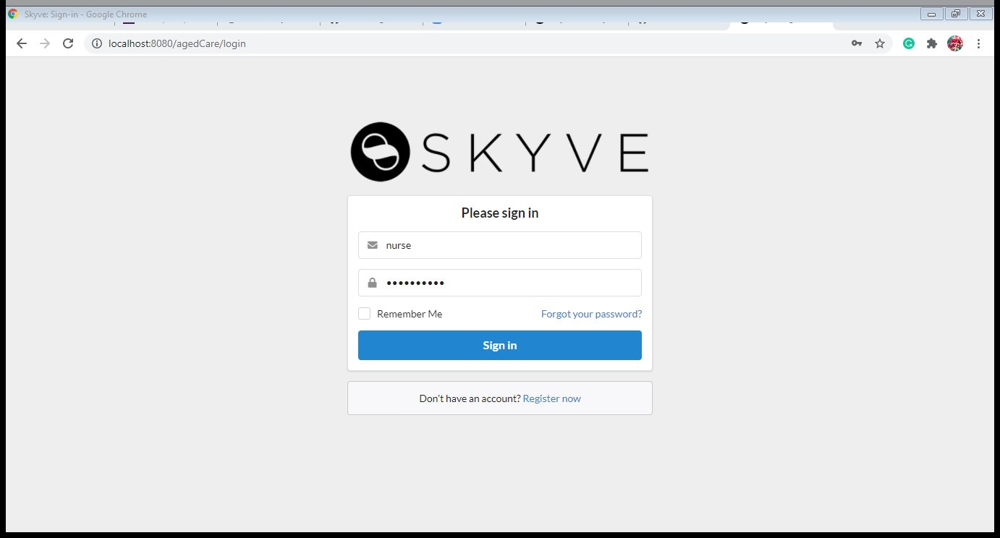

Congratulations, we are almost finished.

The last step is to ensure that the Assessment Reviewed Time can only be changed using the action (which is restricted to Nurse users).

To do this, modify the Resident view, and change the `Assessment Reviewed Time` attribute to be `enabled="false"`, like this:

```xml
<row>
   <item>
     <textField binding="assessmentReviewedTime" enabled="false" />
   </item>
</row>
```

Save the changes to the view, return to your browser and refresh the screen to see the change. The Assessment Reviewed Time can now only be modified by a Nurse using the action.

You can see the Reviewed button on the top.

When you click on the Reviewed button it set the Assessment Review field with current date and time.


Congratulations you have completed the AgedCare tutorial.

In this tutorial, you learned how:

- To create a Skyve application using Skyve Foundry
- to deploy your application
- To configure your application for collaboration
- To configure your local developer environment and build and deploy
- To modify the XML metadata that defines the data, menus and roles within your application
- To add custom Java code to control visibility, set values and perform action behaviours within the application.

From here it is time for you to explore Skyve some more and try your own applications and changes. Remember you can ask questions on the Skyve slack channel, or purchase direct assistance from Skyve specialist developers through Skyve Foundry. Check the skyve.org homepage for self-help training videos and don't forget the Developer Guide (https://skyvers.github.io/skyve-dev-guide/).

We hope that you have enjoyed this tutorial!
