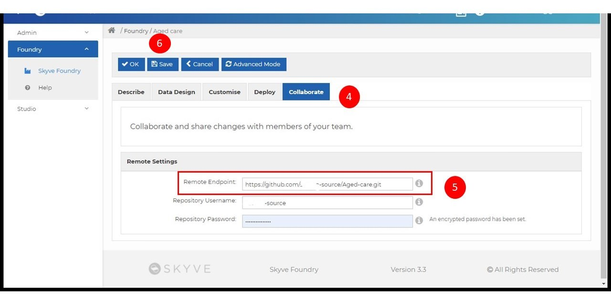
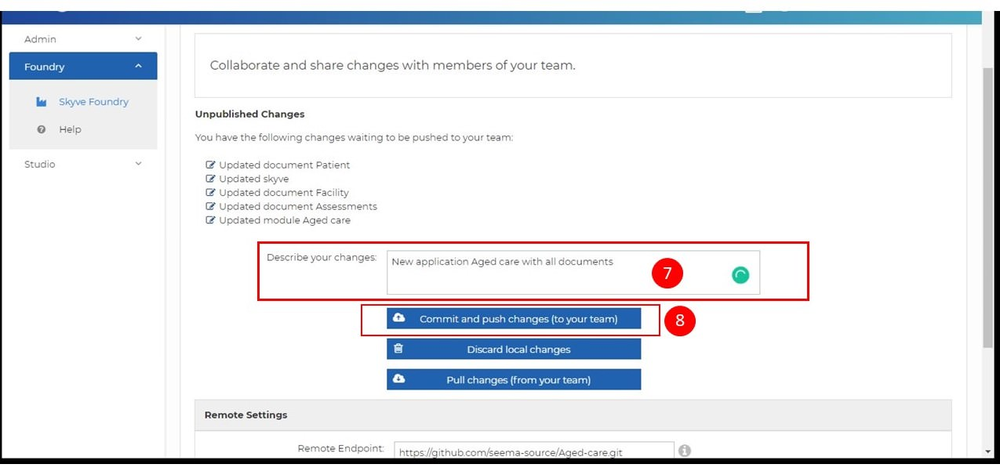

# agedCare Application Tutorial

Before starting of this tutorial it is important to go through few questions below:

### Contents

- [1. Is This Tutorial Right For Me ?](#)
- [2. AgedCare App Overview]()
  - [Functionality overview]()
  - [Low code App]() using Skyve Foundry
  - [Low-code Extensions]()
- [3. No-code Development]()
    * [1. Getting Started](https://github.com/seema-source/Aged-care/blob/master/readme.md#1-getting-started)
    * [2. Create](https://github.com/seema-source/Aged-care/blob/master/readme.md#2-create)
    * [3. Collaboration](https://github.com/seema-source/Aged-care/blob/master/readme.md#3-collaboration)
- [4. Low-code Extensions]()
- [5. Java Extensions]()

- [4. Import Project in Eclipse](https://github.com/seema-source/Aged-care/blob/master/readme.md#4-import-project-in-eclipse)
  - [4.1 Install Eclipse](https://github.com/seema-source/Aged-care/blob/master/readme.md#41--install-eclipse)
  - [4.2 Install and Configue Wildfly Server](https://github.com/seema-source/Aged-care/blob/master/readme.md#42--install-and-configue-wildfly-server)
  - [4.3 Add Repository in Eclipse](https://github.com/seema-source/Aged-care/blob/master/readme.md#43--add-repository-in-eclipse)
  - [4.4 Import Project](https://github.com/seema-source/Aged-care/blob/master/readme.md#44--import-project)
  - [4.5 Set the server](https://github.com/seema-source/Aged-care/blob/master/readme.md#45--set-the-server)
- [5. Deploy and Configure Skyve Project](https://github.com/seema-source/Aged-care/blob/master/readme.md#5-deploy-and-configure-skyve-project)
- [6. List Views](https://github.com/seema-source/Aged-care/blob/master/readme.md#6-list-views)
  - [6.1 Patient List](https://github.com/seema-source/Aged-care/blob/master/readme.md#61--patient-list)
  - [6.2 Facility List](https://github.com/seema-source/Aged-care/blob/master/readme.md#62--facility-list)
  - [6.3 Assessments List](https://github.com/seema-source/Aged-care/blob/master/readme.md#63--assessments-list)
- [7. Edit Views, Layout, and Components](https://github.com/seema-source/Aged-care/blob/master/readme.md#7-edit-views-layout-and-components)
  - [7.1 Patient Edit view](https://github.com/seema-source/Aged-care/blob/master/readme.md#71--patient-edit-view)
  - [7.2 Facility Edit view](https://github.com/seema-source/Aged-care/blob/master/readme.md#72--facility-edit-view)
  - [7.3 Assessment Edit view](https://github.com/seema-source/Aged-care/blob/master/readme.md#73--assessment-edit-view)
- [8. Roles](https://github.com/seema-source/Aged-care#8-roles)
- [9. Conditions](https://github.com/seema-source/Aged-care#9-conditions)
- [10. Bizlets](https://github.com/seema-source/Aged-care#10-bizlets)
- [11. Actions](https://github.com/seema-source/Aged-care#11-actions)

# 1. Is This Tutorial Right For Me ?

# 2. AgedCare App Overview
  * [Functionality overview]()
  - [Low code App]() using Skyve Foundry
  - [Low-code Extensions]()

# 3. No-code Development

   ###  1. Getting Started

Before continuing with our tutorial, there are some pages you may want to visit:

- [What is Skyve?](https://skyve.org/what-is-skyve) - Will answer what [Skyve](https://skyve.org) is, and how it will be useful in your Enterprise Application Development.

- [Getting Started](https://skyve.org/getting-started) - Will help give you some ideas on how to start with our [Skyve](https://skyve.org) Framework.

- [Dev Guide](https://skyvers.github.io/skyve-dev-guide/) - Will help you learn and understand about our development. It also covers most [Skyve Framework](https://skyve.org) elements and concepts. There are many real examples for you to refer to also.
- [Skyve foundry](https://foundry.skyve.org/)-Will help you to learn about skyve foundry.

Now, lets move to the next step how to create application with [Skyve foundry](https://foundry.skyve.org/)

## 2. Create

To create a new [Skyve](https://skyve.org) Project, you can go to the [Skyve foundry](https://foundry.skyve.org/) and [Get started](https://foundry.skyve.org/foundry/register.xhtml)

and if you are already register Sign in with your register email and password.

To create a new skyve project through foundry go to the [How to get started](https://youtu.be/G3OQu5PeUn8) on the top right-hand side of skyve foundry page and watch the video to create new application.

Now, I will take you step by step creation of application:

- Click on Add button
  
- Enter the name of App and email address
  
- Click on save
  After that start build Data Design
- Click on Data Design to add the Documents
  
- Add all information as shown below and click on Zoom out
  
- You can see your document on screen.
- Next, create documents for Facility and Assessments same as patient and click on arrow to add attributes for each document
  
- Click on Add button to add attributes to patient document
  
- Add all the attributes for Patient, Facility, and Assessments as below
  
  
  

## 3. Collaboration

Next, we need to Collaborate our application with github.
To find the more detail how to collaborate Go to [Help button](https://foundry.skyve.org/foundry/loggedIn.jsp?a=e&m=foundry&d=Help) top right of the screen Foundry Help.
Then follow the steps for collaboration.

#### Setup to Github

To enable the collaboration, first of all Sign up or log into [Github](https://github.com/) account.
To create a new repository follow the steps below:

- Click on the plus icon on the top right side to create the new repository
  
- Next, enter the name of the repository, make it private, and click on create
  
- After creating repository, you will see the link as shown below, copy the link
  
- Next, go to foundry, open the collaborate tab and paste the link in Remote Endpoint
- Click on apply
- Click on Save
  
- Then, Go to collaborate tab of your application and describe changes with comment, click on commit and push button
  
- Next, check your project in Github
- Go to Github, open repository to see all the files
  

This is the End of create and collaboration of the application...!

## 4. Import Project in Eclipse

Before import your project in Eclipse, you need to download and install Eclipse in your system.

#### 4.1 Download and Install Eclipse
* Click here to [Download Eclipse](https://www.eclipse.org/downloads/packages/)

* Next, Click on [Eclipse IDE for Enterprise Java Developers](https://www.eclipse.org/downloads/packages/release/2020-09/r/eclipse-ide-enterprise-java-developers)

* Click on download
* Then, Install Eclipse in your system

#### 4.2 Install and Configue Wildfly Server

#### 4.3 Add Repository in Eclipse

#### 4.4 Import Project

#### 4.5 Set the server

## 5. Deploy and Configure Skyve Project

## 6. List Views

#### 6.1 Patient List

#### 6.2 Facility List

#### 6.3 Assessments List

## 7. Edit Views, Layout, and Components

#### 7.1 Patient Edit view

#### 7.2 Facility Edit view

#### 7.3 Assessment Edit view

## 8. Roles

## 9. Conditions

## 10. Bizlets

## 11. Actions
