# Contents

- [1. Tutorial Overview ](../readme.md/#1-tutorial-overview)
- [2. No-code Development](../tutorial/chapter2.md/#2-no-code-development)
- [3. Low Code Extensions](#3-low-code-extension)
  - [3.1. Collaboration](#31-collaboration)
  - [3.2. Configure your local environment](#32-configure-your-local-environment)
  - [3.3. Install and Configue Wildfly Server](#33-install-and-configure-wildfly-server)
  - [3.4. Add Repository in Eclipse](#34-add-repository-in-eclipse)
  - [3.5. Import Project](#35-import-project)
  - [3.6. Set the server](#36-set-the-server)
  - [3.7. Configure and Deploy the Skyve project](#37-configure-and-deploy-the-skyve-project)
  - [3.8 List Views](#38-list-views)
  - [3.9. Edit Views, Layout, and Components](#39-edit-views-layout-and-components)
  - [3.10. Roles](#310-roles)
- [4. Java Extensions](../tutorial/chapter4.md/#4-java-extension)

# 3. Low Code Extension

In this section, we will work on collaboration and configuration of the local environment. After that, we will do some editing in the XML files, which will change the lists, views, and layout of our application. So, this step will enable us to test and deploy our application locally on our own (or another machine).

For more detail visit our [Dev Guide](https://skyvers.github.io/skyve-dev-guide/) - which will help you learn and understand about our development. It also covers most [Skyve Framework](https://skyve.org) elements and concepts. There are many real examples for you to refer to also.

### 3.1. Collaboration

Next, we need to Collaborate our application with Github.

Why we need collaboration?

Collaboration will allow another user of your team to do editing in your application or between [Foundry](https://foundry.skyve.org/foundry/) users and developer. So, to do collaboration we need to provide our application with a remote endpoint of new Git repository.

To find the more detail how to collaborate Go to [Help button](https://Foundry.skyve.org/Foundry/loggedIn.jsp?a=e&m=Foundry&d=Help) top right of the screen [Foundry](https://foundry.skyve.org/foundry/) Help, and follow the steps for collaboration.


#### Setup to Github

To enable the collaboration, first of all Sign up or log into [Github](https://github.com/) account.
To create a new repository follow the steps below:

- Click on the Add button on the top right side to create the new repository

  

- Next, enter the name of the repository, make it private, and click on create

  

- After creating repository, you will see the link as shown below, copy the link

  

- Next, go to [Foundry](https://foundry.skyve.org/foundry/), open the collaborate tab and paste the link in Remote Endpoint

- Click on apply
- Click on Save

  

- Then, Go to collaborate tab of your application and describe changes with comment, click on commit and push button

  (Note: "Commit will put your changes into your local repo and "Push" sends that changes to remote location)

  

- Next, check your project in Github

- Go to Github, open repository to see all the files

  

You have now successfully created your application and configured it for collaboration!

**[⬆ back to top](#contents)**

### 3.2. Configure your local environment

For this section, we have chosen to show how to use Eclipse as the development environment, however if you prefer you can use other development environment tools such as IntelliJ, NetBeans, Visual Studio Code etc. However, if you're not completely familiar with these, use Eclipse so that you can follow the steps below.

Before you can import the project into Eclipse, you need to download and install Eclipse in your system.

#### Download and Install Eclipse and JDK

- ##### Download and Install Eclipse

  - Click here to [Download Eclipse](https://www.eclipse.org/downloads/packages/)
  - Next, Click on [Eclipse IDE for Enterprise Java Developers](https://www.eclipse.org/downloads/packages/release/2020-09/r/eclipse-ide-enterprise-java-developers)

  

  - Click on download
  - Then, Install Eclipse in your system

- ##### Download and Install JDK
  - Click here to [download and install JDK 8](https://adoptopenjdk.net/installation.html)
  - Install an OpenJDK 8 version from [AdoptOpenJDK](https://adoptopenjdk.net/installation.html?variant=openjdk8&jvmVariant=hotspot#x86-32_win-jdk) (or an alternative open JDK of your choice)

**[⬆ back to top](#contents)**

### 3.3. Install and Configure Wildfly Server

We need an application server to be able to access the application through our browser, for this we will demonstrate using Red Hat's Wildfly application server plugin. Skyve apps can be deployed on recent versions of Wildfly (10-20).

- #### Install Wildfly Server
  You can skip this step if WildFly Server is already installed on your system.

Before installing WildFly Server, make sure JBoss Tools is installed on your system.

To install JBoss Tools, click on Help, then click Eclipse Marketplace.


In the searchbar, enter 'jboss' then search.

Select the JBoss Tools version that the search returns, and click Install.


Select list as below


To check if JBoss Tools is installed properly, click on Help, then click Eclipse Marketplace.


Change to the `Installed` tab.

If the JBoss Tools plugin is present, you are ready to continue.


After JBoss Tools was installed properly, follow these steps to install WildFly Server.

1. Once Eclipse is opened, right-click under the Package Explorer tab and highlight New, then from the pop-out, click on Server

   

2. Select the WildFly version you wish to work with and click Next

   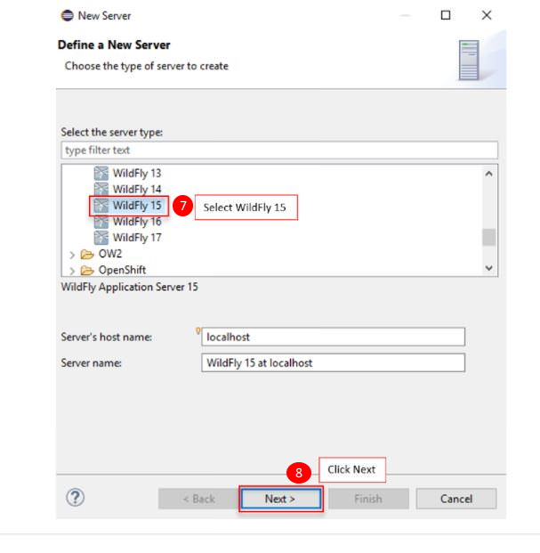

3. Click Next again

   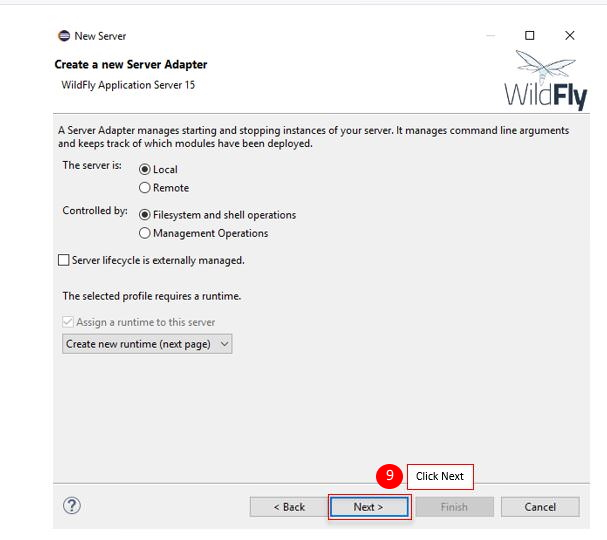

4. Once more, click the Next button

   

5. Click on the Download and install runtime link

   

Select the latest version of WildFly, then click Next


7.  Once you have read the terms of the licence agreement, check the box to accept the terms, and click Next

    

8.  Finally, select the path for where you wish your download and install locations to be found, then click Finish to complete the installation

    

9.  Wait for Eclipse to complete the download and installation process before moving on to the next step

    

**[⬆ back to top](#contents)**

### 3.4. Add Repository in Eclipse

After downloading and installation of eclipse and server, the next step is add our repository in the eclipse.

1. Open the Eclipse in your system
2. Click on window tab and click on show View, then other

   

3. Select Git Repositoies and click on open

   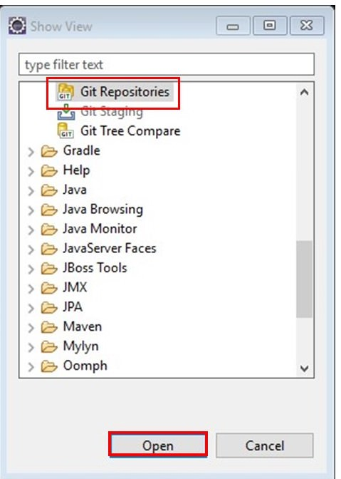

4. Click on Git Repositories in bottom area of eclipse, right click and select clone a Git Repostory...

   

5. Get URL from Github, go to Github and click on Code button.

   

6. Copy that link and paste in Clone window and click on Next

   

7. Click on Next again

   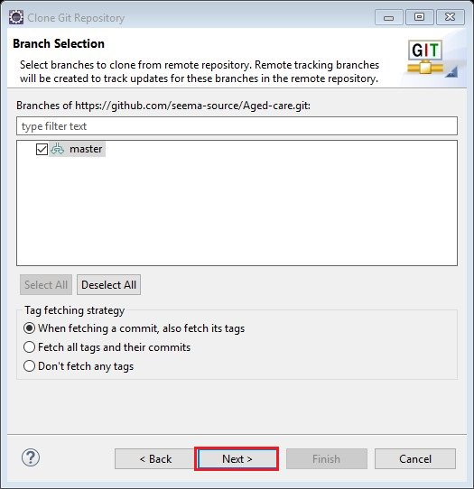

8. Click on Finish

   

In Git Repositories, we can see our repository is added now!

**[⬆ back to top](#contents)**

### 3.5. Import Project

As we already created a project in Skyve [Foundry](https://foundry.skyve.org/foundry/), now it is time to import that project in Eclipse to do changes in the Aged care app. To import project in Eclipse follow the steps below:

1. Click on File tab in Eclipse and Select import

   

2. Select Exiting Maven Project form list and click on Next

   

3. Set your root directory (Folder wwhere you cloned your git repository to in the previous section) and click on Finish

   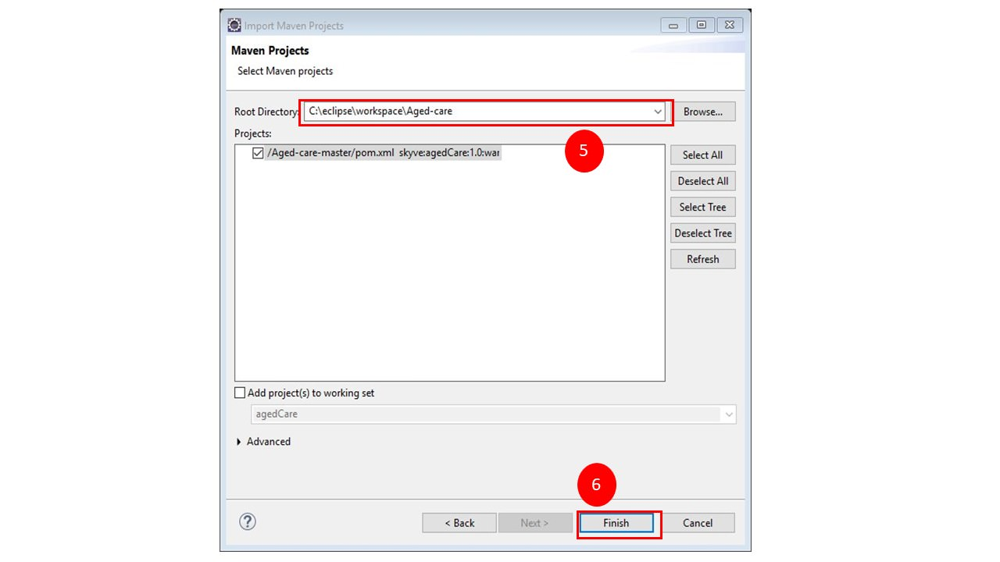

You can see your project in Project Explorer area in Eclipse.

**[⬆ back to top](#contents)**

### 3.6. Set the server

To run our project in server we need to set Server in Eclipse first.

1. Click on Server tab in Eclipse and right click

   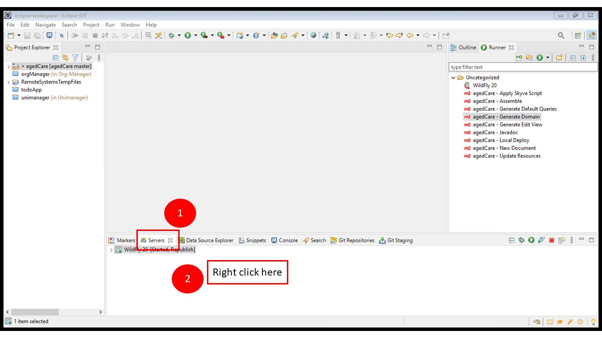

2. Click on Add and Remove and then Finish

   

**[⬆ back to top](#contents)**

## 3.7 Configure and Deploy the Skyve Project

##### Deploy your Skyve project

Once the Wildfly Server is configured, it's easy to deploy your Skyve project to your WildFly Server.

1. Open WildFly deployments folder Right-click on the server and click on Show In, then click on File Browser

   

2. Copy the agedCare.json and agedCare-ds.xml and paste in the deployments folder to the WildFly deployments folder that you opened in the previous step.

   

Skyve applications can store images and other types of rich content. To be able to do this, Skyve needs to have full access to a folder to store and manage content.
You need to create a dedicated folder for Skyve to do this. The content folder can be located anywhere and named whatever you like, however it is easiest to place it inside your eclipse folder and name it something simple like `content`.

3. Open the File window and browse to the content folder (which is in your root folder) and create new folder named `agedCare`.

   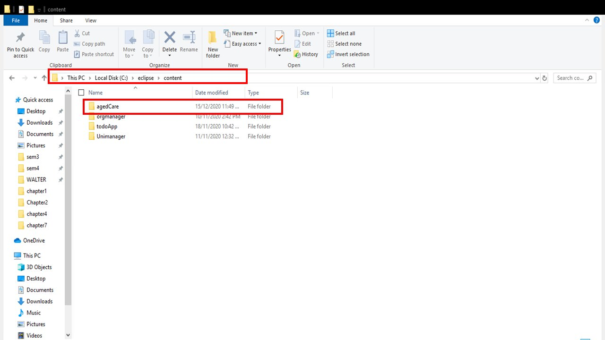

4. Open the agedCare.json file in your preferred text editor.

Go to the `content` section and modify the `directory` setting to tell Skyve where the content folder is located.
Note that you must not use backslashes even if you are running on Windows - and the folder path must be terminated with a slash
e.g. `directory: "C:/eclipse/content/",`


Go to the bottom of the file to change the identifier.


If you want to change the username and password, you can change in bootstrap in this app it is not changed.

Lastly, save and close the file.

5. Open agedCare-ds.xml file in the text editor

   

   Go to connection-url and replace ~ sign with content folder address and save the file.

   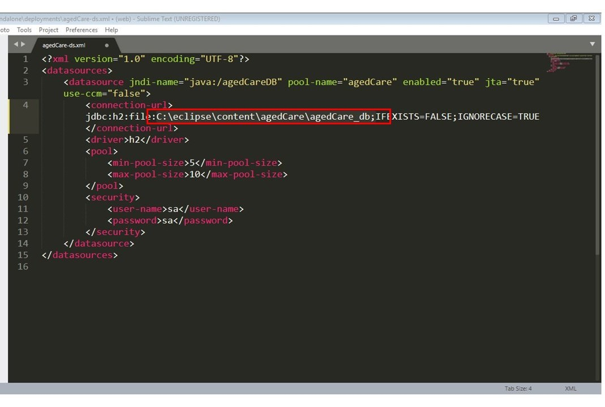

##### Run your Aged care application

Part of Skyve's low-code approach is to generate Java code for you (in the background) so that you don't have to write large amounts of Java code. We call this step `Generate Domain` because Java classes will be created representing the `domain` (the `problem domain` or `area of knowledge`) of your project. The domain classes are Java classes that do the work of managing data access and storage for your application.

Generate domain validates and compiles the metadata (XML files) in your project and checks that the application domain is in a valid state. Errors for the developer to fix are written to your console, and if generate is successful, the domain will be compiled to produce Java domain files and unit tests.


Right click the server and use the start button to start the server.


When your Console Window shows text similar to that shown below, your agedCare has been deployed and is running on your localhost server (your local machine).


If not, you may try to debug by yourself to find the source of the problem, or [Join Us On Slack](https://join.slack.com/t/skyveframework/shared_invite/enQtNDMwNTcyNzE0NzI2LWNjMTBlMTMzNTA4YzBlMzFhYzE0ZmRhOWIzMWViODY4ZTE1N2QzYWM1MTdlMTliNDIyYTBkOWZhZDAxOGQyYjQ) and ask any questions there. You will get support from the [Skyve](https://skyve.org) team or a community team member.

Access the Aged care app from your Web Browser at http://localhost:8080/agedCare. Sign in with by default username "setup" and password "setup"..


**[⬆ back to top](#contents)**

### 3.8. List Views

Skyve provides two main ways of accessing data - either via list or detail views. The `list` view allows you to search and find the data you wish to change and is normally what you see when you choose a menu item. Once you select a record you will see the `detail` view - which allows you to enter, change or delete data.

Skyve will provide generic/default list and edit views. Skyve supports rapid prototyping of the domain model and gives the developer an ability to begin interacting with the application at an early stage.

List views provide for searching and review of data - they show data in the context of other data in the system. Lists are usually based on queries that you can define, however, for simple applications Skyve will automatically list all records for each type of `document`.

Each row of the list corresponds to an instance of the document (a record) but may include columns from associated documents within the document's object hierarchy.
For example, the list of Residents may include columns for the Facility and Staff - because these documents are associated to the Resident records.

- #### Resident List

The Resident list shows the details of each resident, according to the attributes we defined when creating the Aged care application.

So that we can control exactly what is shown in the list, we will define a query and specify what columns are shown and in which order. To do this we add a query definition to the agedCare module (as shown below).

To make the application easier to use, it can be useful to hide some columns in the list. In this case we will hide the attributes `admissionDate` and `residentId` for the Resident records, and display the Resident photo as a thumbnail image.

A thumbnail is a scaled down version of the image. If you store high quality images of each resident (e.g 5MB each), when you include these images in the list, the user would have to receive a lot of data to view the list. For example, for 50 rows (for example) of Resident data, this would mean the user would have to receive 50x5MB of data, and this would make the `list` view appear very slow to use. Instead, Skyve automatically generates scaled down versions of images (thumbnails) and these can be included in the `list` so that application performance is not compromised.

This means we can include a thumbnail column in our query to show the images of each Resident without significantly impacting on the performance of our application.

Open agedCare.xml

Right after the Menu declaration in agedCare.xml, we will declare Queries like below:

```xml
<queries>
    <query documentName="Resident" name="qResident">
    <description>All Resident</description>
    <columns>
   	<content display="thumbnail" binding="photo" pixelHeight="45" pixelWidth="45" />
    	<column binding="residentID" sortOrder="ascending" hidden="true" />
    	<column binding="residentName" sortOrder="ascending" />
    	<column binding="DOB" sortOrder="ascending" />
    	<column binding="roomNo" sortOrder="ascending" />
    	<column binding="BIO" sortOrder="ascending" />
    	<column binding="admissionDate" sortOrder="ascending" hidden="true" />
    	<column binding="facilityName.facilityName" sortOrder="ascending" />
    </columns>
    </query>
</queries>

```

Here the `content query column` provides a `content` column type for content items like image and file attachments.

You can specify a default query for each document in the module (in the agedCare.xml file ) and this will ensure that wherever a list is shown for this document in your application, you will always get the same query.

To do this, set defaultQueryName for the Resident document to be the name of our query as shown below:

```xml
<documents>
        <document ref="Resident" defaultQueryName="qResident"/>
        <document ref="Facility"/>
        <document ref="Assessment"/>
        <document ref="Contact" moduleRef="admin"/>
        <document ref="DataGroup" moduleRef="admin"/>
        <document ref="User" moduleRef="admin"/>
</documents>


```

To apply the change, stop the `WildFly` server and run the `Generate Domain` command, then start the `WildFly` Server again.


- #### Facility List

Next, let's see our Facility list: it now shows a column for each of the attributes we defined in the document.

Instead, we will create another module query, so that we can define precisely which columns are show.

In the module (the agedCare.xml file), define a Facility query as shown below, hiding the attributes `Location` and `Facility manager`.

Open agedCare.xml

Right after the Menu declaration in agedCare.xml, we will declare Queries like below:

```xml
<query documentName="Facility" name="qFacility">
			<description>All Facilities</description>
			<columns>
				<column binding="facilityName" sortOrder="ascending" />
				<column binding="buildingNumber" sortOrder="ascending" />
				<column binding="streetName" sortOrder="ascending" />
				<column binding="suburb" sortOrder="ascending" />
				<column binding="state" sortOrder="ascending" />
				<column binding="facilityManager" sortOrder="ascending"
					hidden="true" />
				<column binding="location" sortOrder="ascending"
					hidden="true" />
			</columns>
</query>
```

Then you will need to provide `defaultQueryName` attribute to your facility document in `agedCare.xml` like below:

```xml
<documents>
		<document ref="Resident" defaultQueryName="qResident" />
		<document ref="Facility" defaultQueryName="qFacility" />
		<document ref="Assessment" />
		<document ref="Contact" moduleRef="admin" />
		<document ref="DataGroup" moduleRef="admin" />
		<document ref="User" moduleRef="admin" />
</documents>
```

To apply the change, stop the `WildFly` server and run the `Generate Domain` command, then start the `WildFly` Server again.

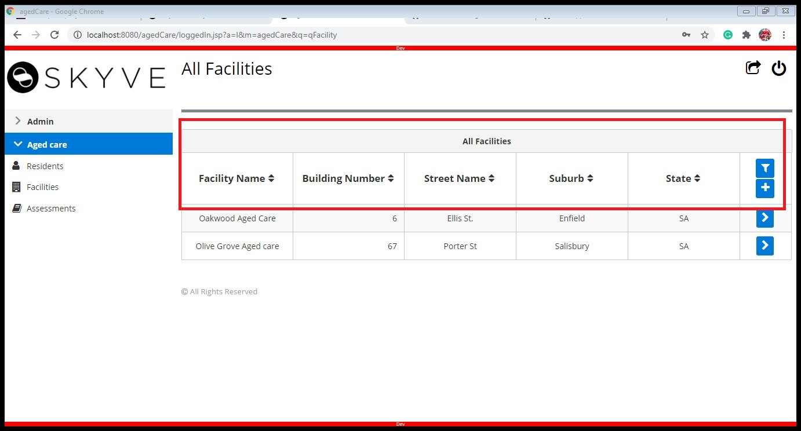

- #### Assessments List

As in the `Assessment` document, you can see different assessments related to each resident.

Let's hide `Pain assessement` and `Review date` from the document and add resident name and image.

Let's try it: Add a query to your module (the agedCare.xml file)

```xml
<query documentName="Assessment" name="qAssessment">
    <description>All Assessments</description>
    <columns>
    	<content display="thumbnail" binding="parent.photo" pixelHeight="60" pixelWidth="60" />
    	<column binding="parent.residentName" sortOrder="ascending" />
    	<column binding="hygieneAssessment" sortOrder="ascending" />
    	<column binding="painAssessment" sortOrder="ascending"   hidden="true"/>
    	<column binding="continenceAssessment" sortOrder="ascending" />
    	<column binding="sleepAssessment" sortOrder="ascending" />
    	<column binding="behaviourAssessment" sortOrder="ascending" hidden="true" />
    	<column binding="staff" sortOrder="ascending" />
    	<column binding="assessmentReview" sortOrder="ascending" hidden="true" />
    </columns>
</query>
```

Then, set the `defaultQueryName` attribute to your Assessment document, as shown:

```xml
<documents>
        <document ref="Resident" defaultQueryName="qResident"/>
        <document ref="Facility"  defaultQueryName="qFacility"/>
        <document ref="Assessment"  defaultQueryName="qAssessment"/>
        <document ref="Contact" moduleRef="admin"/>
        <document ref="DataGroup" moduleRef="admin"/>
        <document ref="User" moduleRef="admin"/>
</documents>
```

Again, to apply the change, stop the WildFly server and run the Generate Domain command, then start the WildFly Server.

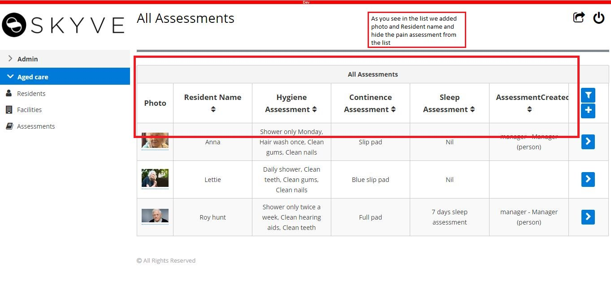

**[⬆ back to top](#contents)**

### 3.9. Edit Views, Layout, and Components

In this section we will override the default detail view which is generated by Skyve.

- #### Resident Edit view

Skyve provides us with a very useful function to create default `edit view` based on our document attributes and attributes type, the default widget will be applied for each attribute type.

So to create our Resident `edit view`, we will go through the following steps:

#### Create edit view

1. Click on `Generate edit view` in the right side of the eclipse window and write the module and document name in the Console window.

   

2. If you go to the agedCare module left side of eclipse and open the resident module. You can see view module and in view module there is a document with `generatedit.xml`. Rename the document, `edit.xml`

   

#### Enhance the edit view

In the previous step we generated an edit view by using the Generate Edit View function. Now we will enhance our edit view to make it more visually appealing.

As of now, Resident attributes show one by one, from top to bottom.

We will enhance the view by showing all personal information one the left-hand side of the screen and the photo and BIO on the right-hand side.

To do that, we will need to understand about Skyve View Containers - https://skyvers.github.io/skyve-dev-guide/views/#containers

After reading through the chapter on Skyve Containers, you may have already guessed how to split our view into 2 parts.

The `hbox` container lays out items horizontally.

Open resident `edit.xml` and add the code given below;

```xml
<?xml version="1.0" encoding="UTF-8"?>
<view xmlns="http://www.skyve.org/xml/view"
	xmlns:xsi="http://www.w3.org/2001/XMLSchema-instance" name="edit"
	title="Resident"
	xsi:schemaLocation="http://www.skyve.org/xml/view ../../../../schemas/view.xsd">
	<tabPane>
		<tab title="General">
			<hbox border="true">
				<!-- left side -->
				<vbox responsiveWidth="8" percentageWidth="60">
					<form>
						<column percentageWidth="30" responsiveWidth="4" />
						<column />
						<row>
							<item>
								<default binding="residentID" />
							</item>
						</row>
						<row>
							<item>
								<default binding="residentName" />
							</item>
						</row>
						<row>
							<item>
								<default binding="DOB" />
							</item>
						</row>
						<row>
							<item>
								<default binding="roomNo" />
							</item>
						</row>
						<row>
							<item>
								<default binding="admissionDate" />
							</item>
						</row>
						<row>
							<item>
								<default binding="facilityName" />
							</item>
						</row>
					</form>
				</vbox>
				<!-- right side -->
				<vbox responsiveWidth="4" percentageWidth="40">
					<form>
						<column percentageWidth="20" responsiveWidth="1" />
						<column />
						<row>
							<item showLabel="false">
								<contentImage binding="photo" />
							</item>
						</row>
						<row>
							<item>
								<default binding="BIO" />
							</item>
						</row>
					</form>
				</vbox>
			</hbox>
		</tab>
		<tab title="Assessments">
			<dataGrid binding="assessments">
				<boundColumn binding="hygieneAssessment" />
				<boundColumn binding="painAssessment" />
				<boundColumn binding="continenceAssessment" />
				<boundColumn binding="sleepAssessment" />
				<boundColumn binding="behaviourAssessment" />
				<boundColumn binding="staff" />
				<boundColumn binding="assessmentReview" />
				<onAddedHandlers />
				<onEditedHandlers />
				<onRemovedHandlers />
				<onSelectedHandlers />
			</dataGrid>
		</tab>
	</tabPane>
	<actions>
		<defaults />
	</actions>
	<newParameters />
</view>
```

To see the changes, generate domain and re-deploy the application as you did before (stop the WildFly server, run Generate Domain, then restart WildFly).

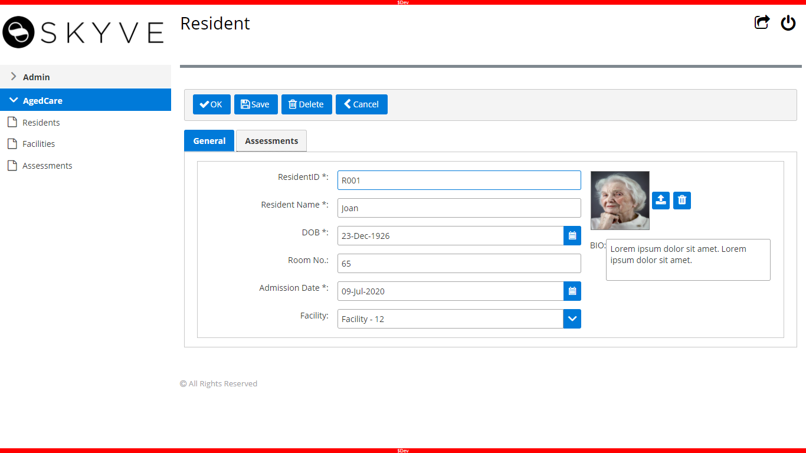

Next, we will group related information together to make it easier to manage.
The easiest way is to use the `border` and `borderTitle` attributes of the Form container.

So, in this case, we will have 2 forms, one for Resident information, one for Faciltiy information. Let's add border and borderTitle in the <form> tag.

Let's add `border` and `borderTitle` in the `<form>` tag.

```xml
<?xml version="1.0" encoding="UTF-8"?>
<view xmlns="http://www.skyve.org/xml/view"
	xmlns:xsi="http://www.w3.org/2001/XMLSchema-instance" name="edit"
	title="Resident"
	xsi:schemaLocation="http://www.skyve.org/xml/view ../../../../schemas/view.xsd">
	<tabPane>
		<tab title="General">
			<hbox border="true">
				<!-- left side -->
				<vbox responsiveWidth="8" percentageWidth="60">
					<form border="true" borderTitle="Resident Info">
						<column percentageWidth="30" responsiveWidth="4" />
						<column />
						<row>
							<item>
								<default binding="residentID" />
							</item>
						</row>
						<row>
							<item>
								<default binding="residentName" />
							</item>
						</row>
						<row>
							<item>
								<default binding="DOB" />
							</item>
						</row>
					</form>
					<form border="true" borderTitle="Facility Info">
						<column percentageWidth="30" responsiveWidth="4" />
						<column />
						<row>
							<item>
								<default binding="roomNo" />
							</item>
						</row>
						<row>
							<item>
								<default binding="admissionDate" />
							</item>
						</row>
						<row>
							<item>
								<default binding="facilityName" />
							</item>
						</row>
					</form>
				</vbox>
				<!-- right side -->
				<vbox responsiveWidth="4" percentageWidth="40">
					<form>
						<column percentageWidth="20" responsiveWidth="1" />
						<column />
						<row>
							<item showLabel="false">
								<contentImage binding="photo" />
							</item>
						</row>
						<row>
							<item>
								<default binding="BIO" />
							</item>
						</row>
					</form>
				</vbox>
			</hbox>
		</tab>
		<tab title="Assessments">
			<dataGrid binding="assessments">
				<boundColumn binding="hygieneAssessment" />
				<boundColumn binding="painAssessment" />
				<boundColumn binding="continenceAssessment" />
				<boundColumn binding="sleepAssessment" />
				<boundColumn binding="behaviourAssessment" />
				<boundColumn binding="staff" />
				<boundColumn binding="assessmentReview" />
				<onAddedHandlers />
				<onEditedHandlers />
				<onRemovedHandlers />
				<onSelectedHandlers />
			</dataGrid>
		</tab>
	</tabPane>
	<actions>
		<defaults />
	</actions>
	<newParameters />
</view>
```


Now that we have created a view for Resident records, it's time learn about View Components.

So, what are View Components?

Let's imagine that our view is very complex, lots of sections and these sections can be reused in different views. Skyve allows for reuse of view sections via the component widget.

To demonstrate how to re-use components, we will split our view into three components:

1. Resident Info
2. Facility Info
3. Photo and Bio

The view component must be declared according to the convention, with the file name matching the declared name.

##### Resident Info component

In the Resident > views package, create new `_residentInfo.xml` file with below content:

```xml
<?xml version="1.0" encoding="UTF-8"?>
<view xmlns="http://www.skyve.org/xml/view"
	xmlns:xsi="http://www.w3.org/2001/XMLSchema-instance"
	name="_residentInfo" title="Resident Info"
	xsi:schemaLocation="http://www.skyve.org/xml/view ../../../../schemas/view.xsd">
	<form border="true" borderTitle="Resident Info">
		<column percentageWidth="30" responsiveWidth="4" />
		<column />
		<row>
			<item>
				<default binding="residentID" />
			</item>
		</row>
		<row>
			<item>
				<default binding="residentName" />
			</item>
		</row>
		<row>
			<item>
				<default binding="DOB" />
			</item>
		</row>
	</form>
</view>
```

##### Facility Info component

In the Resident > views package, create new `_facilityInfo.xml` file with below content:

```xml
<?xml version="1.0" encoding="UTF-8"?>
<view xmlns="http://www.skyve.org/xml/view"
	xmlns:xsi="http://www.w3.org/2001/XMLSchema-instance"
	name="_facilityInfo" title="Facility Info"
	xsi:schemaLocation="http://www.skyve.org/xml/view ../../../../schemas/view.xsd">
	<form border="true" borderTitle="Facility Info">
		<column percentageWidth="30" responsiveWidth="4" />
		<column />
		<row>
			<item>
				<default binding="roomNo" />
			</item>
		</row>
		<row>
			<item>
				<default binding="admissionDate" />
			</item>
		</row>
		<row>
			<item>
				<default binding="facilityName" />
			</item>
		</row>
	</form>
</view>
```

##### Photo and Bio component

In the Resident > views package, create new `_photoBio.xml` file with below content:

```xml
<?xml version="1.0" encoding="UTF-8"?>
<view xmlns="http://www.skyve.org/xml/view"
	xmlns:xsi="http://www.w3.org/2001/XMLSchema-instance" name="_photoBio"
	title="Resident Photo and Bio"
	xsi:schemaLocation="http://www.skyve.org/xml/view ../../../../schemas/view.xsd">
	<form>
		<column percentageWidth="20" responsiveWidth="1" />
		<column />
		<row>
			<item showLabel="false">
				<contentImage binding="photo" />
			</item>
		</row>
	</form>
	<form border="true" borderTitle="BIO">
		<column />
		<row>
			<item showLabel="false">
				<textArea binding="BIO" />
			</item>
		</row>
	</form>
</view>
```

##### Combine together

After done with component creation, we will go to use it on our `edit view`.
Change `edit.xml` view like below:

```xml
<?xml version="1.0" encoding="UTF-8"?>
<view xmlns="http://www.skyve.org/xml/view"
	xmlns:xsi="http://www.w3.org/2001/XMLSchema-instance" name="edit"
	title="Resident"
	xsi:schemaLocation="http://www.skyve.org/xml/view ../../../../schemas/view.xsd">
	<tabPane>
		<tab title="General">
			<hbox border="true">
				<!-- left side -->
				<vbox responsiveWidth="8" percentageWidth="60">
					<component name="_residentInfo" />
					<component name="_facilityInfo" />
				</vbox>
				<!-- right side -->
				<vbox responsiveWidth="4" percentageWidth="40">
					<component name="_photoBio" />
				</vbox>
			</hbox>
		</tab>
		<tab title="Assessments">
			<dataGrid binding="assessments">
				<boundColumn binding="hygieneAssessment" />
				<boundColumn binding="painAssessment" />
				<boundColumn binding="continenceAssessment" />
				<boundColumn binding="sleepAssessment" />
				<boundColumn binding="behaviourAssessment" />
				<boundColumn binding="staff" />
				<boundColumn binding="assessmentReview" />
				<onAddedHandlers />
				<onEditedHandlers />
				<onRemovedHandlers />
				<onSelectedHandlers />
			</dataGrid>
		</tab>
	</tabPane>
	<actions>
		<defaults />
	</actions>
	<newParameters />
</view>
```

Now re-deploy the application to check that the view appears as it did before:


**[⬆ back to top](#contents)**

- #### Facility Edit view

In the previous section we explore and practice how to create an edit view and customize it to meet our requirements. It's now easy for us to create an edit view for the Facility document.

The Facility edit view will contain three components:

1. Facility Info
2. Facility address
3. Facility location

Let's start with Facility Info component.

1. Generate the edit view for Facility document

   

2. Add the facility component the same way we have done for the resident component

##### Facility Info component

In the Facility > views package, create new `_facilityInfo.xml`
as below content:

```xml
<?xml version="1.0" encoding="UTF-8"?>
<view xmlns="http://www.skyve.org/xml/view"
	xmlns:xsi="http://www.w3.org/2001/XMLSchema-instance"
	name="_facilityInfo" title="Facility Info"
	xsi:schemaLocation="http://www.skyve.org/xml/view ../../../../schemas/view.xsd">
	<form border="true" borderTitle="Facility Info">
		<column percentageWidth="30" responsiveWidth="4" />
		<column />
		<row>
			<item>
				<default binding="facilityName" />
			</item>
		</row>
		<row>
			<item>
				<default binding="facilityManager" />
			</item>
		</row>
	</form>
</view>

```

##### Facility address component

In the Facility > views package, create new `_facilityAddress.xml` as below content:

```xml

<?xml version="1.0" encoding="UTF-8"?>
<view xmlns="http://www.skyve.org/xml/view"
	xmlns:xsi="http://www.w3.org/2001/XMLSchema-instance"
	name="_facilityAddress" title="Facility Address"
	xsi:schemaLocation="http://www.skyve.org/xml/view ../../../../schemas/view.xsd">
	<form borderTitle="Facility Address" border="true">
		<column percentageWidth="30" responsiveWidth="4" />
		<column />
		<row>
			<item>
				<default binding="buildingNumber" />
			</item>
		</row>
		<row>
			<item>
				<default binding="streetName" />
			</item>
		</row>
		<row>
			<item>
				<default binding="suburb" />
			</item>
		</row>
		<row>
			<item>
				<default binding="state" />
			</item>
		</row>
	</form>
</view>
```

##### Facility location Component

In the Facility > views package, create new `_facilityLocation.xml` as below content:

```xml
<?xml version="1.0" encoding="UTF-8"?>
<view xmlns="http://www.skyve.org/xml/view"
	xmlns:xsi="http://www.w3.org/2001/XMLSchema-instance"
	name="_facilityLocation" title="Facility Location"
	xsi:schemaLocation="http://www.skyve.org/xml/view ../../../../schemas/view.xsd">
	<form border="true" borderTitle="Facility Location">
		<column />
		<row>
			<item showLabel="false">
				<geometryMap binding="location">
					<onChangedHandlers />
				</geometryMap>
			</item>
		</row>
	</form>
</view>
```

##### Combine together

After creating the components, add then to the edit.xml view as shown:

```xml

<?xml version="1.0" encoding="UTF-8"?>
<view xmlns="http://www.skyve.org/xml/view"
	xmlns:xsi="http://www.w3.org/2001/XMLSchema-instance" name="edit"
	title="Facility"
	xsi:schemaLocation="http://www.skyve.org/xml/view ../../../../schemas/view.xsd">
	<hbox border="true">
		<!-- left side -->
		<vbox responsiveWidth="8" percentageWidth="60">
			<component name="_facilityInfo" />
			<component name="_facilityAddress" />
		</vbox>
		<!-- right side -->
		<vbox responsiveWidth="4" percentageWidth="40">
			<component name="_facilityLocation" />
		</vbox>
	</hbox>
	<actions>
		<defaults />
	</actions>
	<newParameters />
</view>

```

Again re-deploy the application to see the changes in your Facility document.


**[⬆ back to top](#contents)**

- #### Assessment Edit view

This completes the edit views for Resident and Facility documents. Next we will create an edit view for our Assessment document. The Assessment document will show the following sections:

1. Resident Info
2. Assessment Detail
3. Review Detail

Let's start with Resident Info

Generate edit view for the assessment document first.


##### Resident info component

In the Assessment > views package, create new `_residentInfo.xml` as below content:

```xml
<?xml version="1.0" encoding="UTF-8"?>
<view xmlns="http://www.skyve.org/xml/view"
	xmlns:xsi="http://www.w3.org/2001/XMLSchema-instance"
	name="_residentInfo" title="Resident Info"
	xsi:schemaLocation="http://www.skyve.org/xml/view ../../../../schemas/view.xsd">
	<form border="true" borderTitle="Resident Info">
		<column percentageWidth="30" responsiveWidth="4" />
		<column />
		<row>
			<item>
				<default binding="parent.residentName" />
			</item>
		</row>
	</form>
	<form border="true" borderTitle="Resident Photo">
		<column percentageWidth="30" responsiveWidth="4" />
		<column />
		<row>
			<item showLabel="false">
				<contentImage binding="parent.photo" />
			</item>
		</row>
	</form>
</view>
```

##### Assessment Detail component

In the Assessment > views package, create new `_assessmentDetail.xml` as below content:

```xml
<?xml version="1.0" encoding="UTF-8"?>
<view xmlns="http://www.skyve.org/xml/view"
	xmlns:xsi="http://www.w3.org/2001/XMLSchema-instance"
	name="_assessmentDetail" title="Assessment Detail"
	xsi:schemaLocation="http://www.skyve.org/xml/view ../../../../schemas/view.xsd">
	<form border="true" borderTitle="Assessment Detail">
		<column percentageWidth="30" responsiveWidth="4" />
		<column />
		<row>
			<item>
				<default binding="hygieneAssessment" />
			</item>
		</row>
		<row>
			<item>
				<default binding="painAssessment" />
			</item>
		</row>
		<row>
			<item>
				<default binding="continenceAssessment" />
			</item>
		</row>
		<row>
			<item>
				<default binding="sleepAssessment" />
			</item>
		</row>
		<row>
			<item>
				<default binding="behaviourAssessment" />
			</item>
		</row>
	</form>
</view>
```

##### Review Detail component

In the Assessment > views package, create new `_reviewDetail.xml` as below content:

```xml
<?xml version="1.0" encoding="UTF-8"?>
<view xmlns="http://www.skyve.org/xml/view"
	xmlns:xsi="http://www.w3.org/2001/XMLSchema-instance"
	name="_reviewDetail" title="Review Detail"
	xsi:schemaLocation="http://www.skyve.org/xml/view ../../../../schemas/view.xsd">
	<form border="true" borderTitle="Review Detail">
		<column percentageWidth="30" responsiveWidth="4" />
		<column />
		<row>
			<item>
				<default binding="staff" />
			</item>
		</row>
		<row>
			<item>
				<default binding="assessmentReview" />
			</item>
		</row>
	</form>
</view>
```

##### Combine together:

After creating the components, add then to the edit.xml view as shown:

```xml
<?xml version="1.0" encoding="UTF-8"?>
<view xmlns="http://www.skyve.org/xml/view"
	xmlns:xsi="http://www.w3.org/2001/XMLSchema-instance" name="edit"
	title="Assessment"
	xsi:schemaLocation="http://www.skyve.org/xml/view ../../../../schemas/view.xsd">
	<hbox border="true">
		<!-- left side -->
		<vbox responsiveWidth="8" percentageWidth="60">
			<component name="_residentInfo" />
			<component name="_reviewDetail" />
		</vbox>
		<!-- right side -->
		<vbox responsiveWidth="4" percentageWidth="40">
			<component name="_assessmentDetail" />
		</vbox>
	</hbox>
	<actions>
		<defaults />
	</actions>
	<newParameters />
</view>
```

Let's re-deploy the application to see the changes we made in this step.


**[⬆ back to top](#contents)**

### 3.10. Roles

Each role specifies the privilege levels for documents that the role will access (and associated actions). The role name is the name displayed when assigning roles to user security groups in the admin.

For each document, the privilege level is specified in terms of C (Create) R (Read) U (Update) D (Delete). The underscore character (_) means no permission is granted.
For example, if a role has `CRU_` privileges, this means a user with this role could Create, Read and Update documents but not Delete them.

Skyve also introduces a new concept called Scope. The document scope access level can either be G (Global), C (Customer), D (Data Group) or U (User).

For example, if a role has `CRUDU` privilege, this would mean that a user with this role could Create, Read, Update and Delete documents, but only within the User scope - this means they can only change their own documents - documents they have created - and not documents created by any other user.
If the role specified the privilege `CRUDC` this would mean that a user with this role could Create, Read, Update and Delete documents, for all records within the Customer scope. If you were to offer the Aged care application as Software as a Service, to many different customers, users with this role could only change data for their own Customer tenancy.

For more information about Document Scope, read https://skyvers.github.io/skyve-dev-guide/concepts/#document-scoping

In our Aged care App, we will define below roles:

1. Nurse: Nurse can have all permissions in the resident and assessment documents. But, in the facility document nurses can only have update and scope permission.

2. Carer: Carer can have _RU_C permissions in Resident document, \_R_ \_C permissions in the facility document, and in Assessment carer can CRU_C permissions.

3. Manager: Manager have all the permissions in all three documents.

Note: Before creating a new role just careful about the roles which is already created by the [Foundry](https://foundry.skyve.org/foundry/): Viewer and Maintainer. if you want to delete any of this role please, we careful that these roles are not assigned to any user before. Otherwise it will not work. For this tutorial, we are not doing anything with Viewer and Maintainer role.

Open `agedCare.xml` to create new roles and change menu.

```xml
<?xml version="1.0" encoding="UTF-8"?>
<module xmlns="http://www.skyve.org/xml/module"
	xmlns:xsi="http://www.w3.org/2001/XMLSchema-instance" title="Aged care"
	prototype="true" name="agedCare"
	xsi:schemaLocation="http://www.skyve.org/xml/module ../../schemas/module.xsd">
	<homeRef>list</homeRef>
	<homeDocument>Resident</homeDocument>
	<documents>
		<document ref="Resident" defaultQueryName="qResident" />
		<document ref="Facility" defaultQueryName="qFacility" />
		<document ref="Assessment" defaultQueryName="qAssessment" />
		<document ref="Contact" moduleRef="admin" />
		<document ref="DataGroup" moduleRef="admin" />
		<document ref="User" moduleRef="admin" />
	</documents>
	<roles>
		<role name="Viewer">
			<description><![CDATA[Enough privileges to view Aged care documents.]]></description>
			<privileges>
				<document name="Resident" permission="_R__C" />
				<document name="Facility" permission="_R__C" />
				<document name="Assessment" permission="_R__C" />
			</privileges>
		</role>
		<role name="Maintainer">
			<description><![CDATA[Enough privileges to create and edit Aged care documents.]]></description>
			<privileges>
				<document name="Resident" permission="CRUDC" />
				<document name="Facility" permission="CRUDC" />
				<document name="Assessment" permission="CRUDC" />
			</privileges>
		</role>
		<role name="Nurses">
			<description>Permission to see all Assessments</description>
			<privileges>
				<document name="Resident" permission="CRUDC" />
				<document name="Facility" permission="_R__C" />
				<document name="Assessment" permission="CRUDC" />
			</privileges>
		</role>
		<role name="Carers">
			<description>Permission to see only Carer Assessments</description>
			<privileges>
				<document name="Resident" permission="_RU_C"></document>
				<document name="Facility" permission="_R__C" />
				<document name="Assessment" permission="CRU_C" />
			</privileges>
		</role>
		<role name="Manager">
			<description>Permission to manage Facility, Staff, and Assessments</description>
			<privileges>
				<document name="Resident" permission="CRUDC" />
				<document name="Facility" permission="CRUDC" />
				<document name="Assessment" permission="CRUDC" />
			</privileges>
		</role>
	</roles>
	<menu>
		<list document="Resident" name="Residents">
			<role name="Nurses" />
			<role name="Manager" />
			<role name="Carers" />
		</list>
		<list document="Facility" name="Facilities">
			<role name="Manager" />
		</list>
		<list document="Assessment" name="Assessments">
			<role name="Nurses" />
			<role name="Carers" />
			<role name="Manager" />
		</list>
	</menu>
<module>
```

In the next section, we will use these permissions by applying some conditions in our documents.

**[⬆ back to top](#contents)**
